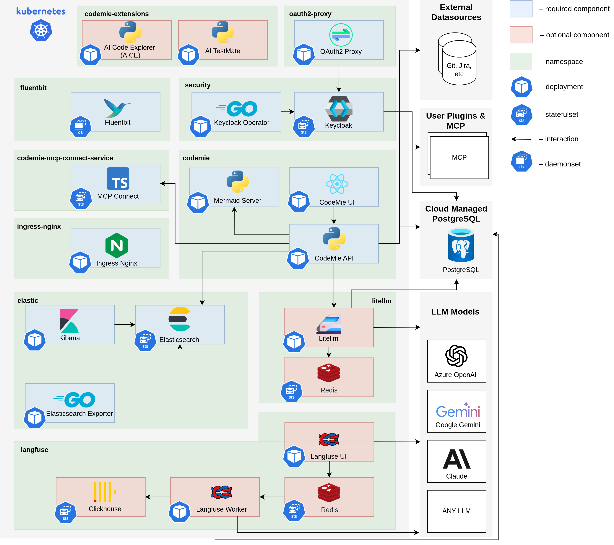
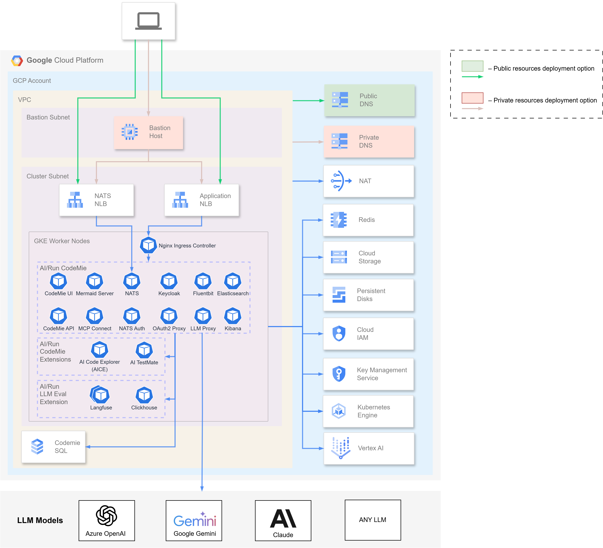

import Tabs from '@theme/Tabs';
import TabItem from '@theme/TabItem';
import ContainerResources from '../deployment/common/deployment/architecture/_container-resources.mdx';

# Kubernetes Deployment Architecture

This page describes the full production deployment architecture on a managed Kubernetes cluster. A cloud provider can be selected below for provider-specific details.

## Application Stack Components

The AI/Run CodeMie application consists of multiple integrated components organized into functional categories:

### Core AI/Run CodeMie Services

Proprietary services that provide the main AI/Run CodeMie functionality:

| Component             | Container Registry                                                  | Description                                                                           |
| --------------------- | ------------------------------------------------------------------- | ------------------------------------------------------------------------------------- |
| **CodeMie API**       | `europe-west3-docker.pkg.dev/.../codemie:x.y.z`                     | Backend service handling business logic, data processing, and API operations          |
| **CodeMie UI**        | `europe-west3-docker.pkg.dev/.../codemie-ui:x.y.z`                  | Frontend web application providing the user interface                                 |
| **NATS Auth Callout** | `europe-west3-docker.pkg.dev/.../codemie-nats-auth-callout:x.y.z`   | Authentication and authorization service for NATS messaging (Plugin Engine component) |
| **MCP Connect**       | `europe-west3-docker.pkg.dev/.../codemie-mcp-connect-service:x.y.z` | Bridge enabling CodeMie to communicate with MCP servers                               |
| **Mermaid Server**    | `europe-west3-docker.pkg.dev/.../mermaid-server:x.y.z`              | Diagram generation service for visualization in chats                                 |

### Data Layer

Database and search components for data persistence:

| Component         | Container Registry                                    | Description                                                                        |
| ----------------- | ----------------------------------------------------- | ---------------------------------------------------------------------------------- |
| **Elasticsearch** | `docker.elastic.co/elasticsearch/elasticsearch:x.y.z` | Primary data store for AI/Run CodeMie (datasources, projects, conversations, etc.) |
| **Kibana**        | `docker.elastic.co/kibana/kibana:x.y.z`               | Analytics and visualization interface for Elasticsearch data                       |

### Security & Identity Management

Authentication and authorization components:

| Component             | Container Registry                        | Description                                                                 |
| --------------------- | ----------------------------------------- | --------------------------------------------------------------------------- |
| **Keycloak Operator** | `epamedp/keycloak-operator:x.y.z`         | Manages Keycloak deployment and configuration                               |
| **Keycloak**          | `quay.io/keycloak/keycloak:x.y.z`         | Identity and access management (IAM) solution providing SSO, authentication |
| **OAuth2 Proxy**      | `quay.io/oauth2-proxy/oauth2-proxy:x.y.z` | Authentication middleware integrating with Keycloak for secure access       |

### Infrastructure Services

Essential Kubernetes infrastructure components:

| Component                    | Container Registry                                                  | Description                                         |
| ---------------------------- | ------------------------------------------------------------------- | --------------------------------------------------- |
| **Nginx Ingress Controller** | `registry.k8s.io/ingress-nginx/controller:x.y.z`                    | Routes external traffic to internal services        |
| **Storage Class**            | Cloud-provider CSI driver (EBS, Azure Disk, or GCP Persistent Disk) | Provides persistent volumes for stateful components |

### Messaging & Integration

Message broker for Plugin Engine:

| Component | Container Registry | Description                                                       |
| --------- | ------------------ | ----------------------------------------------------------------- |
| **NATS**  | `nats:x.y.z`       | High-performance messaging system for Plugin Engine communication |

### Observability

Logging and monitoring components:

| Component      | Container Registry                        | Description                                            |
| -------------- | ----------------------------------------- | ------------------------------------------------------ |
| **Fluent Bit** | `cr.fluentbit.io/fluent/fluent-bit:x.y.z` | Lightweight log collector enabling agent observability |

### Optional Components

Components that can be omitted based on configuration:

| Component     | Container Registry | Description                                                                                     |
| ------------- | ------------------ | ----------------------------------------------------------------------------------------------- |
| **LLM Proxy** | –                  | Optional proxy for load balancing and high availability of AI model requests and usage insights |

### Deployment Dependencies

Components must be deployed in the following order due to dependencies:

1. **Infrastructure** → Ingress Controller, Storage Class
2. **Operators** → Keycloak Operator
3. **Data Layer** → Elasticsearch
4. **Security** → Keycloak (with database credentials), OAuth2 Proxy
5. **Messaging** → NATS
6. **Core Services** → CodeMie API, UI, MCP Connect, NATS Auth
7. **Observability** → Fluent Bit, Kibana
8. **Optional** → LLM Proxy (if needed)

## Cloud Infrastructure

A cloud provider can be selected below for provider-specific infrastructure details.

<Tabs groupId="cloud-provider">
<TabItem value="aws" label="AWS">

AI/Run CodeMie is deployed on Amazon Elastic Kubernetes Service (EKS) with supporting AWS services for networking, storage, and identity management.

**High-Level Architecture Diagram**

The diagram below illustrates the complete AI/Run CodeMie infrastructure deployment on AWS:

</TabItem>
<TabItem value="azure" label="Azure">

AI/Run CodeMie is deployed on Azure Kubernetes Service (AKS) with supporting Azure services for networking, storage, and identity management.

**High-Level Architecture Diagram**

The diagram below illustrates the complete AI/Run CodeMie infrastructure deployment on Azure:

</TabItem>
<TabItem value="gcp" label="GCP">

AI/Run CodeMie is deployed on Google Kubernetes Engine (GKE) with supporting GCP services for networking, storage, and identity management.

**Deployment Options**

There are two deployment options available depending on your organization's access requirements:

- **Public cluster option** - Access to AI/Run CodeMie from predefined networks or IP addresses (VPN, corporate networks, etc.) using public DNS resolution from user workstations
- **Private cluster option** - Access to AI/Run CodeMie via Bastion host using private DNS resolution for enhanced security

**High-Level Architecture Diagram**

The diagram below illustrates the complete AI/Run CodeMie infrastructure deployment on GCP:

</TabItem>
</Tabs>

:::tip Architecture Customization
The architecture can be customized based on your organization's security policies, compliance requirements, and operational preferences. Consult with your deployment team to discuss specific requirements.
:::

## Kubernetes Resource Requirements

<ContainerResources />
