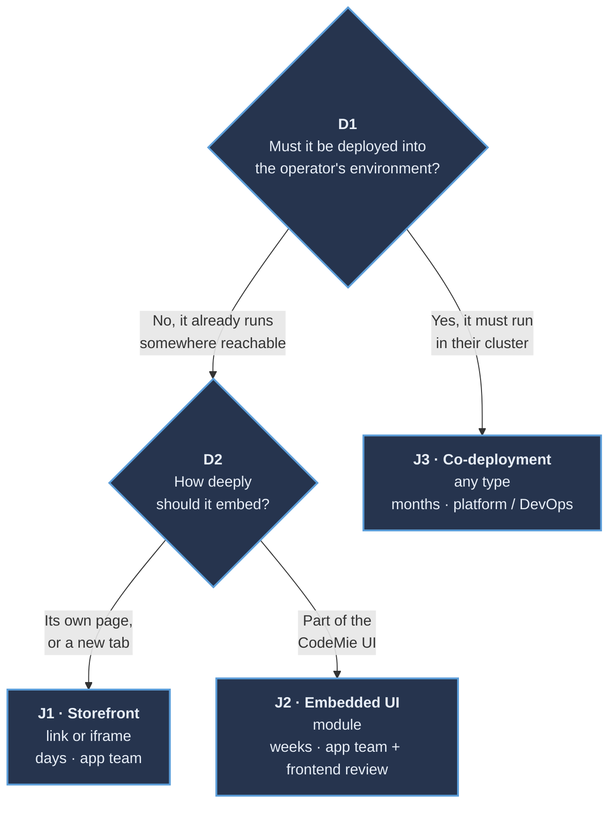

# Application Onboarding Guide

**Audience:** any team that wants a product to appear as a tile inside CodeMie, on EPAM's instance or on an on-premises client's own deployment.

**Scope:** this guide covers the decision process, the registration mechanism, and the review requirements. Read time is fifteen to twenty minutes, after which the target journey, the obligations, and the required sign-offs are all known.

---

## 1. Is an application the right mechanism?

An **application** is a tile in the left navigation that opens a product's own UI. If the goal is for CodeMie's assistants to _use_ that product instead of a human opening it, a cheaper mechanism fits better:

| Goal                                                   | Mechanism          | Not this       |
| ------------------------------------------------------ | ------------------ | -------------- |
| An assistant calls an API or runs external logic       | **MCP server**     | An application |
| Package a repeatable procedure for assistants          | **Skill**          | An application |
| Chain steps into an automation                         | **Workflow**       | An application |
| A product's own UI, inside CodeMie, for a human to use | **Application** ✅ | n/a            |

Only the last row continues here. When two rows apply, building the MCP server first is the faster path: days of work, ships independently, no platform team involvement needed.

The Applications page is a **launcher, not a hosting platform**. CodeMie does not build, deploy, run, or scale the application; it is deployed and operated independently, and CodeMie stores a pointer to it and renders a card that opens it. There is **no self-service UI, no API, and no database record** for this today — registration happens through a pull request, and a config change requires a **backend restart** (the YAML is parsed once at process start and cached in a singleton).

:::warning Two different sources can supply the config, and only one wins
CodeMie's registration mechanism is a YAML file, but two different things can supply it, and they don't always agree. The repository's `config/customer/customer-config.yaml` is baked into the image at build time. On many deployments, the Helm chart separately mounts a `codemie-customer-config` ConfigMap over that same path, and wherever it's mounted, it wins — a pull request to the in-repo file then has **no effect at all**. Which one governs has already been inconsistent across cloud providers in practice: the ConfigMap mount has failed to apply on at least one major cloud provider and wasn't mounted by default on another. Before submitting a change, confirm with whoever operates the target deployment which mechanism is actually live there; this guide's steps work the same either way, but only one of them takes effect.
:::

---

## 2. Which journey applies?

Two independent questions decide it, answered in this order.

:::info Operator, defined
The operator is whoever runs the CodeMie deployment being targeted: EPAM, for EPAM's own instance; the client's own team, for an on-premises deployment. The same product can be J1 on one deployment and J3 on another — answer D1 for the deployment being targeted, not for CodeMie in general.
:::



:::note D1 and D2 are independent
D1 sets cost, ownership, and timeline; D2 sets the security review. Neither follows from the other: a co-deployed product can still be a `link`, and a `module` can run entirely outside the operator's environment.
:::

### The three journeys

|                               | **J1 · Storefront** | **J2 · Embedded UI**      | **J3 · Co-deployment**         |
| ----------------------------- | ------------------- | ------------------------- | ------------------------------ |
| **Deployed by the operator?** | no                  | no                        | **yes**                        |
| **Type**                      | `link` · `iframe`   | `module`                  | any                            |
| **Application team owns**     | a config entry      | + a hosted remote bundle  | + images, chart, data, CI/CD   |
| **Also needs**                | n/a                 | frontend review           | infra + security + DB review   |
| **Realistic time**            | days                | weeks                     | months                         |
| **Sign-off**                  | application owner   | + frontend / architecture | + platform / DevOps / security |

**Typical examples.**

- **J1:** an internal wiki or support desk already running elsewhere.
- **J2:** a build-status panel — the shape `technology-copilot` runs today.
- **J3:** a vendor product that needs data residency — the shape `AICE` runs today.

All three run the same six stages: **choose · agree · build · test · review · publish**. Only the gate content and sign-off differ.

:::note J3 is a delivery answer, not a security answer
J3 identifies who deploys the application; the embedding type still decides how demanding the security review is. A co-deployed `module` maxes out both.
:::

:::info Escalation
For platform issues (registration, rendering, the gaps in [Section 7](#7-known-gaps-in-the-platform)), raise them with the CodeMie platform team. There is no dedicated J3/co-deployment owner today; until one is named, route co-deployment questions there too.
:::

---

## 3. Which type?

_(In this section, "the integrating team" is the team building the integration; CodeMie is the platform.)_

|                                              | `link`                     | `iframe`                                                                            | `module`                                                                                |
| -------------------------------------------- | -------------------------- | ----------------------------------------------------------------------------------- | --------------------------------------------------------------------------------------- |
| **What happens**                             | Opens in a new tab         | The application's own page, framed by CodeMie                                       | The application's JS runs inside CodeMie's page                                         |
| **Must be hosted**                           | a URL                      | a web app                                                                           | a built ESM bundle (JS module format, defined in [Section 4](#4-what-must-be-provided)) |
| **Runs in CodeMie's origin?**                | no                         | no                                                                                  | **yes**                                                                                 |
| **Access to CodeMie's DOM, storage, tokens** | none                       | none                                                                                | **full**                                                                                |
| **Isolation mechanism**                      | none needed (separate tab) | cross-origin context, but no `sandbox` ([known gap](#7-known-gaps-in-the-platform)) | **none** (Shadow DOM only)                                                              |
| **Trust tier**                               | 🟢 light                   | 🟡 medium                                                                           | 🔴 strict                                                                               |
| **Feels like part of CodeMie**               | no                         | mostly                                                                              | yes                                                                                     |

**Typical examples.**

- **`link`:** an external tool with its own UI, e.g. a wiki, that doesn't need to feel native.
- **`iframe`:** a product with its own frontend that should look embedded without deep integration work.
- **`module`:** a panel that needs to share layout and navigation state with CodeMie itself, e.g. a build-status panel.

The **lightest type that meets the need** is the right choice. `module` is not a better `iframe`; it is a far larger commitment for both sides. It is only worth taking on when the surface must feel native:

- shared layout
- no scrollbar-in-a-scrollbar
- host-level navigation

:::warning Shadow DOM is a style boundary, not a security boundary
`module` code is isolated from CodeMie's _CSS_, not from its origin, cookies, or JS realm. That single fact is why the trust tiers differ.
:::

### Worked example

A preview of the whole path, using the build-status panel from the typical examples above; every other journey and type follows the same shape, with different gates. It references terms and sections that come later, on purpose, so the destination is clear before the detail.

1. **Journey.** The panel can run outside the operator's environment (D1), and it should feel like part of the CodeMie UI (D2). That's J2: weeks, sign-off from the application team plus frontend, the same journey `technology-copilot` is in today.
2. **Type.** `module`. An `iframe` would mean a scrollbar inside a scrollbar; a `link` would leave CodeMie entirely, and this panel needs to feel native.
3. **What must be provided**, per the `module` contract in [Section 4](#4-what-must-be-provided):
   ```yaml
   - id: 'applications:build-status'
     settings:
       enabled: true
       name: 'Build Status'
       description: 'Live CI status across your pipelines.'
       type: 'module'
       url: 'https://build-status.example.com/assets/remoteEntry.js'
       icon_url: 'https://build-status.example.com/icon.svg'
       created_by: 'Build Tools Team'
       arguments:
         apiUrl: 'https://build-status-api.example.com'
   ```
   Plus the `module` contract: an ESM build exposing `./CodemieEntryComponent`, a `mount`/`unmount` pair, no `shared` modules. Section 4 defines every one of these terms.
4. **Review.** The 🔴 `module` tier in [Section 5](#5-review-checklist), and every tier above it too: a named owner, an HTTPS and version-pinned `entry`, no secrets in `arguments`.
5. **Testing.** Faster iteration is available through the dev-override mechanism mentioned in [Section 6](#6-local-testing) where the deployment supports it, then the five steps in that section, with particular attention on step 4: navigate away and back twice, watching for duplicated DOM or leaked listeners.
6. **Sign-off.** Frontend and architecture review recorded, per the journey table above.

That's the whole path. Sections 1 through 7 cover every other journey and type combination.

`AICE` follows the same six stages but lands in J3 instead: unlike a build-status panel, it has to run inside the operator's environment.

---

## 4. What must be provided

### Every type

Every application, regardless of type, is registered as a `components` entry of type `applications:<slug>` in `customer-config.yaml`. The full field reference — including `availableForExternal` and the `arguments` field — is documented in [Customer Feature Configuration → Integrated Applications](./customer-feature-configuration.md#integrated-applications). The fields with sharp edges are called out below.

:::danger The field is `url` in YAML and `entry` in the API
The backend renames it. Writing `entry:` in YAML does **not** fail loudly: the unknown key is silently accepted while `url` stays `None`, and the required `entry` then fails validation while building the response. That returns **500 from `/v1/applications`, which blanks the Applications page and hides the sidebar item for every user**, not just the one being registered. This is the single most expensive typo available here.
:::

`url` must be a **stable, network-reachable URL from the user's browser**, not from the CodeMie backend, which only echoes the string — all fetching is client-side. It must be **HTTPS** on any real deployment (`http://localhost:*` is exempt, and is how local development works), and should be **version-pinned**: a mutable URL means the code can change after it was reviewed, with **no integrity check on the loaded content** — there is no SRI pinning today, so a changed URL is trusted verbatim.

A **slug** (lowercase, hyphenated, unique) becomes both the URL path and, for `module`, the Module Federation remote name (the standard the bundler uses to load one application's JS into another's).

### `link` also needs

`window.open(entry, '_blank')` without `noopener` lets the opened page reach back into the tab that opened it (reverse tabnabbing). `rel="noopener"` semantics should be set on the linked application's own end where that end is controlled — CodeMie's own dispatch does not add it today.

### `iframe` also needs

Three requirements, not recommendations. Today, nothing on the platform side enforces any of them (see [Section 7](#7-known-gaps-in-the-platform)): skipping one still lets the application mount, and the failure shows up as a blank rectangle or a stolen session instead of a rejected registration.

1. **Permit framing by CodeMie's origin.** `Content-Security-Policy: frame-ancestors https://<codemie-host>`, and **not** `X-Frame-Options: DENY` or `SAMEORIGIN`, which override it.
2. **Make session cookies work in a third-party context.** `SameSite=None; Secure`, or move to token-based auth entirely. This applies even in the same cluster: same cluster is not same origin.
3. **Handle the logged-out path explicitly.** If the IdP refuses to be framed, the default is a blank rectangle. Detecting it and rendering an "open in a new tab" link instead avoids a dead end.

CodeMie can append a `?path=` deep link to the `entry` on the iframe route.

:::warning Convenience, not a hardened feature
The value is concatenated without validation today, so it should not be relied on for anything security-sensitive until that's fixed.
:::

### `module` also needs

The full contract:

| Obligation                                                                                                     | Where it's enforced                                           | If it's wrong                                                                           |
| -------------------------------------------------------------------------------------------------------------- | ------------------------------------------------------------- | --------------------------------------------------------------------------------------- |
| **ESM** Module Federation build, loadable via bare `import()`                                                  | the bundler's federation config (Vite/Webpack settings below) | `TypeError: lib.init is not a function`                                                 |
| Expose `./CodemieEntryComponent`                                                                               | the federation config's `exposes` map                         | `remote.get(...)` rejects                                                               |
| Default export with `mount(el, args)` returning `{ unmount() }` (not a React component, never rendered as JSX) | the entry module                                              | `mount is not a function`; or a leak with no teardown                                   |
| `init(shareScope)` tolerates being called twice                                                                | the entry module (container init)                             | double-initialisation errors                                                            |
| `unmount()` releases **everything** (timers, listeners, subscriptions, nodes)                                  | the entry module                                              | leaks across navigations                                                                |
| **Its own bundled framework runtime** (the host shares nothing)                                                | the federation config's `shared` list (left empty)            | silent breakage if dependencies are marked external, expecting the host to provide them |
| No assumption of `document` ownership (the module runs in a `ShadowRoot`)                                      | the entry module                                              | visual/behavioural bleed into the host, or vice versa                                   |
| CORS (`Access-Control-Allow-Origin`) on the entry **and every lazy chunk**                                     | the static server / CDN config                                | CORS error on load                                                                      |
| `Content-Type: text/javascript` on the entry and every chunk                                                   | the static server / CDN config                                | CORS error on load                                                                      |

That is the whole contract. Everything else is internal to the application.

:::tip The component name has two forms
The `exposes` key is `./CodemieEntryComponent`, with the leading `./`. The host asks for it as `CodemieEntryComponent`, without. Most federation tooling normalises between the two forms, but that normalisation has varied across tool versions — confirming empirically that the build's emitted key resolves is worth doing up front. If the host's remote-get call rejects, this is the first thing to check.
:::

:::note ESM, defined
**ECMAScript Modules**, the standard JavaScript module format (`import` / `export`). Not CommonJS (`require`), not UMD, not SystemJS. The host loads the remote with a plain dynamic `import()` and no loader shim, so anything else will not execute. In Vite: `build.target: 'esnext'`; in Webpack: `output.module: true` with `experiments.outputModule`. The `Content-Type` and CORS requirements above follow from the same fact: each lazy chunk is a separate cross-origin module request.
:::

**What the host actually does, in order** (useful when something doesn't mount):

1. `setRemote(slug, { format: 'esm', url: entry })`: registers the remote at runtime.
2. `import(entry)`: dynamic ESM import of the remote entry.
3. `lib.init(shareScope)`: container init, called twice; must be idempotent.
4. `lib.get('CodemieEntryComponent')`: returns a factory.
5. `factory()`: returns the module.
6. `unwrapDefault(module)`: takes `.default` if it is an ES module.
7. `component.mount(shadowRootChild, arguments)`: implemented by the application; returns `{ unmount }`.
8. On navigation away, `returned.unmount()`: implemented by the application.

The host's `vite.config.ts` does not need modification: remotes are registered at runtime via `setRemote`, which accepts any slug.

**Styling.** CodeMie clones `<style>`/`<link rel="stylesheet">` elements added to `document.head` after mount into the module's shadow root. A standard build that injects CSS into `document.head` at runtime works out of the box. Two gaps to know about: **`adoptedStyleSheets` / constructable stylesheets are not picked up** (the observer only sees element nodes), and `styled-components` output is re-created as a fresh `<style>` rather than cloned, so dynamic updates after mount may not propagate. Missing CSS after mount usually traces back to one of these two.

### `arguments`: public, by design

Partial excerpt — `arguments` nests under `settings:`, alongside the other fields in the schema reference linked above.

```yaml
  settings:
    # ...name, type, url, and the rest — see the schema reference above
    arguments:
      apiUrl: 'https://api.your-product.example.com'
      keycloakConfigPath: '/auth/config.json'
```

`GET /v1/applications` requires no authentication, so **everything in `arguments` is world-readable**. Endpoints and IdP configuration only belong here — never tokens, keys, or secrets. Values must be strings.

**Applications authenticate themselves**, against the shared enterprise IdP (Keycloak). The host passes no identity, token, or session: the user already has an SSO session in the browser, so the application's own login typically completes silently, either via an `iframe`-embedded redirect or, for a `module`, a client-side flow bootstrapped from a `keycloakConfigPath` passed through `arguments`. This is the pattern `technology-copilot` already uses.

Testing the logged-out path, not just the happy path, matters here: silent SSO inside a cross-origin frame depends on third-party cookie behaviour and on the IdP allowing its login page to be framed at all — many block it.

**Authorization is entirely the application's own responsibility.** Every CodeMie user who can see the Applications page sees every enabled card; there is no per-project, per-role, or per-user visibility filter today. An application that must be restricted needs to enforce that restriction itself.

---

## 5. Review checklist

A **self-review** before submitting; for an operator reviewing their own team's tile, it is the review itself. Each tier includes the ones above it.

### 🟢 All types

_Applies to every submission, regardless of type._

- [ ] A named owner who will still be reachable in a year
- [ ] `entry` is HTTPS, and resolves from the operator's network
- [ ] `entry` is version-pinned, not a mutable "latest"
- [ ] `icon_url` is HTTPS and on a host under the application team's control
- [ ] `arguments` contains no secret, token, or key
- [ ] `description` says what the application does (this is the tile subtitle)
- [ ] Behaviour is defined for a user who is _not_ entitled to the application

### 🟡 `iframe`

_E.g. `AICE`._

- [ ] `frame-ancestors` permits the CodeMie origin; no conflicting `X-Frame-Options`
- [ ] Cookies work in a third-party context, or auth does not need them
- [ ] The logged-out and session-expired paths degrade to something readable
- [ ] Nothing inside the frame tries to break out or navigate the top window

### 🔴 `module`

_E.g. `technology-copilot`._

- [ ] Builds ESM and exposes `./CodemieEntryComponent`
- [ ] `mount(el, args)` returns `{ unmount() }`, and `unmount` releases **everything**
- [ ] No `shared` modules declared; the framework runtime is bundled
- [ ] CORS + `text/javascript` verified on the entry **and every chunk**
- [ ] Third-party dependencies reviewed (they execute in CodeMie's origin)
- [ ] The build is reproducible from a tagged commit
- [ ] Frontend / architecture sign-off recorded

### 🔴 J3 · co-deployment, additionally

_E.g. `AICE` again: it also runs inside the operator's own cluster, on top of its `iframe` requirements above._

- [ ] Images from a scanned registry, pinned by digest
- [ ] Helm chart, resource limits, and a non-root `securityContext`
- [ ] Data stores: provisioning, backup, and retention named and owned
- [ ] Network policy and egress requirements stated
- [ ] Upgrade and rollback runbook
- [ ] Infrastructure and security review recorded

---

## 6. Local testing

1. Run a local CodeMie backend with the application's entry added to `config/customer/customer-config.yaml`, pointing `url` at the dev server. Alternatively, some CodeMie deployments offer a dev-override mechanism that registers the remote via a query parameter and a browser reload instead of a YAML edit and a backend restart — check with whoever operates the target deployment whether it's available.
2. When editing YAML directly: restart the backend, then confirm `GET /v1/applications` lists the application with the expected fields.
3. Open `/applications` in the UI and launch the card.
4. For `module`: navigate away and back at least twice, watching for duplicated DOM, leaked listeners, or missing styles — this is what correct `unmount()` behavior looks like in practice.
5. For `iframe`: test logged out, and with third-party cookies blocked.

---

## 7. Known gaps in the platform

Not action items for the integrating team — platform limitations to plan around, and candidates to raise with the CodeMie team.

| Gap                                                | Impact                                                                                                                                                     |
| -------------------------------------------------- | ---------------------------------------------------------------------------------------------------------------------------------------------------------- |
| No visibility control                              | Every enabled application is shown to every user; there is no per-project or per-role filter.                                                              |
| No identity propagation                            | Every integration re-authenticates the user independently; the platform defines no token or context handshake.                                             |
| No versioning or rollback                          | `entry` points at a live URL, so breakage ships to all users the moment a new version deploys.                                                             |
| No health checks                                   | A dead application keeps its card until someone edits YAML and redeploys.                                                                                  |
| Restart required                                   | No hot reload of the config file.                                                                                                                          |
| One bad entry breaks the page                      | See the callout in [Section 4](#4-what-must-be-provided). Highest priority; not yet shipped.                                                               |
| No published CSP for framed applications           | The exact `frame-ancestors` value to allow must be confirmed per environment.                                                                              |
| No `sandbox` on the `iframe`                       | Full browser privileges (popups, downloads, fullscreen, top-navigation) instead of what `sandbox` would restrict. Not deliberate; a planned fix.           |
| No SRI / integrity pinning on `entry`              | A changed URL is trusted verbatim; version-pinning is the only practical mitigation today.                                                                 |
| Style bridge has known edges                       | See the callout in [Section 4](#4-what-must-be-provided).                                                                                                  |
| A type mismatch still renders, on the iframe route | An application registered as `link` or `module` but opened at the `iframe` route renders anyway, after an error toast, rather than being blocked outright. |

---

**Next step:** work through the [Section 5](#5-review-checklist) checklist for the target tier, then submit the pull request described in [Section 1](#1-is-an-application-the-right-mechanism).
