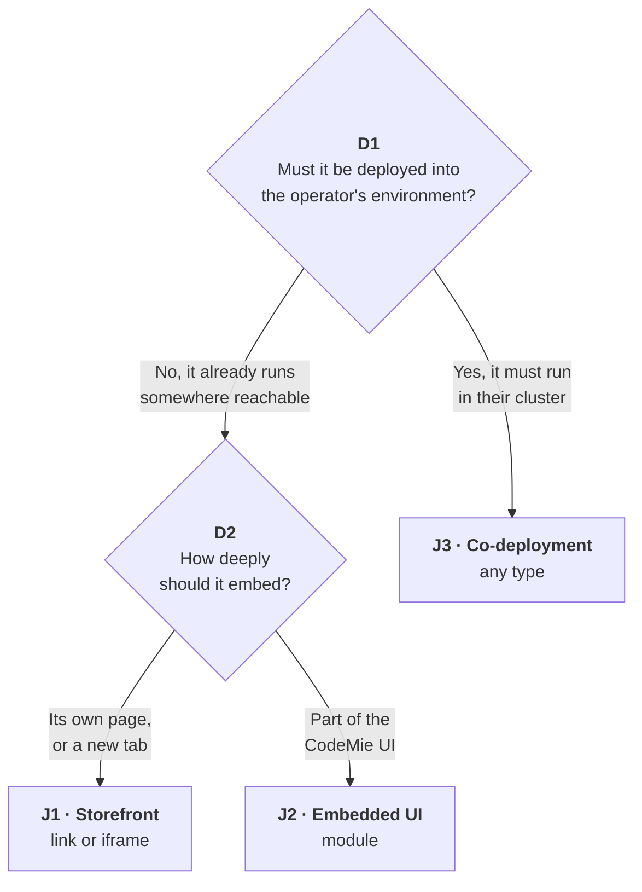

# Adding an application to CodeMie

**Audience:** any team that wants their product to appear as a tile inside CodeMie, on EPAM's instance or an on-premises client's own deployment. **Read time:** fifteen to twenty minutes, after which you know your journey, your obligations, and who signs off.

**Status:** developer-facing guideline, self-contained: everything you need is in this file, no other document required.

**Terms:** "You" is your team, the one building the integration. CodeMie is the platform.

---

## 1. What an application is, and how registration works

An **application** is a tile in the left navigation that opens your product's UI, for a human to use. If what you need is a capability that gets called rather than a UI a person opens, such as calling your API, packaging a repeatable procedure, or chaining steps into an automation, pick a cheaper mechanism:

| You want…                                                 | Mechanism          |
| --------------------------------------------------------- | ------------------ |
| An assistant to call your API or run your logic           | **MCP server**     |
| To package a repeatable procedure for assistants          | **Skill**          |
| To chain steps into an automation                         | **Workflow**       |
| Your product's own UI, inside CodeMie, for a human to use | **Application** ✅ |

Only the last row continues here. If one of the other rows also applies, build that first: days of work, ships independently, no platform team needed.

CodeMie's Applications page is a **launcher, not a hosting platform**. CodeMie does not build, deploy, run, or scale your app. You deploy and operate it yourself; CodeMie stores a pointer to it and renders a card that opens it. There is no self-service UI, no registration API, and no database record for this today; registration is a pull request, and a config change requires a backend restart (the YAML is parsed once at process start and cached in a singleton).

**Which deployment does this apply to, and which file actually wins?** CodeMie's registration mechanism is a YAML file, but two different things can supply it, and they don't always agree.

- **`config/customer/customer-config.yaml` in the repository.** Baked into the image at build time. Governs only when no ConfigMap is mounted.
- **The `codemie-customer-config` ConfigMap.** Mounted over the same path by the Helm chart on many deployments. Wins wherever it is mounted; a pull request to the repository file then has no effect at all.

Which one governs has already been inconsistent across cloud providers in practice: the volume definition was invalid on GCP, and on Azure the volume was not mounted by default.

**Before you submit anything, confirm with whoever operates your target deployment which mechanism is actually live there.** This guide's steps work the same either way, but only one will take effect.

---

## 2. Which journey are you on?

Two independent questions decide it. Answer them in this order.

> **Operator, defined.** The operator is whoever runs the CodeMie deployment you're targeting: EPAM, for EPAM's own instance; the client's own team, for an on-premises deployment. The same product can be J1 on one deployment and J3 on another: answer D1 for the deployment you are targeting, not for CodeMie in general.



> **D1 sets your cost, owner, and timeline; D2 sets your security review.** Neither follows from the other: a co-deployed product can still be a `link`, and a `module` can run entirely outside the operator's environment. **Landing on J3 does not excuse you from D2**: you still answer it in §3 to pick your type.

### The three journeys

|                               | **J1 · Storefront** | **J2 · Embedded UI**      | **J3 · Co-deployment**                                                                              |
| ----------------------------- | ------------------- | ------------------------- | --------------------------------------------------------------------------------------------------- |
| **Deployed by the operator?** | no                  | no                        | **yes**                                                                                             |
| **Type**                      | `link` · `iframe`   | `module`                  | any                                                                                                 |
| **You own**                   | a config entry      | + a hosted remote bundle  | a config entry, images, chart, data, CI/CD, and a remote bundle if you chose `module`               |
| **Also needs**                | n/a                 | frontend review           | infra + security + DB review, plus frontend review if you chose `module`                            |
| **Realistic time**            | days                | weeks                     | months                                                                                              |
| **Sign-off**                  | application owner   | + frontend / architecture | application owner, platform / DevOps / security, plus frontend / architecture if you chose `module` |

**Typical examples.**

- **J1:** an internal wiki or support desk you already run elsewhere.
- **J2:** a build-status panel, as `technology-copilot` does today.
- **J3:** a vendor product that needs data residency, as AICE does today.

All three follow the same path through the rest of this guide. Only the gate content and sign-off differ.

> **J3 is a delivery answer, not a security answer.** It tells you who deploys the thing; your embedding type still decides how hard the security review is. A co-deployed `module` maxes out both.

---

## 3. Which type?

|                                              | `link`                     | `iframe`                                                                            | `module`                                             |
| -------------------------------------------- | -------------------------- | ----------------------------------------------------------------------------------- | ---------------------------------------------------- |
| **What happens**                             | Opens in a new tab         | Your page, framed in ours                                                           | Your JS runs in our page                             |
| **You must host**                            | a URL                      | a web app                                                                           | a built ESM bundle (JS module format, defined in §4) |
| **Runs in CodeMie's origin?**                | no                         | no                                                                                  | **yes**                                              |
| **Access to CodeMie's DOM, storage, tokens** | none                       | none                                                                                | **full**                                             |
| **Isolation mechanism**                      | none needed (separate tab) | cross-origin context, but no `sandbox` ([known gap](#7-known-gaps-in-the-platform)) | **none** (Shadow DOM only)                           |
| **Trust tier**                               | 🟢 light                   | 🟡 medium                                                                           | 🔴 strict                                            |
| **Feels like part of CodeMie**               | no                         | mostly                                                                              | yes                                                  |

**Typical examples.**

- **`link`:** an external tool with its own UI, e.g. a wiki, that doesn't need to feel native.
- **`iframe`:** a product with its own frontend that should look embedded without deep integration work.
- **`module`:** a panel that needs to share layout and navigation state with CodeMie itself, e.g. a build-status panel.

Choose the **lightest type that meets the need**. `module` is not a better `iframe`; it is a far larger commitment for both sides. Take it only when the surface must feel native:

- shared layout
- no scrollbar-in-a-scrollbar
- host-level navigation

> **Shadow DOM is a style boundary, not a security boundary.** `module` code is isolated from CodeMie's _CSS_, not from its origin, cookies, or JS realm. That single fact is why the tiers differ.

### Worked example

A preview of the whole path, using the build-status panel from the typical examples above; every other journey and type follows the same shape, with different gates.

1. **Journey.** It can run outside the operator's environment (D1), and it should feel like part of the CodeMie UI (D2). That's J2, the same journey `technology-copilot` is in today.
2. **Type.** `module`. An `iframe` would mean a scrollbar inside a scrollbar; a `link` would leave CodeMie entirely, and this panel needs to feel native.
3. **What you provide**, per §4's `module` contract:
   ```yaml
   - id: 'applications:build-status'
     settings:
       enabled: true
       name: 'Build Status'
       description: 'Live CI status across your pipelines.'
       type: 'module'
       url: 'https://build-status.example.com/assets/remoteEntry.js'
       icon_url: 'https://build-status.example.com/icon.svg'
       created_by: 'Build Tools Team'
       arguments:
         apiUrl: 'https://build-status-api.example.com'
   ```
   Plus the `module` contract below: an ESM build exposing `CodemieEntryComponent`, a `mount`/`unmount` pair, no `shared` modules. §4 defines each of these.
4. **Review.** The 🟢 All types tier in §5 plus the 🔴 `module` tier: a named owner, an HTTPS and version-pinned `entry`, no secrets in `arguments`.
5. **Testing.** Faster iteration through the dev-override mechanism mentioned in §6 if your deployment has it, then §6's five steps in order, with particular attention on step 4: navigate away and back twice, watching for duplicated DOM or leaked listeners.
6. **Sign-off.** Frontend and architecture review recorded, per the journey table above.

That's the whole path. §1 through §7 cover every other journey and type combination.

AICE follows the same path but lands in J3 instead: unlike a build-status panel, it has to run inside the operator's environment.

---

## 4. What you provide

### Every type

```yaml
- id: 'applications:your-slug'
  settings:
    enabled: true
    name: 'Your Product'
    description: 'One line. This is the tile subtitle.'
    type: 'link'          # link | iframe | module
    url: 'https://your-product.example.com/'
    icon_url: 'https://your-product.example.com/icon.svg'
    created_by: 'Your Team'
```

> **The field is `url` in YAML and `entry` in the API.** The backend renames it. Writing `entry:` in YAML does **not** fail loudly: the unknown key is silently accepted while `url` stays `None`, and the required `entry` then fails validation while building the response. That returns **500 from `/v1/applications`, which blanks the Applications page and hides the sidebar item for every user**, not just yours. Several other omissions in the same block fail exactly the same way, and a missing `enabled` stops the backend from starting at all.

`url` must be a **stable, network-reachable URL from the user's browser**, not from the CodeMie backend, which only echoes the string; all fetching is client-side. It must be **HTTPS** on any real deployment (`http://localhost:*` is exempt, and is how local dev works), and should be **version-pinned**: a mutable URL means the code can change after it was reviewed. There is **no integrity check on the loaded content** — no SRI pinning today — so a changed URL is trusted verbatim.

A **slug** (lowercase, hyphenated, unique) becomes both the URL path and, for `module`, the Module Federation remote name (the standard your bundler uses to load one app's JS into another's).

### `link` also needs

`window.open(entry, '_blank')` without `noopener` lets the opened page reach back into the tab that opened it (reverse tabnabbing); set `rel="noopener"` semantics on your own end where you control the link, and be aware CodeMie's own dispatch does not add it for you today.

### `iframe` also needs

Three requirements, not recommendations. Today, nothing on the platform side enforces any of them (see §7): if you skip one, the app still mounts, and the failure shows up as a blank rectangle or a stolen session instead of a rejected registration.

1. **Permit framing by CodeMie's origin.** `Content-Security-Policy: frame-ancestors https://<codemie-host>`, and **not** `X-Frame-Options: DENY` or `SAMEORIGIN`, which override it.
2. **Make session cookies work in a third-party context.** `SameSite=None; Secure`, or move to token-based auth entirely. This applies even in the same cluster: same cluster is not same origin.
3. **Handle the logged-out path explicitly.** If your IdP refuses to be framed, the default is a blank rectangle. Detect it and render an "open in a new tab" link instead.

On the iframe route, CodeMie reads a `path` query parameter from its own URL and appends that value to your `entry` verbatim, with no separator inserted. So `…/applications/your-slug?path=/reports/42` loads `<your entry>/reports/42`, and the value must carry its own leading `/` or `?`.

> **Treat this as a convenience, not a hardened feature.** The value is concatenated without validation today, so don't rely on it for anything security-sensitive until that's fixed.

### `module` also needs

The full contract:

| Obligation                                                                                                     | Where it's enforced                                            | If you get it wrong                                                                  |
| -------------------------------------------------------------------------------------------------------------- | -------------------------------------------------------------- | ------------------------------------------------------------------------------------ |
| **ESM** Module Federation build, loadable via bare `import()`                                                  | your bundler's federation config (Vite/Webpack settings below) | `TypeError: lib.init is not a function`                                              |
| Expose `CodemieEntryComponent` (no leading `./`)                                                               | your federation config's `exposes` map                         | `remote.get(...)` rejects                                                            |
| Default export with `mount(el, args)` returning `{ unmount() }` (not a React component, never rendered as JSX) | your entry module                                              | `mount is not a function`; or a leak with no teardown                                |
| `init(shareScope)` tolerates being called twice                                                                | your entry module (container init)                             | double-initialisation errors                                                         |
| `unmount()` releases **everything** (timers, listeners, subscriptions, nodes)                                  | your entry module                                              | leaks across navigations                                                             |
| **Your own bundled framework runtime** (the host shares nothing)                                               | your federation config's `shared` list (leave it empty)        | silent breakage if you mark dependencies external expecting the host to provide them |
| No assumption of `document` ownership (you're in a `ShadowRoot`)                                               | your entry module                                              | visual/behavioural bleed into the host, or vice versa                                |
| CORS (`Access-Control-Allow-Origin`) on the entry **and every lazy chunk**                                     | your static server / CDN config                                | CORS error on load                                                                   |
| `Content-Type: text/javascript` on the entry and every chunk                                                   | your static server / CDN config                                | CORS error on load                                                                   |

That is the whole contract. Everything else is your application's business.

> **The `exposes` key must not have a leading `./`.** The host asks for `CodemieEntryComponent`, and `@originjs/vite-plugin-federation` (verified at 1.4.1, the pinned version) does a literal `moduleMap[componentName]` lookup with no normalization between the two forms. A `./`-prefixed key therefore throws `Can not find remote module CodemieEntryComponent`. Conventional Module Federation examples use the `./` form, which is exactly why this catches people. If you are on different federation tooling, do not assume it normalizes either; confirm before you ship.

<!-- -->

> **ESM**: **ECMAScript Modules**, the standard JavaScript module format (`import` / `export`). Not CommonJS (`require`), not UMD, not SystemJS. The host loads your remote with a plain dynamic `import()` and no loader shim, so anything else will not execute. In Vite: `build.target: 'esnext'`; in Webpack: `output.module: true` with `experiments.outputModule`. The `Content-Type` and CORS requirements above follow from the same fact: each lazy chunk is a separate cross-origin module request.

**What the host actually does, in order** (useful when something doesn't mount):

1. `setRemote(slug, { format: 'esm', url: entry })`: registers the remote at runtime.
2. `import(entry)`: dynamic ESM import of your remote entry.
3. `lib.init(shareScope)`: container init, called twice; must be idempotent.
4. `lib.get('CodemieEntryComponent')`: returns a factory.
5. `factory()`: returns your module.
6. `unwrapDefault(module)`: takes `.default` if it is an ES module.
7. `component.mount(shadowRootChild, arguments)`: you implement this; returns `{ unmount }`.
8. On navigation away, `returned.unmount()`: you implement this.

You do **not** need to modify the host's `vite.config.ts`: remotes are registered at runtime via `setRemote`, which accepts any slug.

**Styling.** CodeMie copies `<style>` and `<link rel="stylesheet">` elements added to `document.head` into your shadow root, and this works on first open. The second open is what catches people out: your remote is imported once per page load, so navigating away and back gives you a fresh shadow root with no new injection to copy. Only stylesheet links whose URL matches `/assets/style-*.css` are cached and restored; CSS delivered as an injected `<style>`, or as a link named anything else, is gone. **If you want CSS that survives navigation today, emit it as a stylesheet link at `assets/style-<hash>.css`.** Two smaller gaps: `adoptedStyleSheets` and constructable stylesheets are never picked up (the observer watches only direct element children of `document.head`), and `styled-components` output is re-created as a fresh `<style>` rather than cloned, so updates after mount may not propagate.

### `arguments`: public, by design

Partial excerpt: `arguments` nests under `settings:`, alongside the fields from §4's full schema block above.

```yaml
  settings:
    # ...name, type, url, and the rest from §4
    arguments:
      apiUrl: 'https://api.your-product.example.com'
      keycloakConfigPath: '/auth/config.json'
```

`GET /v1/applications` requires no authentication, so **everything in `arguments` is world-readable**. Endpoints and IdP configuration only, never tokens, keys, or secrets. Values must be strings.

**Your application authenticates itself**, against the shared enterprise IdP (Keycloak). The host passes no identity, token, or session: the user already has an SSO session in the browser, so your app's own login typically completes silently, either via an `iframe`-embedded redirect or, for a `module`, a client-side flow bootstrapped from a `keycloakConfigPath` passed through `arguments`. This is the pattern `technology-copilot` already uses.

**Test the logged-out path, not just the happy path.** Silent SSO inside a cross-origin frame depends on third-party cookie behaviour and on your IdP allowing its login page to be framed at all; many block it.

**Authorisation is entirely yours.** Every CodeMie user who can see the Applications page sees every enabled card; there is no per-project, per-role, or per-user visibility filter today. If your app must be restricted, enforce it inside your app.

---

## 5. Review checklist

Run through this as a **self-review** before submitting. If you're an operator reviewing your own team's tile, this checklist doubles as the actual review — there's no separate step. Everyone does 🟢 All types. Add the tier for your type, and J3's additions if the operator deploys it. The `iframe` and `module` tiers are alternatives, not cumulative.

### 🟢 All types

_Applies to every submission, regardless of type._

- [ ] A named owner who will still be reachable in a year
- [ ] `entry` is HTTPS, and resolves from the operator's network
- [ ] `entry` is version-pinned, not a mutable "latest"
- [ ] `icon_url` is HTTPS and on a host you control
- [ ] `arguments` contains no secret, token, or key
- [ ] `description` says what it does (this is the tile subtitle)
- [ ] Behaviour is defined for a user who is _not_ entitled to your product

### 🟡 `iframe`

_E.g. AICE._

- [ ] `frame-ancestors` permits the CodeMie origin; no conflicting `X-Frame-Options`
- [ ] Cookies work in a third-party context, or auth does not need them
- [ ] The logged-out and session-expired paths degrade to something readable
- [ ] Nothing inside the frame tries to break out or navigate the top window

### 🔴 `module`

_E.g. `technology-copilot`._

- [ ] Builds ESM and exposes `CodemieEntryComponent`, with no leading `./`
- [ ] `mount(el, args)` returns `{ unmount() }`, and `unmount` releases **everything**
- [ ] No `shared` modules declared; the framework runtime is bundled
- [ ] CORS + `text/javascript` verified on the entry **and every chunk**
- [ ] Third-party dependencies reviewed (they execute in CodeMie's origin)
- [ ] The build is reproducible from a tagged commit
- [ ] Frontend / architecture sign-off recorded

### 🔴 J3 · co-deployment, additionally

_E.g. AICE again: it also runs inside the operator's own cluster, on top of its `iframe` requirements above._

- [ ] Images from a scanned registry, pinned by digest
- [ ] Helm chart, resource limits, and a non-root `securityContext`
- [ ] Data stores: provisioning, backup, and retention named and owned
- [ ] Network policy and egress requirements stated
- [ ] Upgrade and rollback runbook
- [ ] Infrastructure and security review recorded

---

## 6. Local testing

1. Run a local CodeMie backend with your entry added to `config/customer/customer-config.yaml`, pointing `url` at your dev server. A faster, query-parameter-based dev-override (no YAML edit, no backend restart) is planned but not yet shipped on any deployment; check with the CodeMie team on its status before assuming it's available.
2. If editing YAML directly: restart the backend, then confirm `GET /v1/applications` lists your app with the fields you expect.
3. Open `/applications` in the UI and launch your card.
4. For `module`: navigate away and back at least twice, watching for duplicated DOM, leaked listeners, or missing styles: this is what `unmount()` correctness looks like in practice.
5. For `iframe`: test logged out, and with third-party cookies blocked.

---

## 7. Known gaps in the platform

Not developer to-dos: platform limitations to plan around, and candidates to raise with the CodeMie team.

| Gap                                   | Impact                                                                                                                                           |
| ------------------------------------- | ------------------------------------------------------------------------------------------------------------------------------------------------ |
| No visibility control                 | Every enabled app is shown to every user; there is no per-project or per-role filter.                                                            |
| No identity propagation               | Every integration re-authenticates the user independently; the platform defines no token or context handshake.                                   |
| No versioning or rollback             | `entry` points at a live URL; you ship breakage to all users the moment you deploy.                                                              |
| No health checks                      | A dead app keeps its card until someone edits YAML and redeploys.                                                                                |
| Restart required                      | No hot reload of the config file.                                                                                                                |
| One bad entry breaks the page         | See the callout in [§4](#4-what-you-provide). Highest priority; not yet shipped.                                                                 |
| No published CSP for framed apps      | The exact `frame-ancestors` value to allow must be confirmed per environment.                                                                    |
| No `sandbox` on the `iframe`          | Full browser privileges (popups, downloads, fullscreen, top-navigation) instead of what `sandbox` would restrict. Not deliberate; a planned fix. |
| No SRI / integrity pinning on `entry` | A changed URL is trusted verbatim; version-pinning is the only practical mitigation today.                                                       |
| Style bridge has known edges          | See the callout in [§4](#4-what-you-provide).                                                                                                    |
| A type mismatch still renders         | An app registered as one type but opened at another type's route renders anyway, after an error toast, rather than being blocked outright.       |

---

**Next step:** work through §5's checklist for your tier, then submit the pull request described in §1.
