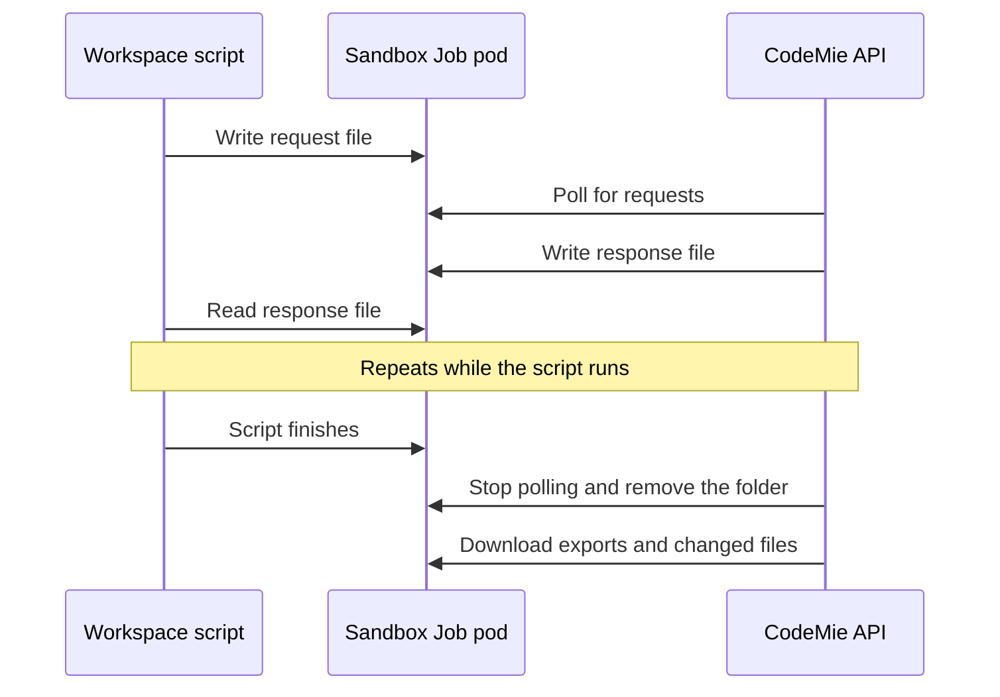

import Tabs from '@theme/Tabs';
import TabItem from '@theme/TabItem';

# Code Executor Configuration

The Code Executor runs Python code in isolated Kubernetes sandbox pods with enforced resource limits and security policies. Every execution request is dispatched to a sandbox pod, keeping user-supplied code isolated from the CodeMie API.

There are two sandbox modes selected with `CODE_EXECUTOR_SANDBOX_MODE`:

- **jobs** (`sandbox-jobs`, default and recommended)
- **shared** (`sandbox-shared`, deprecated and not recommended for production).

## Sandbox Modes

<Tabs>
<TabItem value="jobs" label="sandbox-jobs (default)" default>

Each execution is submitted as a Kubernetes `Job`. A fresh pod runs the user code and is torn down afterwards.

</TabItem>
<TabItem value="shared" label="sandbox-shared">

CodeMie API discovers and reuses long-lived pods from a pool, or creates a new one on demand up to `CODE_EXECUTOR_MAX_POD_POOL_SIZE`. The same pod can be reused across many executions.

:::warning Will be deprecated
`sandbox-shared` is no longer supported and not recommended to use in production environments. Switch to `sandbox-jobs`.
:::

```yaml
extraEnv:
  - name: CODE_EXECUTOR_SANDBOX_MODE
    value: "sandbox-shared"
```

</TabItem>
</Tabs>

## Enabling the Code Executor

The Code Executor is disabled by default. To make it available, set `CODE_EXECUTOR_ENABLED=true` in the CodeMie API environment:

```yaml
extraEnv:
  - name: CODE_EXECUTOR_ENABLED
    value: "true"
```

While disabled, the tool is neither listed in the tools catalog nor executed at runtime.

## Setting the Executor Image

Set `CODE_EXECUTOR_DOCKER_IMAGE` to the image matching your CodeMie version:

```yaml
extraEnv:
  - name: CODE_EXECUTOR_DOCKER_IMAGE
    value: "codemie/codemie-python:<codemie-version>"
```

## RBAC Configuration

Enable RBAC so the CodeMie API service account can manage pods/Jobs in the executor namespace:

```yaml
features:
  tools:
    code_executor:
      rbac:
        enabled: true
```

## Namespace Configuration

Code executor runs in the `codemie-code-executor` namespace by default, matching the `CODE_EXECUTOR_NAMESPACE` default. Set `namespace.create` to `true` to have the chart manage it:

```yaml
features:
  tools:
    code_executor:
      namespace:
        create: true
```

To use a different namespace, set the name and `CODE_EXECUTOR_NAMESPACE` to match:

```yaml
features:
  tools:
    code_executor:
      namespace:
        name: "<namespace>"

extraEnv:
  - name: CODE_EXECUTOR_NAMESPACE
    value: "<namespace>"
```

## Workspace Script Tool-Call Bridge

The workspace script tool-call bridge lets a script run by the execute workspace script tool send requests to the CodeMie backend while it runs. Such a script can import the `codemie_runtime_sdk` module, and its `call` function sends a named operation to the backend and returns the result.

:::info Current limitations

- The backend answers a single operation, `echo`, which returns the request payload unchanged. Any other operation name fails with the `unknown_op` error code. Calling CodeMie tools from scripts is not available yet.
- The bridge works in `sandbox-jobs` mode only. In `sandbox-shared` mode, and whenever the bridge is disabled, every call fails with the `unavailable` error code.
  :::

### Enabling the Bridge

The bridge is controlled by the `features:workspaceScriptBridge` [customer configuration](./customer-feature-configuration.md) component. It is disabled by default.

| Setting          | Default | Description                                                                                                                                                           |
| ---------------- | ------- | --------------------------------------------------------------------------------------------------------------------------------------------------------------------- |
| `enabled`        | `false` | Enables the bridge for workspace script runs.                                                                                                                         |
| `timeoutSeconds` | `120`   | Time limit in seconds for a script run with the bridge. Values above `3600` are reduced to `3600`. A missing, non-numeric, or non-positive value falls back to `120`. |

```yaml
components:
  - id: "features:workspaceScriptBridge"
    settings:
      enabled: true
      timeoutSeconds: 120
      name: "Workspace Script Bridge"
      description: "Allow scripts run in the workspace sandbox to call the backend during their run"
```

Ways to change the settings:

- **Administration page.** Both settings can be edited at runtime in **Settings → Administration → Customer Configuration**, under **Workspace script bridge** (switch **Enable workspace script bridge** and field **Script run limit (seconds)**). See [Dynamic Customer Configuration](./dynamic-customer-configuration.md).
- **`customer-config.yaml`.** The YAML value is the deployment default when nothing is saved on the page. A customer ConfigMap that replaces the default file needs its own copy of the component for the YAML value and for `FEATURE_WORKSPACE_SCRIPT_BRIDGE` to apply; a value saved on the administration page works without it.
- **`FEATURE_WORKSPACE_SCRIPT_BRIDGE`.** Set to `true` or `false` to override `enabled` from the YAML at load time. The override applies only where the component exists in the loaded file, and changing it requires a restart of CodeMie API.

A saved change applies to script runs that start afterwards. The backend reads the setting on every run, and other CodeMie API instances pick up the change within `CUSTOMER_CONFIG_CACHE_TTL_SECONDS` (default: `60` seconds).

### Run Time Limit and Capacity

While the bridge is enabled, the deadline of the sandbox Job for every workspace script run is:

```text
max(CODE_EXECUTOR_EXECUTION_TIMEOUT, timeoutSeconds) + 60 seconds
```

With the defaults (`30` and `120`), a run can last up to 180 seconds. A `timeoutSeconds` value below `CODE_EXECUTOR_EXECUTION_TIMEOUT` does not shorten a run. Without the bridge, the deadline is `CODE_EXECUTOR_EXECUTION_TIMEOUT` plus 60 seconds.

:::warning Capacity
A run holds one executor slot until it finishes. The number of slots is set by `CODE_EXECUTOR_MAX_POD_POOL_SIZE` (default: `5`), and a request made when all slots are taken fails with a capacity error. Long runs with a high `timeoutSeconds` can exhaust the slots sooner, so the limit should stay as low as the scripts allow.
:::

### Calling the Backend from a Script

```python
import codemie_runtime_sdk as sdk

reply = sdk.call("echo", {"msg": "ping"})
print(reply)
```

`sdk.call(op, payload, timeout=None)` takes an operation name and a JSON-serializable dictionary, and returns the result from the backend. Calls are made one at a time from a single thread. The SDK uses the Python standard library only.

Failures raise `ToolCallError`, whose `code` attribute identifies the reason:

| Code                | Reason                                                                                                         |
| ------------------- | -------------------------------------------------------------------------------------------------------------- |
| `unavailable`       | The bridge is disabled, the sandbox mode is `sandbox-shared`, or the backend stopped answering during the run. |
| `payload_too_large` | The request is larger than 256 KiB.                                                                            |
| `timeout`           | No answer arrived within `timeout` seconds (default: `100`).                                                   |
| `unknown_op`        | The backend has no handler for the operation.                                                                  |

While a run is active, requests and responses are exchanged as files in a `.codemie_bridge` folder inside the script working directory. The folder is removed when the script finishes and is excluded from exported and changed files.



## Applying CodeMie API Settings

```bash
helm upgrade codemie-api \
  oci://europe-west3-docker.pkg.dev/or2-msq-epmd-edp-anthos-t1iylu/helm-charts/codemie \
  --version <version> \
  -f codemie-api/values-<cloud>.yaml \
  --namespace codemie
```

## Environment Variables Reference

For the full list of available environment variables, see [API Configuration — Code Executor & Python Sandbox](./api-configuration.md#code-executor--python-sandbox).

## Legacy Topics

The topics below only apply to niche or deprecated setups. Most deployments can skip this section.

<details>
<summary>Dedicated Cluster via kubeconfig (will be deprecated)</summary>

It is also possible to point Code Executor at a namespace in a different cluster by mounting a `kubeconfig` secret instead of relying on in-cluster RBAC:

```yaml
extraVolumeMounts: |
  - name: executor-kubeconfig
    mountPath: "/secrets/kubeconfig"
    subPath: kubeconfig
    readOnly: true

extraVolumes: |
  - name: executor-kubeconfig
    secret:
      secretName: codemie-executor-kubeconfig

extraEnv:
  - name: CODE_EXECUTOR_NAMESPACE
    value: "codemie-code-executor"
  - name: CODE_EXECUTOR_KUBECONFIG_PATH
    value: "/secrets/kubeconfig"
```

</details>

<details>
<summary>Pre-warming the Pod Pool (sandbox-shared only)</summary>

Pre-warming only applies to the deprecated `sandbox-shared` mode. `sandbox-jobs` always creates a fresh Job pod per execution, so there is no pool to pre-warm.

In `sandbox-shared` mode, CodeMie API creates executor pods on demand by default, and the first execution request waits for a pod to start. To avoid this, deploy the `codemie-code-executor` chart to keep pods running and ready for discovery, into the **same namespace** as `CODE_EXECUTOR_NAMESPACE`:

```bash
helm upgrade --install codemie-runtime \
  oci://europe-west3-docker.pkg.dev/or2-msq-epmd-edp-anthos-t1iylu/helm-charts/codemie-runtime \
  --version <version> \
  -f codemie-code-executor/values.yaml \
  --namespace <executor-namespace>
```

To control how many pods are kept ready, set `replicaCount` in your `codemie-code-executor/values.yaml`:

```yaml
replicaCount: 5
```

</details>
