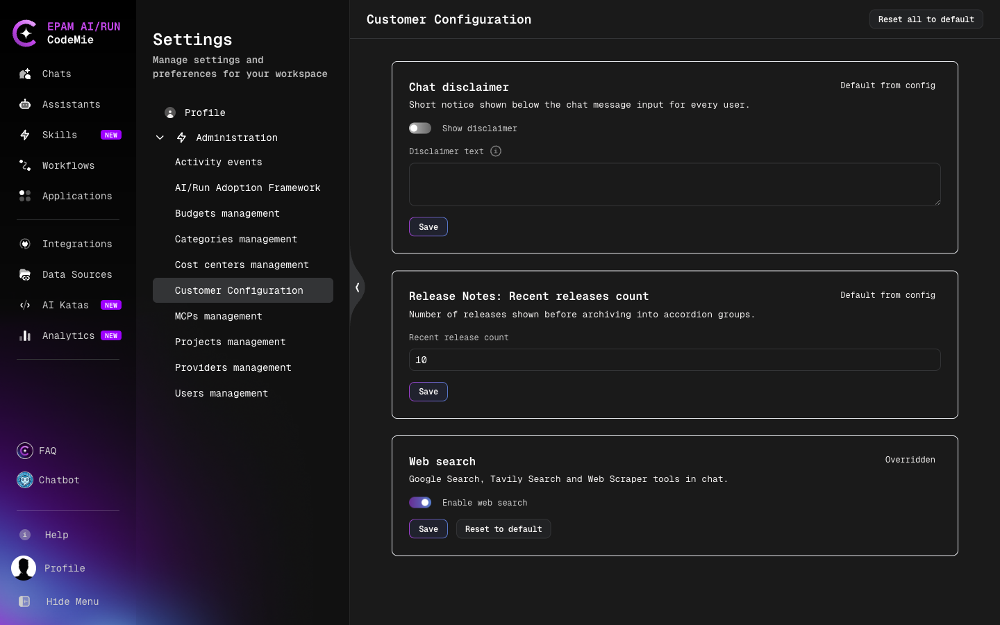
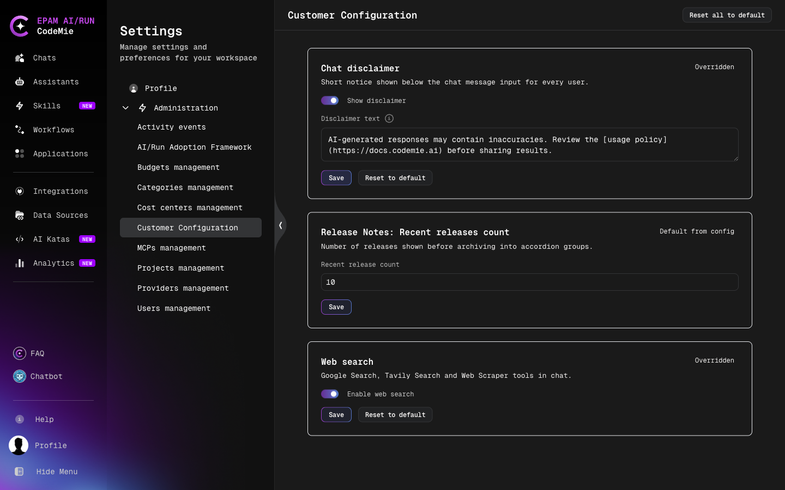

# Dynamic Customer Configuration

Dynamic customer configuration lets platform administrators change selected [customer configuration](./customer-feature-configuration.md) components at runtime from the **Customer Configuration** page in Administration. A saved change reaches all users and the backend without a restart or a redeploy.

Components that are not declared as dynamic keep working exactly as before: they are configured only through `customer-config.yaml` and do not appear on the page.

## Prerequisites

- The user has the platform `admin` role or the `maintainer` role. Project administrators cannot view or change dynamic configuration.
- The component is present in `customer-config.yaml`. The YAML value is the deployment default that the page displays until an override is saved.

## Access the Customer Configuration Page

1. Open **Settings** from the profile menu.
2. Select **Administration → Customer Configuration**.

The page shows one card per dynamic component. Each card contains:

- The setting name and a short description.
- A status marker: **Default from config** when the value comes from `customer-config.yaml`, or **Overridden** when a runtime value is stored.
- A form with the editable fields, prefilled with the value currently in effect.
- **Save** and, for an overridden setting, **Reset to default**.

When no components are declared as dynamic, the page shows the message "No dynamic settings are declared yet."

## Change a Setting

1. Edit the fields on the setting card.
2. Click **Save**.

The value is validated before it is stored. A value that exceeds the maximum length, does not match the expected format, or contains a link with a `javascript:`, `data:`, or `vbscript:` scheme is rejected, and nothing is saved. Markdown in the chat disclaimer is sanitized on save.

After saving, the card shows **Overridden** and a **Reset to default** button.

:::info Saving freezes all fields of the card
**Save** stores every field shown on the card, including fields that were not edited. From that moment these fields no longer follow `customer-config.yaml` across deployments. Use **Reset to default** to return the component to the deployment default.
:::

## Reset a Setting

- **Reset to default** on a card removes the override for that component. The value comes from `customer-config.yaml` again and keeps following later deployments.
- **Reset all to default** in the page header removes every override on the page.

The deployment default is never copied into the database, so resetting never leaves a stale copy behind.

## Available Dynamic Settings

| Component ID              | Setting on the page                  | What it is                                                                               |
| ------------------------- | ------------------------------------ | ---------------------------------------------------------------------------------------- |
| `chatDisclaimer`          | Chat disclaimer                      | Short notice below the chat message input for every user                                 |
| `banner`                  | Banner                               | Dismissible announcement across the top of the application, with an optional link        |
| `features:webSearch`      | Web search                           | Web search tools for assistants in chat (Google Search, Tavily Search, Web Scraper)      |
| `releaseNotesRecentCount` | Release Notes: Recent releases count | Number of latest releases listed on the Release Notes page before older ones are grouped |

Deployment defaults for these components are set in `customer-config.yaml` — see the full example in [Customer Feature Configuration](./customer-feature-configuration.md#full-configuration-example).

:::warning Legacy banner components
The `banner` component replaces `bannerMessage`, `bannerLinkLabel`, and `bannerLinkRoute`, which are no longer read. Values do not carry over: replace the legacy entries in `customer-config.yaml` with a single `banner` entry (`enabled`, `message`, `linkLabel`, `linkRoute`), or set the banner on the Customer Configuration page after the upgrade.
:::

## How Values Are Resolved

For each field of a component, CodeMie uses the first available value:

1. A runtime-computed value, for components the platform calculates itself. Such components cannot be overridden.
2. The dynamic override, if it contains that field.
3. The value from `customer-config.yaml`.

Consequences of this per-field rule:

- An override of `enabled` can turn on a component that is disabled in `customer-config.yaml`, and turn off one that is enabled.
- Fields that are not shown on the card, such as a component's `name` or `description`, always come from `customer-config.yaml`.
- The same resolved value is used by the `/v1/config` endpoint that the UI reads and by backend feature checks.

## When Changes Take Effect

- The API instance that handles the save applies the change immediately.
- Other API instances pick up the change within the cache interval set by `CUSTOMER_CONFIG_CACHE_TTL_SECONDS` in the `codemie-api` configuration (default: `60` seconds).
- Browser tabs that are already open show the new value after a page reload; new sessions receive it automatically.
- An API instance loads the stored overrides during start-up, before it serves requests, so a restart or a new deployment does not temporarily fall back to `customer-config.yaml` values.

If the database is temporarily unreachable, the last loaded values keep being served; if none were loaded, the values from `customer-config.yaml` are used.

## Audit

Every save and reset is recorded in the platform activity log with the user who made the change, the time, the component, and the old and new values.

## API Reference

| Method   | Endpoint                                 | Access                | Description                                                               |
| -------- | ---------------------------------------- | --------------------- | ------------------------------------------------------------------------- |
| `GET`    | `/v1/config`                             | Public                | Customer configuration with dynamic overrides already applied             |
| `GET`    | `/v1/config/declarations`                | `admin`, `maintainer` | Dynamic components with their fields, current values, and override status |
| `PUT`    | `/v1/config/declarations/{component_id}` | `admin`, `maintainer` | Save an override; the request body carries the complete `settings` object |
| `DELETE` | `/v1/config/declarations/{component_id}` | `admin`, `maintainer` | Remove the override and return to the deployment default                  |

The response format of `/v1/config` is unchanged by dynamic configuration, so existing consumers need no changes.
