# Marketplace Management

Marketplace management lets platform administrators and maintainers control which assistants appear in the Marketplace. Assistants submitted by users are validated automatically and then wait in a review queue until an administrator approves or rejects them. Administrators can also audit the quality and usage of published assistants and configure the validation thresholds.

For the submitter's side of the flow, see [Publish to Marketplace](../../../user-guide/assistants/marketplace-publishing.md).

## Enabling Marketplace Management

Marketplace management is controlled by two independent environment variables on the `codemie-api` service. Both default to `false`; the feature ships disabled and must be deliberately turned on per environment.

| Flag                                | Default | Description                                                                                                                                                                                                                                                                                     |
| ----------------------------------- | ------- | ----------------------------------------------------------------------------------------------------------------------------------------------------------------------------------------------------------------------------------------------------------------------------------------------- |
| `MARKETPLACE_MANAGEMENT_ENABLED`    | `false` | Kill switch for the entire feature. When `false`, the `/v1/marketplace-management` router is not mounted, the **Marketplace management** page is unavailable, and all schedulers related to marketplace management are disabled.                                                                |
| `MARKETPLACE_APPROVAL_GATE_ENABLED` | `false` | Approval gate for publishing. When `true`, submitting an assistant sets its status to `PENDING_REVIEW` and keeps it private until an administrator approves it; automated quality gates also run. When `false`, publish self-approves the assistant straight to `APPROVED` / global visibility. |

Both are plain top-level environment variables read by pydantic `BaseSettings` with no prefix or namespace.

The `features:marketplaceManagement` value visible in the frontend configuration is derived automatically from `MARKETPLACE_MANAGEMENT_ENABLED` at request time — it is not a separate flag for operators to set.

### Recommended Rollout Order

Enable the flags in stages rather than all at once:

1. Set `MARKETPLACE_MANAGEMENT_ENABLED=true`. This mounts the router and exposes the **Marketplace management** page, but publishing behavior is unchanged — assistants still self-approve.
2. Confirm that at least one administrator or maintainer account is available to review submissions.
3. Set `MARKETPLACE_APPROVAL_GATE_ENABLED=true`. From this point, new publish requests enter the review queue instead of self-approving.

:::warning
Enabling `MARKETPLACE_APPROVAL_GATE_ENABLED` without `MARKETPLACE_MANAGEMENT_ENABLED` has no effect — the router is not mounted when the kill switch is off.
:::

## Accessing Marketplace Management

Marketplace management is available to users with the platform administrator or maintainer role.

1. Click the **Profile** icon in the bottom left corner and select **Settings**.
2. In the **Administration** section, select **Marketplace management**.

The page contains the following tabs:

| Tab               | Purpose                                                                                      |
| ----------------- | -------------------------------------------------------------------------------------------- |
| **Overview**      | Marketplace quality audit results and statistics                                             |
| **Review queue**  | Assistants waiting for an administrator's decision                                           |
| **Cleanup queue** | Published assistants sorted by quality and usage, with recommendations for removal           |
| **Config**        | Usage thresholds, validation gates, and similarity settings used by the checks and the audit |

## Overview

The **Overview** tab shows the results of the latest Marketplace audit. The audit sorts every assistant published to the Marketplace into a bucket based on its usage and quality-gate results. The results are shared across all administrators; the time of the last audit is shown at the top of the tab.

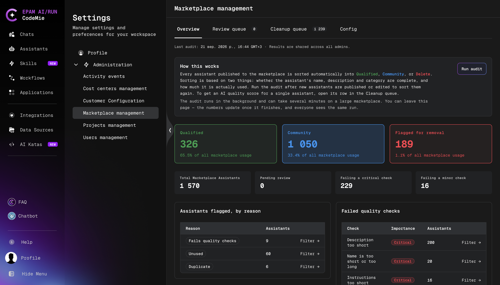

### Running the Audit

The audit runs only when it is started manually. Run it after new assistants are published or edited, and after changing the settings on the **Config** tab, so that existing assistants are evaluated again.

1. On the **Overview** tab, click **Run audit**.
2. Wait for the audit to finish. The audit runs in the background and can take several minutes on a large Marketplace. The page can be left in the meantime; the numbers update once the audit finishes, and all administrators see the same run.

The audit only assigns buckets and recommendations. It never removes assistants from the Marketplace; removal is always a manual action in the [Cleanup Queue](#cleanup-queue).

### Buckets

The three cards at the top show how many assistants are in each bucket:

| Card                    | Assistants in the bucket                                                                                                                                                                                                                                   |
| ----------------------- | ---------------------------------------------------------------------------------------------------------------------------------------------------------------------------------------------------------------------------------------------------------- |
| **Qualified**           | Passed the core quality gates and are in the Hot or Warm usage tier (Warm with at most one polish gap), or in the Cold tier when fully polished and used by at least 2 users.                                                                              |
| **Community**           | Remain in the Marketplace but are flagged: gate failures, minor polish gaps, or an assistant within its grace period.                                                                                                                                      |
| **Flagged for removal** | Recommended for removal: a cleanup verdict (duplicate, invalid, or unused), part of an oversized cluster of similar assistants, a Cold-tier assistant that failed core gates, or a Cold-tier assistant that stalled past its grace period without growing. |

Each card also shows the share of all Marketplace usage that falls on the assistants in the bucket, calculated from the number of unique users of each assistant. If no usage data is available, the card shows **Usage data not available**. Click a card to open the **Cleanup queue** filtered to that bucket.

Usage tiers, polish gaps, and grace periods are defined by the settings described in [Configuration](#configuration).

### Statistics

| Counter                          | Description                                                                                           |
| -------------------------------- | ----------------------------------------------------------------------------------------------------- |
| **Total Marketplace Assistants** | Number of assistants in the Marketplace.                                                              |
| **Pending review**               | Number of assistants waiting in the **Review queue**.                                                 |
| **Failing a critical check**     | Number of assistants with at least one CRITICAL finding.                                              |
| **Failing a minor check**        | Number of assistants with at least one OPTIONAL finding, such as a description that repeats the name. |

### Flagged Assistants and Failed Checks

The tables below the counters break down the audit results:

- **Assistants flagged, by reason**: the number of assistants flagged for each reason, for example:
  - **Fails quality checks**: the assistant has two or more CRITICAL findings and is in the Cold or Dead tier.
  - **Unused**: the assistant is in the Dead tier and has not been updated for longer than the Dead grace period.
  - **Duplicate**: the assistant's similarity score with another assistant reaches the Similarity **Critical threshold**.
  - **Duplicate purpose**: the assistant's purpose is very similar to that of a more widely used assistant.
- **Failed quality checks**: each failed check (for example, **Instructions too short**, **Description just repeats the name**, or **Possible credential in the instructions**) with its importance (**Critical** or **Minor**) and the number of assistants that fail it.
- **Most-used MCP servers** and **Most-used categories**: the MCP servers and categories used by the most Marketplace assistants, with the number of assistants and their total users.

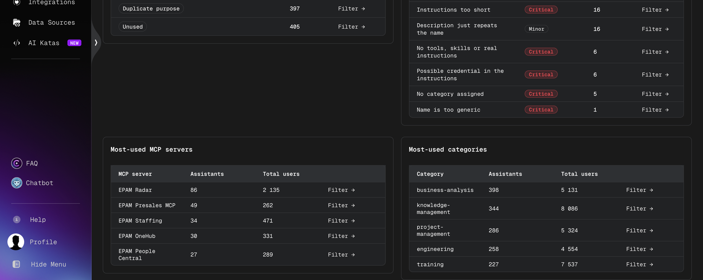

Click **Filter →** in any row to open the **Cleanup queue** with the corresponding filter applied.

## Review Queue

The **Review queue** tab lists assistants that passed the automated validation checks and are waiting for an administrator's decision. The number next to the tab name shows how many assistants are pending review. Assistants in the queue have the **REVIEW** status and are not visible in the Marketplace. Only assistants without CRITICAL findings reach the queue, so the review actions are limited to publishing and rejecting.

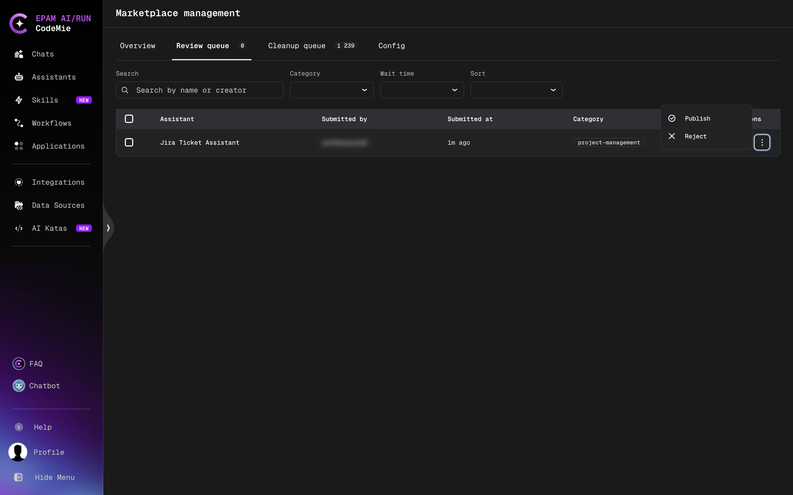

### Finding Assistants in the Queue

Use the controls above the table to narrow down the list:

| Control       | Description                                                                                                                                    |
| ------------- | ---------------------------------------------------------------------------------------------------------------------------------------------- |
| **Search**    | Search assistants by name or creator.                                                                                                          |
| **Category**  | Show assistants assigned to a specific category.                                                                                               |
| **Wait time** | Show assistants by how long they have been waiting: **All Wait Times**, **< 1 day**, **1-7 days**, **7-30 days**, or **> 30 days**.            |
| **Sort**      | Change the order of assistants in the table: **Default order**, **Submitted (newest first)**, **Submitted (oldest first)**, or **Name (A-Z)**. |

The table shows the following columns:

| Column           | Description                                     |
| ---------------- | ----------------------------------------------- |
| **Assistant**    | Assistant name.                                 |
| **Submitted by** | User who submitted the assistant for review.    |
| **Submitted at** | Time elapsed since the assistant was submitted. |
| **Category**     | Categories assigned to the assistant.           |
| **Actions**      | Menu (**⋮**) with the review actions.           |

### Reviewing Assistant Details

Click an assistant name in the table to open the **Assistant details** dialog:

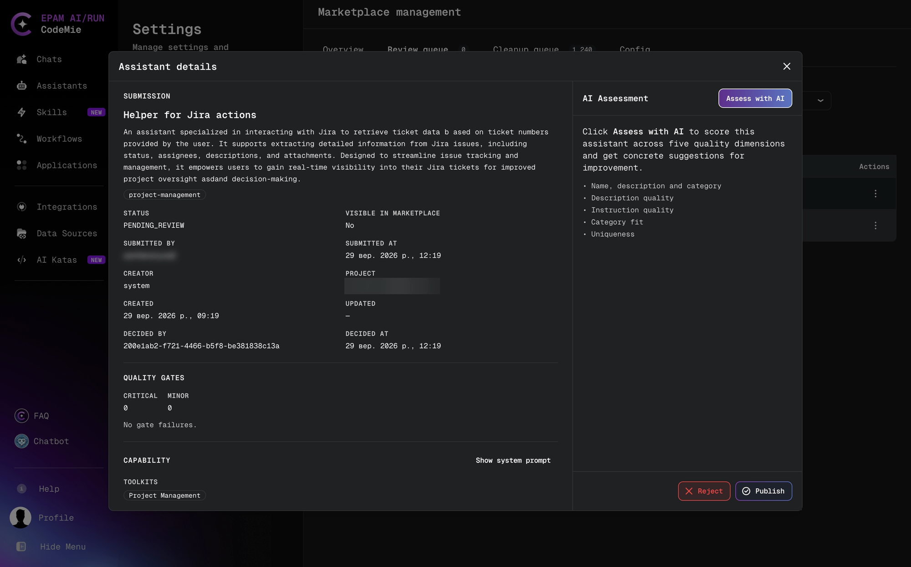

The dialog contains the following information:

- **Submission**: the assistant name, description, and categories.
- Submission metadata: **Status**, **Visible in Marketplace**, **Submitted by**, **Submitted at**, **Creator**, **Project**, **Created**, **Updated**, **Decided by**, and **Decided at**.
- **Quality gates**: the number of **Critical** and **Minor** gate failures found for the assistant.
- **Capability**: the toolkits and other capabilities of the assistant. Click **Show system prompt** to view the system prompt.
- **AI Assessment**: click **Assess with AI** to score the assistant across five quality dimensions and get concrete suggestions for improvement:
  - Name, description and category
  - Description quality
  - Instruction quality
  - Category fit
  - Uniqueness

Use the **Publish** and **Reject** buttons at the bottom of the dialog to make a decision. They work the same way as the row actions described below.

### Approving an Assistant

1. In the **Actions** column, click **⋮** next to the assistant.
2. Select **Publish**.

The assistant is published in the Marketplace with the **VERIFIED** status and is removed from the review queue.

### Rejecting an Assistant

1. In the **Actions** column, click **⋮** next to the assistant.
2. Select **Reject**.
3. In the **Reject assistant** dialog, enter the reason in the **Reason** field. The reason must be 20–2000 characters long; the dialog shows the current character count.
4. Click **Reject**.

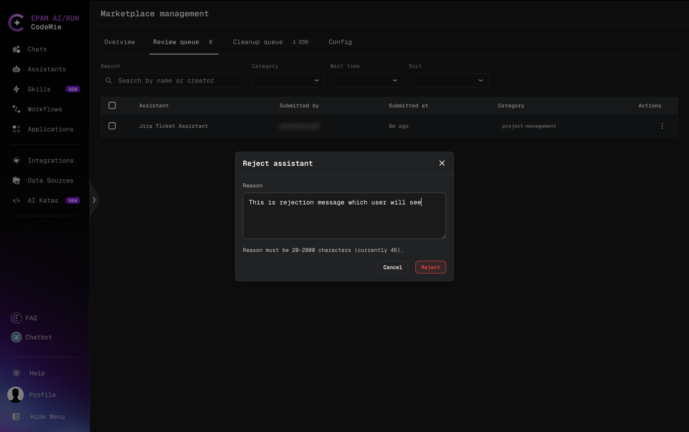

The assistant gets the **REJECTED** status and is removed from the review queue. The submitter sees the reason by hovering over the **REJECTED** badge on the assistant card, as described in [Publish to Marketplace](../../../user-guide/assistants/marketplace-publishing.md#review-statuses).

:::tip
Write the rejection reason for the submitter: state which requirement is not met and what to change, so the assistant can be fixed and submitted again.
:::

### Reviewing Several Assistants at Once

1. Select the checkboxes next to the assistants. To select all assistants in the table, select the checkbox in the table header.
2. Above the table, the number of selected assistants and the bulk actions appear:
   - **Approve selected**: publish all selected assistants.
   - **Reject selected**: reject all selected assistants with one shared reason.
3. To clear the selection, click **×** next to the number of selected assistants.

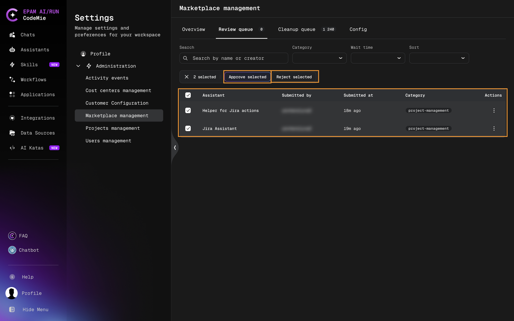

To reject several assistants:

1. Select the assistants and click **Reject selected**.
2. In the **Reject N assistant(s)** dialog, enter the reason in the **Reason** field. The reason must be 20–2000 characters long and is shared with all submitters of the selected assistants.
3. Click **Reject**.

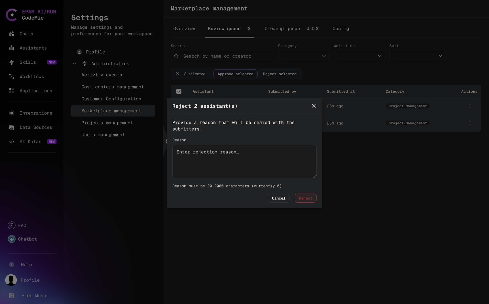

## Cleanup Queue

The **Cleanup queue** tab lists the assistants published to the Marketplace together with the latest audit results: usage tier, bucket, and decision. Use it to find assistants that are unused, duplicated, or of low quality and to unpublish them. The number next to the tab name shows how many assistants are in the queue.

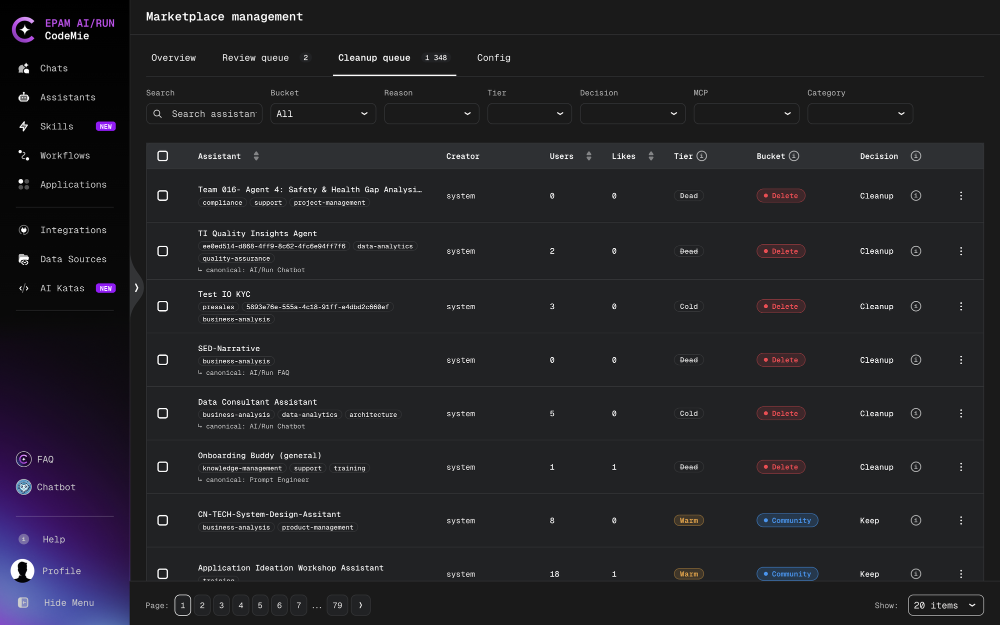

### Filtering and Sorting

Changing a filter applies it immediately. When any filter is active, **Clear all** appears to reset all filters. Filters opened from the **Overview** tab (for example, a failed check) appear as removable chips above the table.

| Filter       | Options                                                                                                                                                                        |
| ------------ | ------------------------------------------------------------------------------------------------------------------------------------------------------------------------------ |
| **Search**   | Search assistants by text.                                                                                                                                                     |
| **Bucket**   | **All** (default), **Qualified**, **Community**, or **Delete**.                                                                                                                |
| **Reason**   | **All Reasons**, or one of the reasons that currently have assistants: **Duplicate**, **Duplicate purpose**, **Near-identical copy**, **Fails quality checks**, or **Unused**. |
| **Tier**     | **All Tiers**, **Hot**, **Warm**, **Cold**, or **Dead**.                                                                                                                       |
| **Decision** | **All Decisions**, **Keep**, **Review**, or **Cleanup**.                                                                                                                       |
| **MCP**      | **All MCPs**, or an MCP server name with the number of assistants that use it. Shows only assistants that use the selected MCP server.                                         |
| **Category** | **All Categories**, or a category with the number of assistants in it.                                                                                                         |

To sort the table, click a column header:

- **Assistant**: A→Z, then Z→A, then unsorted.
- **Users** and **Likes**: highest first, then lowest first, then unsorted.

### Understanding the Columns

| Column        | Description                                                                                                           |
| ------------- | --------------------------------------------------------------------------------------------------------------------- |
| **Assistant** | Assistant name and categories. For a duplicate, the line **↳ canonical:** shows the original assistant it duplicates. |
| **Creator**   | User who created the assistant.                                                                                       |
| **Users**     | Number of unique users of the assistant.                                                                              |
| **Likes**     | Number of likes.                                                                                                      |
| **Tier**      | Usage tier based on the number of unique users.                                                                       |
| **Bucket**    | Marketplace qualification bucket assigned by the audit.                                                               |
| **Decision**  | The audit's recommendation for the assistant.                                                                         |

Hover over the ⓘ icon next to a column name, or over a tier or bucket chip in a row, to see its description.

**Tier** is based on the number of unique users of the assistant. With the default [Marketplace Thresholds](#marketplace-thresholds):

| Tier     | Unique users |
| -------- | ------------ |
| **Hot**  | 50 or more   |
| **Warm** | 7–49         |
| **Cold** | 3–6          |
| **Dead** | fewer than 3 |

**Bucket** has the same meaning as on the [Overview](#buckets) tab: **Qualified**, **Community**, or **Delete** (shown as **Flagged for removal** on the **Overview** tab).

**Decision** shows the audit's verdict for the assistant:

| Decision    | Meaning                                                                                                  |
| ----------- | -------------------------------------------------------------------------------------------------------- |
| **Keep**    | The assistant itself needs no changes. Check **Bucket** for its Marketplace visibility status.           |
| **Review**  | The assistant requires human review.                                                                     |
| **Cleanup** | The assistant is recommended for removal. Hover over the ⓘ icon next to the decision to see the details. |

The **Reason** filter values explain why an assistant is recommended for removal:

- **Duplicate**: the similarity score with another assistant reaches the Similarity **Critical threshold**.
- **Duplicate purpose**: the assistant's purpose is very similar to that of a more widely used assistant.
- **Near-identical copy**: the assistant is a near-identical copy within a group of similar assistants.
- **Fails quality checks**: the assistant has two or more CRITICAL findings and is in the Cold or Dead tier.
- **Unused**: the assistant is in the Dead tier and has not been updated for longer than the Dead grace period.

### Viewing Assistant Details and AI Assessment

To open the **Assistant details** dialog, click the assistant name, or click **⋮** and select **View details**. The dialog is the same as in the [Review Queue](#reviewing-assistant-details), with an additional **Decision** section and an **Unpublish** button.

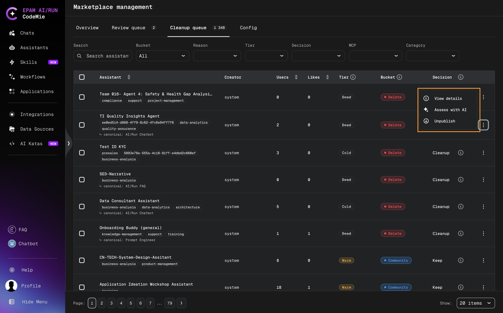

To score the assistant's quality, click **Assess with AI** in the **AI Assessment** panel, or click **⋮** and select **Assess with AI** to open the dialog and start the assessment right away. The assessment shows:

- **Overall**: the overall score and the recommended bucket (for example, **Community**).
- **Quality scores**: a score from 0 to 100 with an explanation for each of the five dimensions: **Name, description and category**, **Description quality**, **Instruction quality**, **Category fit**, and **Uniqueness**.

Once a result exists, the button changes to **Re-assess**.

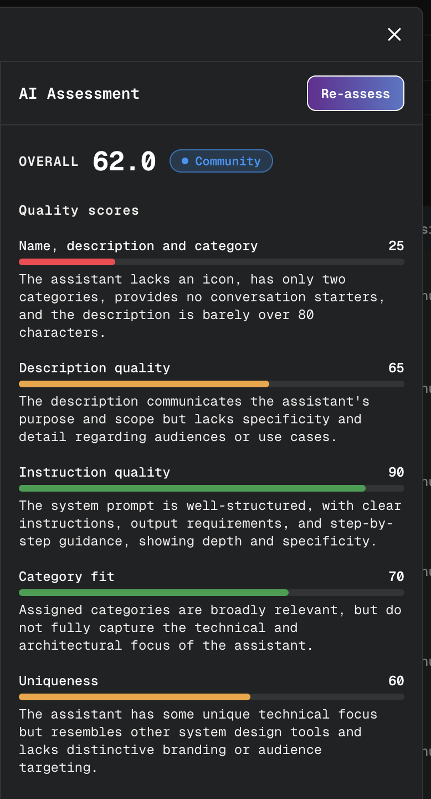

### Unpublishing Assistants

Unpublishing removes an assistant from the Marketplace listing and the search index and returns it to its creator. The assistant is not deleted.

To unpublish one assistant:

1. Click **⋮** next to the assistant and select **Unpublish**, or click **Unpublish** in the **Assistant details** dialog.
2. Confirm the action.

To unpublish several assistants:

1. Select the checkboxes next to the assistants. The checkbox in the table header selects all assistants on the current page only.
2. Click **Unpublish selected**.
3. Confirm the action in the **Unpublish N assistant(s)?** dialog.

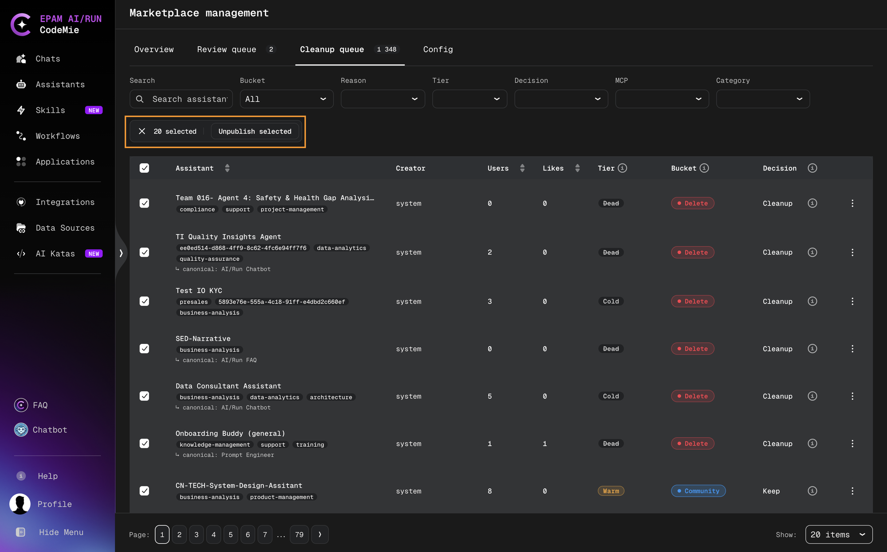

## Configuration

The **Config** tab contains the thresholds used by the validation checks and the Marketplace audit. The settings are grouped into sections; each section has its own **Save** button.

The label in the top right corner of each section shows where the values come from:

- **Default from config**: the section uses the platform default values listed below.
- **Overridden**: the values were changed and saved on this tab. Click **Reset to default** next to **Save** to return to the default values.

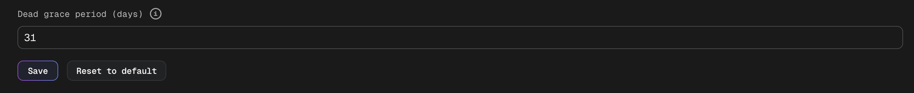

Changes take effect on the next audit run. Existing assistants are not re-evaluated automatically: after changing the settings, click **Run audit** on the [Overview](#running-the-audit) tab.

### Marketplace Thresholds

Usage tiers and grace periods used by the audit and the **Cleanup queue**. Tiers are based on the number of unique users of an assistant: Hot from the Hot tier minimum, Warm from the Warm tier minimum up to the Hot tier minimum, Cold from the Cold tier minimum up to the Warm tier minimum, and Dead below the Cold tier minimum.

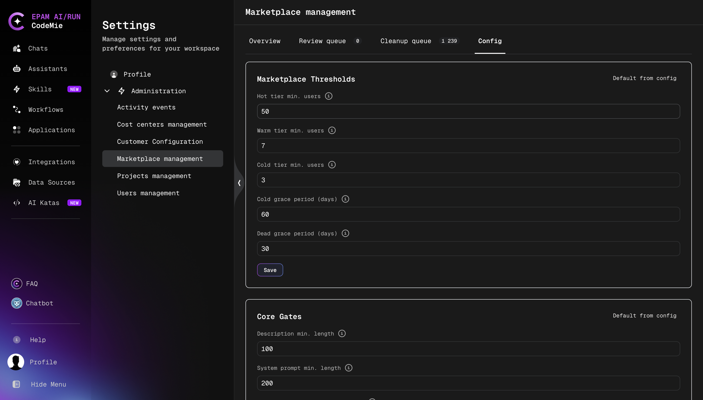

| Setting                      | Default | Description                             |
| ---------------------------- | ------- | --------------------------------------- |
| **Hot tier min. users**      | 50      | Minimum active users for the Hot tier.  |
| **Warm tier min. users**     | 7       | Minimum active users for the Warm tier. |
| **Cold tier min. users**     | 3       | Minimum active users for the Cold tier. |
| **Cold grace period (days)** | 60      | Days in the Cold tier before cleanup.   |
| **Dead grace period (days)** | 30      | Days in the Dead tier before cleanup.   |

### Core Gates

Minimum requirements checked when an assistant is published. Failing a core gate is a CRITICAL finding.

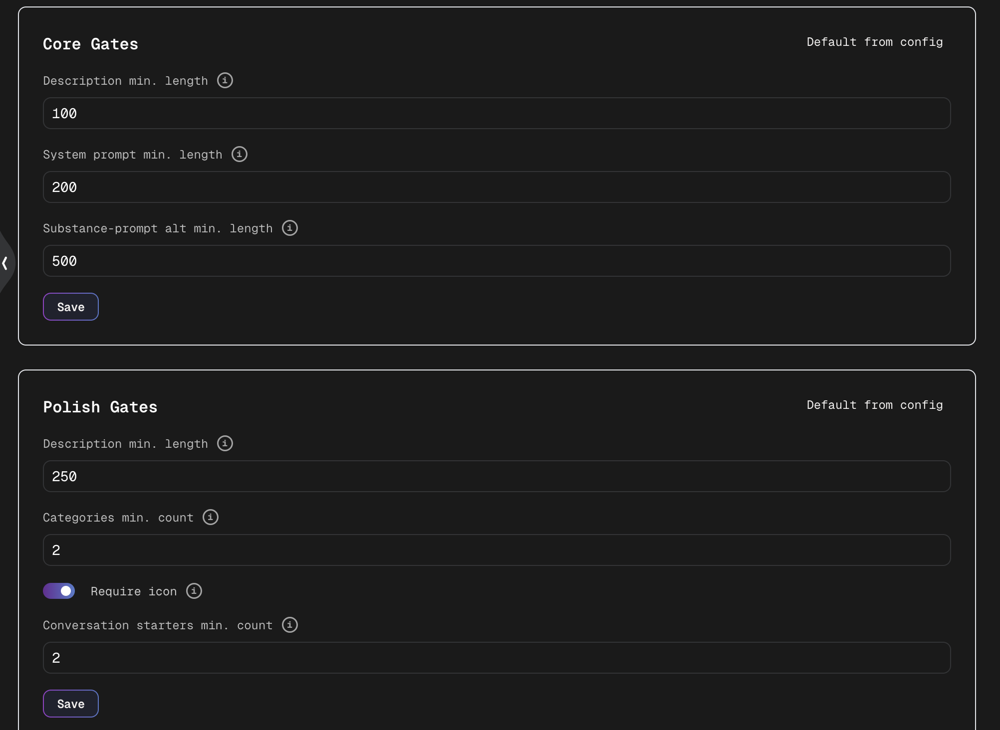

| Setting                              | Default | Description                                                                                                                     |
| ------------------------------------ | ------- | ------------------------------------------------------------------------------------------------------------------------------- |
| **Description min. length**          | 100     | Minimum number of characters required in the assistant's description.                                                           |
| **System prompt min. length**        | 200     | Minimum number of characters required in the system prompt.                                                                     |
| **Substance-prompt alt min. length** | 500     | Minimum number of characters required in the system prompt of an assistant without tools, MCP servers, skills, or data sources. |

### Polish Gates

Additional quality requirements checked only during the audit. Polish gates are not checked when an assistant is published and do not block approval; they affect which bucket a published assistant is placed in (for example, **Qualified** or **Community**).

| Setting                              | Default | Description                                                                                |
| ------------------------------------ | ------- | ------------------------------------------------------------------------------------------ |
| **Description min. length**          | 250     | Minimum number of characters required in the assistant's description for the polish check. |
| **Categories min. count**            | 2       | Minimum number of categories the assistant must be assigned to.                            |
| **Require icon**                     | Enabled | Whether the assistant must have an icon to pass the polish check.                          |
| **Conversation starters min. count** | 2       | Minimum number of conversation starters the assistant must have.                           |

### Similarity

Settings for comparing assistants with each other. Similarity scores range from 0 to 1.

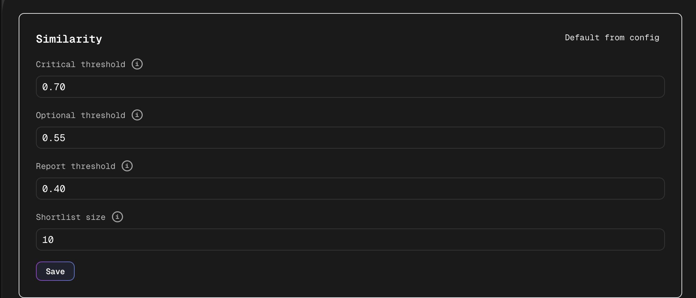

| Setting                | Default | Description                                                                                         |
| ---------------------- | ------- | --------------------------------------------------------------------------------------------------- |
| **Critical threshold** | 0.70    | Similarity score above which two assistants are treated as near-duplicates.                         |
| **Optional threshold** | 0.55    | Similarity score above which two assistants are flagged as worth reviewing for overlap.             |
| **Report threshold**   | 0.40    | Similarity score above which a pair appears in similarity reports.                                  |
| **Shortlist size**     | 10      | Maximum number of candidate assistants to compare against each assistant during a similarity check. |
