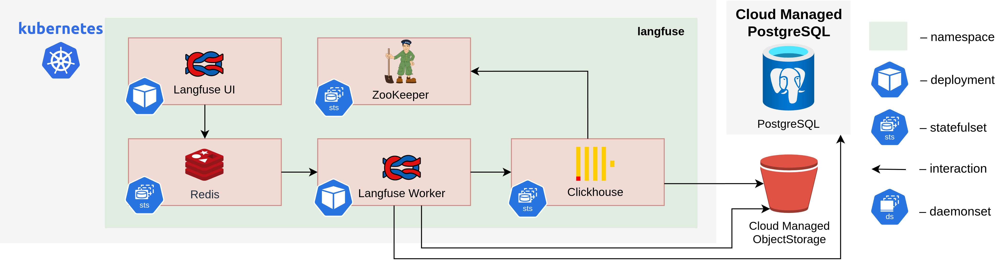

# Langfuse System Requirements

The diagram below depicts the Langfuse LLM Observability Platform deployed on Kubernetes infrastructure within a cloud environment.

## Components and Requirements

| Component               | CPU (Limits/Requests) | Memory (Limits/Requests)  | Storage         |
| ----------------------- | --------------------- | ------------------------- | --------------- |
| Langfuse Web            | 2 / 1                 | 4Gi / 2Gi                 | —               |
| Langfuse Worker         | 2 / 1                 | 4Gi / 2Gi                 | —               |
| PostgreSQL[^1]          | —                     | —                         | —               |
| ClickHouse x 3 Replicas | 2 / 0.3               | 8Gi / 8Gi                 | 100Gi PVC       |
| Zookeeper x 3 Replicas  | 2 / 0.1               | 4Gi / 4Gi                 | 1Gi             |
| Redis                   | 1 / 0.1               | 1.5Gi / 512Mi             | 2Gi             |
| **Total**               | **~9 / ~2.5 vCPU**    | **~45.5 / ~32.5 GiB RAM** | **~300 Gi PVC** |

[^1]: Reusing main AI/Run CodeMie PostgreSQL instance
