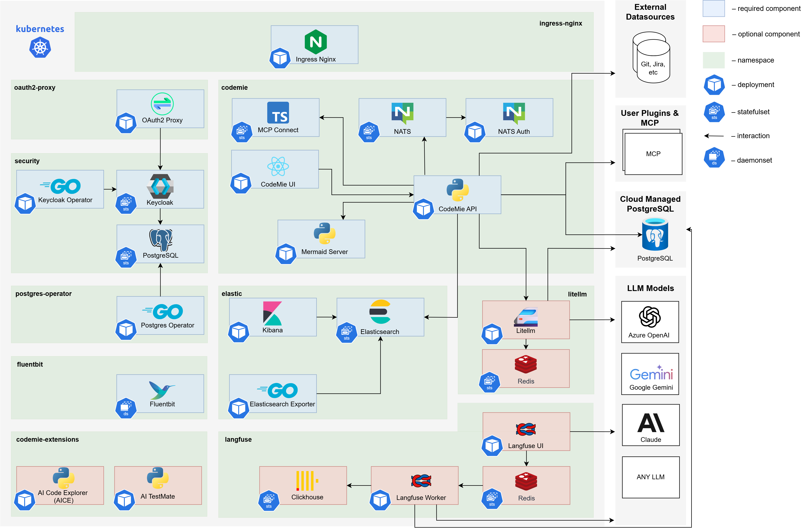

# AI/Run CodeMie Components Deployment

## Overview

This section guides you through deploying the AI/Run CodeMie application stack on your GKE cluster. After completing infrastructure deployment, this phase installs all necessary Kubernetes components including:

- **Core AI/Run CodeMie services** (API, UI, MCP Connect, NATS Auth)
- **Data layer** (Elasticsearch, PostgreSQL via operators)
- **Security & Identity** (Keycloak, OAuth2 Proxy)
- **Infrastructure services** (Ingress controller, storage)
- **Observability** (Kibana, Fluent Bit)
- **Optional LLM Proxy** (for load balancing AI model requests)

The deployment uses Helm charts to install and configure all components in the correct order, ensuring proper dependencies and integration.

:::info Prerequisites
This phase assumes you have completed [Infrastructure Deployment](../infrastructure-deployment/) and have a running GKE cluster with network, storage, and security configured.
:::

## Prerequisites

### Cluster Readiness

Ensure your GKE cluster is ready for component deployment:

- [x] **Infrastructure Deployed**: Completed [Infrastructure Deployment](../infrastructure-deployment/) phase
- [x] **Cluster Access**: kubectl configured and authenticated to GKE cluster
- [x] **Bastion/Jumpbox Access**: Connected to Bastion Host (for private clusters) or have authorized network access

#### Configure Kubectl Access

Obtain kubectl credentials using the appropriate Terraform output command based on your cluster access type:

```bash
# For public clusters or clusters with authorized networks
# Use the command from Terraform outputs
# Parameter: get_kubectl_credentials_for_public_cluster

# For completely private clusters (access via Bastion Host)
# Use the command from Terraform outputs
# Parameter: get_kubectl_credentials_for_private_cluster
```

Verify cluster connectivity:

```bash
# Test cluster access
kubectl get nodes

# Check cluster information
kubectl cluster-info
```

### Required Components

The following components will be installed during this phase if not already present:

- **Nginx Ingress Controller**: Routes external traffic to services
- **GCP Storage Class**: Provides persistent storage for stateful components

:::tip Automated Installation
If your cluster doesn't have these components, don't worry. The deployment scripts and manual guides include steps to install them automatically.
:::

### Repository and Access {#repository-and-access}

#### Helm Charts Repository

Clone the Helm charts repository on your deployment machine (Bastion Host or local workstation):

```bash
git clone git@gitbud.epam.com:epm-cdme/codemie-helm-charts.git
cd codemie-helm-charts
```

#### Container Registry Credentials

Before deploying AI/Run CodeMie components, you need to set up authentication for the container registry.

**Request Access**: Ask the AI/Run CodeMie team to provide:

- `key.json` file (GCP service account credentials)
- Service account email for pulling images from GCR

**Create Namespace**:

```bash
kubectl create namespace codemie
```

**Configure Registry Secret**:

Replace `%%PROJECT_NAME%%` with your project name and create the pull secret:

```bash
kubectl create secret docker-registry gcp-artifact-registry \
  --docker-server=https://europe-west3-docker.pkg.dev \
  --docker-email=gsa-%%PROJECT_NAME%%-to-gcr@or2-msq-epmd-edp-anthos-t1iylu.iam.gserviceaccount.com \
  --docker-username=_json_key \
  --docker-password="$(cat key.json)" \
  -n codemie
```

**Verify Secret**:

```bash
kubectl get secret gcp-artifact-registry -n codemie
```

:::info Pull Secret Usage
The `gcp-artifact-registry` secret must be referenced in all AI/Run CodeMie component deployments: `codemie-ui`, `codemie-api`, `codemie-nats-auth-callout`, `codemie-mcp-connect-service`, and `mermaid-server`.

This is configured automatically in the values files:

```yaml
imagePullSecrets:
  - name: gcp-artifact-registry
```

:::

## AI/Run CodeMie Application Stack Overview



### Core AI/Run CodeMie Components

:::info
AI/Run CodeMie latest releases for core components versions can be found by executing the following script in the [codemie-helm-charts](https://gitbud.epam.com/epm-cdme/codemie-helm-charts) repository for each component.

```bash
bash get-codemie-latest-release-version.sh
bash get-codemie-latest-release-version.sh -c ./path/to/key.json
```

Make sure you logged in with `key.json` shared with you.

:::note
Versions for Docker containers and Helm releases are matching.
:::
:::

| Component name                   | Images                                                                                              | Description                                                                                                                                                                                       |
| -------------------------------- | --------------------------------------------------------------------------------------------------- | ------------------------------------------------------------------------------------------------------------------------------------------------------------------------------------------------- |
| AI/Run CodeMie API               | `europe-west3-docker.pkg.dev/or2-msq-epmd-edp-anthos-t1iylu/prod/codemie:x.y.z`                     | The backend service of the AI/Run CodeMie application responsible for business logic, data processing, and API operations                                                                         |
| AI/Run CodeMie UI                | `europe-west3-docker.pkg.dev/or2-msq-epmd-edp-anthos-t1iylu/prod/codemie-ui:x.y.z`                  | The frontend service of the AI/Run CodeMie application that provides the user interface for interacting with the system                                                                           |
| AI/Run CodeMie Nats Auth Callout | `europe-west3-docker.pkg.dev/or2-msq-epmd-edp-anthos-t1iylu/prod/codemie-nats-auth-callout:x.y.z`   | Authorization component of AI/Run CodeMie Plugin Engine that handles authentication and authorization for the NATS messaging system                                                               |
| AI/Run CodeMie MCP Connect       | `europe-west3-docker.pkg.dev/or2-msq-epmd-edp-anthos-t1iylu/prod/codemie-mcp-connect-service:x.y.z` | A lightweight bridge tool that enables cloud-based AI services to communicate with local Model Context Protocol (MCP) servers via protocol translation while maintaining security and flexibility |
| AI/Run Mermaid Server            | `europe-west3-docker.pkg.dev/or2-msq-epmd-edp-anthos-t1iylu/prod/mermaid-server:x.y.z`              | Implementation of open-source service that generates image URLs for diagrams based on the provided Mermaid code for workflow visualization                                                        |

### Required Third-Party Components

| Component name           | Images                                                                                                                                 | Description                                                                                                                                                                                                      |
| ------------------------ | -------------------------------------------------------------------------------------------------------------------------------------- | ---------------------------------------------------------------------------------------------------------------------------------------------------------------------------------------------------------------- |
| Ingress Nginx Controller | `registry.k8s.io/ingress-nginx/controller:x.y.z`                                                                                       | Handles external traffic routing to services within the Kubernetes cluster. The AI/Run CodeMie application uses oauth2-proxy, which relies on the Ingress Nginx Controller for proper routing and access control |
| Storage Class            | –                                                                                                                                      | Provides persistent storage capabilities                                                                                                                                                                         |
| Elasticsearch            | `docker.elastic.co/elasticsearch/elasticsearch:x.y.z`                                                                                  | Database component that stores all AI/Run CodeMie data, including datasources, projects, and other application information                                                                                       |
| Kibana                   | `docker.elastic.co/kibana/kibana:x.y.z`                                                                                                | Web-based analytics and visualization platform that provides visualization of the data stored in Elasticsearch. Allows monitoring and analyzing AI/Run CodeMie data                                              |
| Postgres-operator        | `registry.developers.crunchydata.com/crunchydata/postgres-operator:x.y.z`                                                              | Manages PostgreSQL database instances required by other components in the stack. Handles database lifecycle operations                                                                                           |
| Keycloak-operator        | `epamedp/keycloak-operator:x.y.z`                                                                                                      | Manages Keycloak identity and access management instance and its configuration                                                                                                                                   |
| Keycloak                 | `docker.io/busybox:x.y.z`, `quay.io/keycloak/keycloak:x.y.z`, `registry.developers.crunchydata.com/crunchydata/crunchy-postgres:x.y.z` | Identity and access management solution that provides authentication and authorization capabilities for integration with oauth2-proxy component                                                                  |
| Oauth2-Proxy             | `quay.io/oauth2-proxy/oauth2-proxy:x.y.z`                                                                                              | Authentication middleware that provides secure authentication for the AI/Run CodeMie application by integrating with Keycloak or any other IdP                                                                   |
| NATS                     | `nats:x.y.z`, `natsio/nats-server-config-reloader:x.y.z`                                                                               | Message broker that serves as a crucial component of the AI/Run CodeMie Plugin Engine, facilitating communication between services                                                                               |
| LLM Proxy                | –                                                                                                                                      | Optional proxy component that balances requests to Azure OpenAI language models (LLMs), providing high availability and load distribution                                                                        |
| Fluentbit                | `cr.fluentbit.io/fluent/fluent-bit:x.y.z`                                                                                              | Fluentbit enables logs and metrics collection from AI/Run CodeMie enabling the Agents observability                                                                                                              |

## Deployment Methods

Choose your preferred deployment method:

- **[Scripted Deployment](./components-scripted-deployment)** - Automated deployment using helm-charts.sh script
- **[Manual Deployment](./components-manual-deployment)** - Step-by-step manual installation of each component

## Finalizing Installation

Regardless of your installation method, eventually you should have the following application stack available:

| Component          | URL                                                   |
| ------------------ | ----------------------------------------------------- |
| AI/Run CodeMie UI  | `https://codemie.<your-domain>`                       |
| AI/Run CodeMie API | `https://codemie.<your-domain>/code-assistant-api/v1` |
| Keycloak UI        | `https://keycloak.<your-domain>/auth/admin`           |
| Kibana             | `https://kibana.<your-domain>`                        |

:::info
Some components may be missing due to your setup configuration or use `http` protocol in private cluster.
:::

## Next Steps

After successful components deployment, proceed to [Configuration](../../../configuration/) to complete required setup steps.
