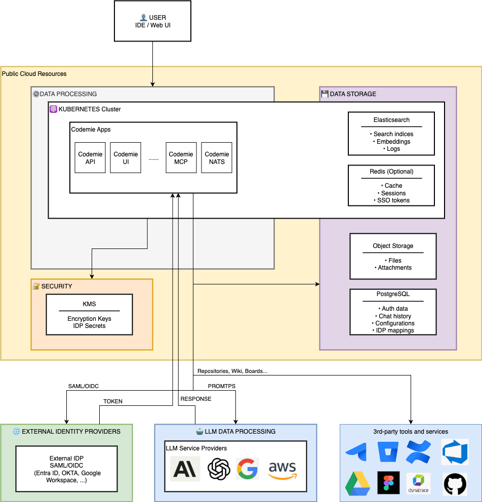

# Codemie Platform - Data Processing & Storage Architecture

## Overview

The Codemie platform is an AI-powered coding assistant that processes user conversations and integrates with external services while maintaining data sovereignty and security through configurable regional deployment.



## Core Principles

**1. Regional Data Isolation**

- All persistent data (PostgreSQL, object storage) resides in a single configurable region (`var.region`)
- In-cluster components (Elasticsearch, Redis, NATS) run within the Kubernetes cluster region
- AI processing occurs in model-specific regions based on LiteLLM configuration
- Encryption keys can be stored in a separate region (`var.kms_region`)

**2. Data Encryption**

- Data at rest: Encrypted using Cloud KMS/AWS KMS (AES-256)
- Data in transit: TLS 1.2+ for all external communications
- Secrets management: OAuth tokens, API keys, and credentials stored in KMS/Secrets Manager

**3. External Data Isolation**

- External service data (Jira, GitHub, etc.) is fetched, indexed, and stored locally
- No direct AI model access to external services - data flows through MCP Connect → Elasticsearch → AI
- External credentials never leave the platform boundaries

## Data Storage Layers

### Persistent Storage (Region: `var.region`)

**PostgreSQL (Cloud SQL / RDS / Azure Database)**

- **Authentication Data**: User credentials, SSO federation mappings, OAuth sessions, role permissions
- **Conversation Data**: Chat history, prompts, AI responses, thread metadata
- **Configuration Data**: Datasource configs, model preferences, system prompts, IDP settings, external service credentials
- **Retention**: Configurable (default: indefinite with backup)
- **Encryption**: KMS-managed keys, SSL/TLS connections required

**Object Storage (GCS / S3 / Azure Blob)**

- **User Files**: Uploaded attachments, documents, images
- **Cached External Data**: Raw data from Jira/GitHub/Confluence (optional)
- **Retention**: Based on customer policy
- **Access**: Service account only, presigned URLs for temporary access

### In-Cluster Storage (Region: K8s cluster)

**Elasticsearch**

- **Knowledge Base Indices**: Document embeddings, code snippets, wiki content
- **External Data Indices**: Jira issues, Confluence pages, GitHub repositories, Google Drive documents
- **Vector Embeddings**: Semantic search vectors (generated by Vertex AI or embeddings models)
- **Retention**: 30-90 days (configurable), rebuilt from source if needed

**Redis**

- **Session Cache**: User sessions, LiteLLM temporary data
- **Rate Limiting**: API throttling, quota tracking
- **External API Responses**: Temporary cache (TTL: 5-60 minutes)
- **Retention**: Ephemeral (lost on restart)

**NATS (Messaging)**

- **Event Streams**: Indexing jobs, webhook events, plugin communication
- **Retention**: In-memory, no persistence (event-driven only)

## Data Processing Flows

### 1. User Authentication Flow

```
User → Keycloak (K8s)
         ↓
    External IDP (Entra/Okta/Google) [SAML/OIDC]
         ↓
    Keycloak validates token
         ↓
    PostgreSQL (store federation mapping)
         ↓
    Return JWT to user
```

**Data Stored:**

- User profile (email, name, roles) in PostgreSQL
- IDP tokens cached temporarily in Redis
- IDP client secrets in KMS

### 2. Chat Conversation Flow

```
User submits prompt → Codemie API
         ↓
    1. Store in PostgreSQL (history)
    2. Search Elasticsearch (context retrieval)
    3. Build prompt + context
         ↓
    LiteLLM Proxy → Vertex AI / Bedrock (external region)
         ↓
    AI Response
         ↓
    Store response in PostgreSQL
         ↓
    Return to user
```

**Data Stored:**

- Prompt: PostgreSQL (region: `var.region`)
- Context snippets: Retrieved from Elasticsearch (not stored again)
- AI Response: PostgreSQL (region: `var.region`)
- Tokens sent to AI: Gemini (`us-central1`), Claude (`us-east5`), or Bedrock (configurable)

:::info Important
Only the final prompt + context is sent to AI models. Raw external data (Jira issues, code) is indexed locally first.
:::

### 3. External Service Integration Flow

```
Admin configures datasource (Jira/GitHub/Confluence)
         ↓
    OAuth token stored in KMS
         ↓
    NATS triggers indexing job
         ↓
    MCP Connect retrieves credentials from KMS
         ↓
    MCP calls external API (REST/GraphQL)
         ↓
    External Service returns data
         ↓
    MCP processes data:
      - Store raw data in Object Storage (optional)
      - Index in Elasticsearch (embeddings)
         ↓
    User queries include external context
```

**Data Stored:**

- **External Service Credentials**: KMS (encrypted)
- **Raw Data**: GCS/S3 (optional cache, region: `var.region`)
- **Indexed Data**: Elasticsearch (searchable, K8s region)
- **Metadata**: PostgreSQL (datasource config, last sync timestamp)

**Supported Services:**

- **Project Management**: Jira, Azure DevOps Boards
- **Documentation**: Confluence, SharePoint, Azure DevOps Wiki
- **Version Control**: GitHub, GitLab, Bitbucket, Azure Repos
- **Cloud Storage**: Google Drive, OneDrive
- **Testing**: Xray (Jira)

## Regional Data Distribution

| Component              | Data Type                | Storage                   | Region             | Encryption                       |
| ---------------------- | ------------------------ | ------------------------- | ------------------ | -------------------------------- |
| **PostgreSQL**         | Auth, Chat, Config       | Cloud SQL/RDS             | `var.region`       | KMS (at rest) + TLS (in transit) |
| **Elasticsearch**      | Knowledge Base, Indices  | K8s Persistent Volume     | K8s cluster region | Disk encryption + TLS            |
| **Object Storage**     | Files, Attachments       | GCS/S3/Azure Blob         | `var.region`       | KMS (server-side)                |
| **Redis**              | Cache, Sessions          | K8s (memory)              | K8s cluster region | None (ephemeral)                 |
| **KMS**                | Encryption Keys, Secrets | Cloud KMS/Secrets Manager | `var.kms_region`   | HSM-backed                       |
| **NATS**               | Events, Messages         | K8s (memory)              | K8s cluster region | TLS (in transit)                 |
| **Vertex AI (Gemini)** | Prompt Processing        | External API              | `us-central1`      | TLS                              |
| **Vertex AI (Claude)** | Prompt Processing        | External API              | `us-east5`         | TLS                              |
| **AWS Bedrock**        | Prompt Processing        | External API              | Configurable       | TLS                              |
| **External IDPs**      | Authentication           | External SaaS             | Customer tenant    | TLS + SAML/OIDC                  |
| **External Services**  | Source Data              | External SaaS/Self-hosted | Customer instance  | TLS + OAuth 2.0                  |

## Data Processing Principles

### AI Model Interaction

- **Input**: User prompt + locally indexed context (from Elasticsearch)
- **Processing**: External AI service (Vertex AI, Bedrock) - data leaves platform boundary
- **Output**: AI-generated response stored in PostgreSQL
- **No Raw External Data**: External service data (Jira issues, code) is indexed locally before AI sees it
- **Embeddings**: Generated by AI models but stored in Elasticsearch (local)

### External Service Data

- **Fetch**: MCP Connect pulls data via OAuth 2.0 authenticated APIs
- **Transform**: Data cleaned, chunked, and prepared for indexing
- **Index**: Elasticsearch stores searchable indices with vector embeddings
- **Cache**: Optional raw data cache in object storage for re-indexing
- **Update**: Scheduled jobs (cron) or webhooks trigger incremental updates

### Authentication & Authorization

- **SSO Federation**: Keycloak acts as SAML/OIDC broker, user data stored locally after federation
- **API Keys**: External service credentials encrypted in KMS, never exposed to users
- **JWT Tokens**: Issued by Keycloak, validated by Codemie API for each request
- **Role-Based Access**: Permissions stored in PostgreSQL, enforced at API layer

## Data Retention & Compliance

| Data Category         | Default Retention        | Configurable | Compliance Notes                 |
| --------------------- | ------------------------ | ------------ | -------------------------------- |
| Chat History          | Indefinite               | Yes          | GDPR right to erasure supported  |
| User Profiles         | Indefinite               | Yes          | Deleted on user account deletion |
| Elasticsearch Indices | 90 days                  | Yes          | Can be rebuilt from sources      |
| Redis Cache           | Ephemeral (TTL: 5-60min) | Yes          | No compliance impact             |
| Object Storage Files  | Indefinite               | Yes          | Customer-controlled lifecycle    |
| PostgreSQL Backups    | 7-30 days                | Yes          | Point-in-time recovery enabled   |
| External Service Data | 30 days (indexed)        | Yes          | Re-synced from source            |
| KMS Keys              | Indefinite               | No           | Key rotation every 90 days       |

## Security & Privacy

**Data Minimization**

- Only necessary data sent to AI models (prompt + relevant context, not entire databases)
- External service credentials scoped to minimum required permissions (read-only)
- User data isolated by tenant/organization (multi-tenant support)

**Audit & Monitoring**

- All API requests logged (CloudWatch/Stackdriver)
- Database query logs enabled (PostgreSQL `log_statement=ddl`)
- External API calls tracked via NATS events
- KMS key usage audited

**Data Sovereignty**

- Infrastructure region (`var.region`) controls data residency for persistent storage
- AI processing regions configurable per model in LiteLLM config
- External IDP/service regions determined by customer's own deployments
- No data replication across regions without explicit configuration

## Example: End-to-End Flow

**Scenario**: User asks "What's the status of JIRA-123?"

1. **User submits question** → Codemie API
2. **API authenticates** user via JWT (validated against Keycloak → PostgreSQL)
3. **API searches** Elasticsearch for "JIRA-123" (indexed data from Jira)
4. **Elasticsearch returns** issue details (title, description, status, comments)
5. **API builds prompt**: User question + Jira issue context
6. **LiteLLM sends** prompt to Vertex AI (`us-central1` or `us-east5`)
7. **Vertex AI processes** and returns response
8. **API stores** conversation in PostgreSQL (prompt, response, timestamp)
9. **Response returned** to user with reference to JIRA-123

**Data Movement:**

- Jira data: External (customer instance) → MCP Connect → Elasticsearch (K8s region)
- Prompt: User → API → PostgreSQL (`var.region`) → Vertex AI (`us-central1`)
- Response: Vertex AI → API → PostgreSQL (`var.region`) → User
- Credentials: KMS (`var.kms_region`) → MCP Connect (ephemeral memory)

## Summary

The Codemie platform follows a **local-first data architecture** where:

- All persistent user data resides in a single configurable region
- External service data is indexed locally before AI processing
- AI models process prompts in their respective regions (`us-central1`, `us-east5`, etc.)
- Encryption keys can be geo-separated from data for compliance
- No raw external data sent to AI without local indexing first
- All external communications use OAuth 2.0/SAML/OIDC with TLS encryption

This architecture supports **data sovereignty**, **GDPR compliance**, and **multi-region AI processing** while maintaining security and performance.

:::tip Data Residency Configuration
Configure the `var.region` and `var.kms_region` variables during deployment to match your organization's data residency and compliance requirements.
:::
