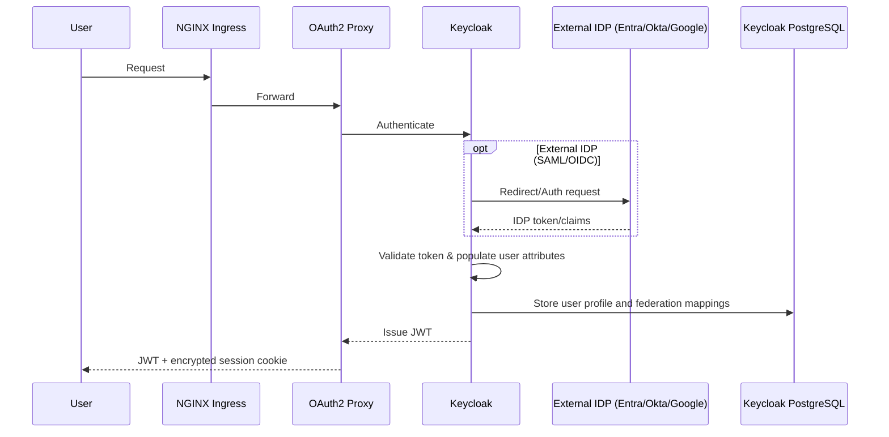
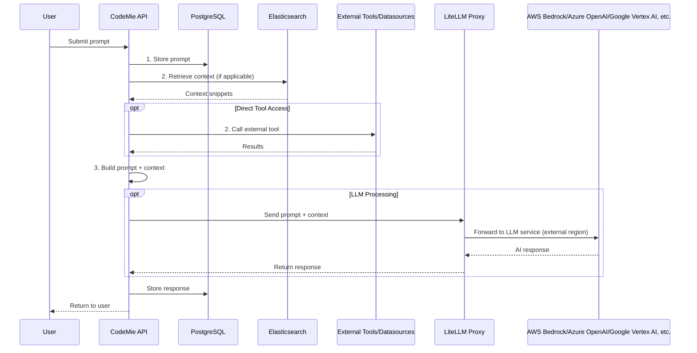
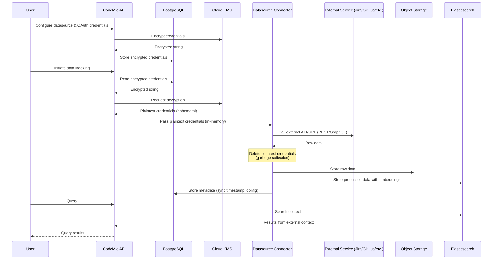
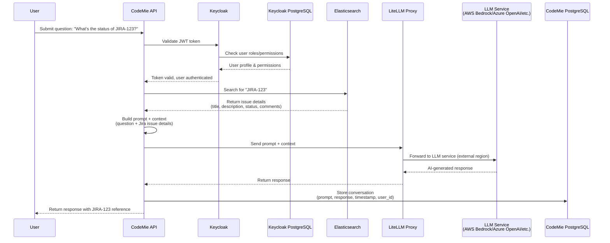

# CodeMie Platform - Data Processing & Storage Architecture

## Overview

The CodeMie platform is an AI-powered coding assistant that processes user conversations and integrates with external services while maintaining data sovereignty and security through configurable regional deployment.

## Core Principles

**1. Regional Data Isolation**

- Persistent storage regions are independently configurable – PostgreSQL (Keycloak), PostgreSQL (CodeMie), Object Storage, and KMS can be deployed in the same region or distributed across different regions based on customer requirements
- In-cluster components (Elasticsearch, NATS, and other in-cluster services) run within the Kubernetes cluster region
- AI processing regions are configurable per LLM provider (AWS Bedrock/Azure OpenAI/Google Vertex AI, etc.) – customers can select specific regions for each model based on compliance and latency requirements
- PostgreSQL (Keycloak) is deployed in the same region as the Kubernetes cluster in default configuration, but can be configured to use an external managed PostgreSQL instance in a different region if required

**2. Data Encryption**

- Data at rest: Encrypted using Cloud KMS (AES-256)
- Data in transit: TLS 1.2+ for all external communications

**3. External Data Isolation**

- External service data (Jira, GitHub, etc.) is fetched via MCP Connect (or datasource); for retrieval-based features it is normalized, embedded, and indexed locally in Elasticsearch
- Some tools can query external data sources directly and return results to chat without indexing
- AI model providers do not train on customer data under their enterprise agreements. Refer to the provider documentation for details:
  - **Azure OpenAI**: [Data Privacy](https://learn.microsoft.com/en-us/azure/ai-foundry/responsible-ai/openai/data-privacy?view=foundry-classic)
  - **AWS Bedrock**: [Service Terms](https://aws.amazon.com/service-terms/) and [Third-Party Models](https://aws.amazon.com/legal/bedrock/third-party-models/)
  - **Google Vertex AI**: [Data Governance](https://docs.cloud.google.com/generative-ai-app-builder/docs/data-governance)
  - **Anthropic Claude**: [Data Training](https://privacy.claude.com/en/articles/7996868-is-my-data-used-for-model-training)
  - **OpenAI**: [Enterprise Data Privacy](https://openai.com/enterprise-privacy/)
  - etc.
- External credentials are never sent to LLMs, and LLM models cannot access them

## Data Storage Layers

### Persistent Storage

**PostgreSQL (Cloud SQL / RDS / Azure Database) – Data Stored**

- **Data Types**:
  - **Authorization Data**: Role permissions, user-role mappings
  - **Conversation Data**: Chat history, prompts, AI responses, thread metadata
  - **Configuration Data**: Datasource configs, model preferences, system prompts, external service credentials (KMS-encrypted strings)
- **Storage & Security**:
  - **Encryption at rest**: Data encrypted with KMS-managed keys (customer-managed HashiCorp Vault can be used)
  - **Encryption in transit**: SSL/TLS connections required

:::info User Authentication Storage
Keycloak uses a dedicated PostgreSQL cluster in Kubernetes that stores SSO federation mappings, IDP client secrets, and local user credentials. When SSO is enabled, user authentication (passwords, MFA) is managed by the external IDP (Entra ID, Okta, Google) rather than stored in Keycloak.
:::

**Object Storage (GCS / S3 / Azure Blob) – Data Stored**

- **Data Types**:
  - **User Files**: Uploaded attachments, documents, images
- **Storage & Security**:
  - **Retention**: Configurable based on customer requirements
  - **Access**: Service account only, no public access
  - **Encryption at rest**: Server-side KMS encryption

### In-Cluster Storage

**Elasticsearch**

- **Vector Embeddings**: Semantic search vectors (generated by embeddings models)
- **Platform Components Logs**: Logs from core platform services (see [Core Components](../deployment/aws/components-deployment/manual-deployment/core-components))

## Data Processing Flows

### 1. User Authentication Flow

**Data Stored:**

- User profile (email, name, roles) in Keycloak PostgreSQL (GKE/AKS/EKS)
- External IDP configuration in Keycloak PostgreSQL (GKE/AKS/EKS)
- OAuth2 Proxy secrets (client-secret, cookie-secret) in K8s Secrets (encrypted at-rest via etcd)
- Session data: Encrypted browser cookie (no server-side storage, TLS 1.2+ in-transit)

:::info OAuth2 Proxy Security
OAuth2 Proxy operates in **stateless mode** using encrypted browser cookies with HTTPS-only transmission and CSRF protection.
:::

### 2. Chat Conversation Flow

**Data Stored:**

- Conversation data: PostgreSQL (Cloud SQL/RDS/Azure Database)
- Context snippets: Retrieved from Elasticsearch (GKE/AKS/EKS)

### 3. External Service Integration Flow

**Data Stored:**

- **External Service Credentials**: PostgreSQL (encrypted string via KMS, plaintext never persisted)
- **User files**: S3/Blob Storage/GCS (KMS-encrypted objects)
- **Indexed Data**: Elasticsearch (GKE/AKS/EKS)
- **Metadata**: PostgreSQL (Cloud SQL/RDS/Azure Database)

:::info Credential Security
External service credentials are stored as KMS-encrypted strings in PostgreSQL. Decryption happens on-demand via Cloud KMS API, and plaintext credentials exist only in memory for the duration of the API call, never persisted to disk.
:::

:::tip Supported Data Sources
For a complete list of supported data source types and configuration details, see [Data Source Overview](../../user-guide/data-source/data-source-overview/index.md#supported-data-source-types).
:::

## Regional Data Distribution

| Component                 | Data Type                | Storage                   | Region                                                 | Encryption                       |
| ------------------------- | ------------------------ | ------------------------- | ------------------------------------------------------ | -------------------------------- |
| **PostgreSQL (Keycloak)** | User auth, SSO mappings  | K8s cluster               | GKE/AKS/EKS Region                                     | StorageClass encryption + TLS    |
| **PostgreSQL (CodeMie)**  | Chat, Config, Roles      | Cloud SQL/RDS/Azure DB    | Cloud SQL/RDS/Azure Database Region                    | KMS (at rest) + TLS (in transit) |
| **Elasticsearch**         | Knowledge Base, Indices  | K8s Persistent Volume     | GKE/AKS/EKS Region                                     | StorageClass encryption + TLS    |
| **Object Storage**        | Files, Attachments       | GCS/S3/Azure Blob         | GCS/S3/Azure Blob Region                               | KMS (server-side)                |
| **KMS**                   | Encryption Keys, Secrets | Cloud KMS/Secrets Manager | KMS Region (configurable)                              | HSM-backed                       |
| **LLM Services**          | Prompt Processing        | External API              | AWS Bedrock/Azure OpenAI/Google Vertex AI, etc. Region | TLS                              |
| **External IDPs**         | Authentication           | External SaaS             | Customer tenant                                        | TLS + SAML/OIDC                  |
| **External Services**     | Source Data              | External SaaS/Self-hosted | Customer instance                                      | TLS + OAuth 2.0                  |

## Data Processing Principles

### AI Model Interaction

- **Input**: User prompt + locally indexed context (from Elasticsearch)
- **Processing**: External AI service (AWS Bedrock/Azure OpenAI/Google Vertex AI, etc.) – data leaves platform boundary
- **Output**: AI-generated response stored in PostgreSQL (Cloud SQL/RDS/Azure DB)
- **External Data Usage**: External service data is indexed locally for retrieval; some tools can access external sources directly when requested
- **Embeddings**: Generated by AI models but stored in Elasticsearch (GKE/AKS/EKS)

### External Service Data

- **Fetch**: Datasource connector pulls data via OAuth 2.0 authenticated APIs
- **Transform**: Data cleaned, chunked, and prepared for indexing
- **Index**: Elasticsearch stores searchable indices with vector embeddings
- **Cache**: Optional raw data cache in object storage

### Authentication & Authorization

- **SSO Federation**: Keycloak acts as SAML/OIDC broker, user data stored locally after federation
- **API Keys**: External service credentials stored in PostgreSQL (Cloud SQL/RDS/Azure DB) as KMS-encrypted strings, never exposed to users
- **JWT Tokens**: Issued by Keycloak, validated by CodeMie API for each request
- **Role-Based Access**: Permissions stored in PostgreSQL, enforced at API layer

## Data Retention & Compliance

| Data Category                       | Default Retention                   | Configurable | Compliance Notes                 |
| ----------------------------------- | ----------------------------------- | ------------ | -------------------------------- |
| Chat History (PostgreSQL CodeMie)   | 30 days                             | Yes          | GDPR right to erasure supported  |
| User Profiles (PostgreSQL Keycloak) | Indefinite                          | Yes          | Deleted on user account deletion |
| Elasticsearch Indices               | Indefinite (90 days if ILM enabled) | Yes          | Can be rebuilt from sources      |
| Object Storage Files                | Indefinite                          | Yes          | Customer-controlled lifecycle    |
| PostgreSQL Backups (Keycloak)       | 7 days                              | Yes          | K8s PGO point-in-time recovery   |
| PostgreSQL Backups (CodeMie)        | 7 days                              | Yes          | Cloud SQL/RDS/Azure DB backups   |
| External Service Data               | Indefinite                          | Yes          | Re-synced from source            |
| KMS Keys                            | Indefinite                          | Yes          | Rotation disabled by default     |

## Security & Privacy

**Data Minimization**

- Only necessary data sent to AI models (prompt + relevant context, not entire databases)
- External service credentials scoped to minimum required permissions
- User data isolated by tenant/organization

**Audit & Monitoring**

Cloud-specific audit logging configurations:

- **Azure**: Log Analytics workspace with Container Insights and Key Vault audit events
- **GCP**: PostgreSQL DDL statement logging, default GKE logging
- **AWS**: Application logs via Fluent Bit to Elasticsearch (CloudWatch and CloudTrail could be configured)

Limitations:

- PostgreSQL connection/disconnection logging could be configured but may impact performance
- KMS key usage auditing could be enabled

**Data Sovereignty**

- **PostgreSQL (Keycloak)**: K8s cluster region – stores SSO federation mappings, local user credentials
- **PostgreSQL (CodeMie)**: Cloud SQL/RDS/Azure Database region – stores chat history, configuration, roles, external service credentials
- **Object Storage**: GCS/S3/Azure Blob region – stores user files and attachments
- **Kubernetes cluster**: GKE/AKS/EKS region – contains Elasticsearch and Keycloak PostgreSQL
- **KMS**: Configurable region (can be separate from data regions) – manages encryption keys
- AI processing regions configurable per model in LiteLLM config (AWS Bedrock/Azure OpenAI/Google Vertex AI, etc.)
- External IDP/service regions determined by customer's own deployments/subscription locations
- No data replication across regions without explicit configuration

## Example: End-to-End Flow

**Scenario**: User asks "What's the status of JIRA-123?"

**Data Movement:**

- Jira data: External → Datasource connector → Elasticsearch (GKE/AKS/EKS region)
- Prompt: User → API → PostgreSQL (Cloud SQL/RDS/Azure DB region) → LLM service
- Response: LLM service → API → PostgreSQL (Cloud SQL/RDS/Azure DB region) → User
- Credentials: KMS (configurable region) → Datasource connector (ephemeral memory)

## Summary

The CodeMie platform follows a **local-first data architecture** where:

- Persistent storage regions are independently configurable – PostgreSQL (Keycloak), PostgreSQL (CodeMie), Object Storage, and KMS can be deployed in the same region or distributed across different regions based on customer requirements
- External service data is indexed locally for retrieval; some tools can access external sources directly when requested
- AI processing regions are configurable per LLM provider (AWS Bedrock/Azure OpenAI/Google Vertex AI, etc.) – customers can select specific regions for each model based on compliance and latency requirements
- Encryption keys can be geo-separated from data for compliance
- External customer services (IDP, data sources) authenticate via OAuth 2.0/SAML/OIDC; cloud infrastructure (databases, storage, LLM services) uses IAM/service accounts; all communications encrypted with TLS 1.2+

This architecture supports **data sovereignty**, **GDPR compliance**, and **multi-region AI processing** while maintaining security and performance.

:::tip Data Residency Configuration
Configure regional settings during deployment to match your organization's data residency and compliance requirements. PostgreSQL (CodeMie), Object Storage, and KMS regions can be set independently from each other and from the Kubernetes cluster region. PostgreSQL (Keycloak) is always deployed in the same region as the Kubernetes cluster.
:::
