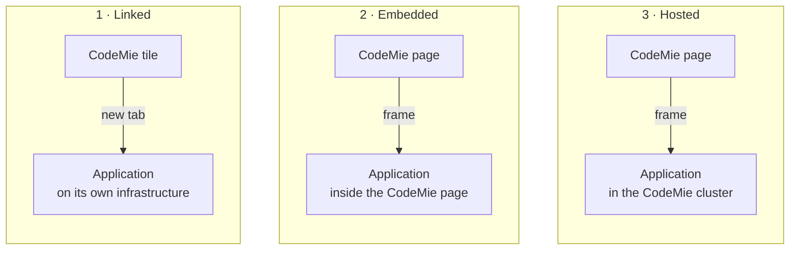
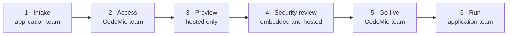

# Applications

The **Applications** tab lists tools that other teams build on top of AI/Run CodeMie. CodeMie can list an application, embed it in the CodeMie page, or host it, and can give it EPAM sign-in, AI models, and the CodeMie platform API. In return, applications shown inside CodeMie or hosted by it run regular security scans.

This page is for project and delivery managers. The engineering details are in the [Integration Guide](./integration-guide.md).

## What CodeMie provides and what the application team provides

| CodeMie provides                                                                                                                      | Application team provides                                                                                                     |
| ------------------------------------------------------------------------------------------------------------------------------------- | ----------------------------------------------------------------------------------------------------------------------------- |
| **A tile in the Applications tab**: application name and icon, visible to every CodeMie user                                          | **A named owner**: a product owner, a support contact, and an escalation path. Users report problems to CodeMie support first |
| **EPAM sign-in**: the same login as CodeMie. Hosted applications need no extra login step                                             | **Access control**: the application decides who can do what. CodeMie shows every tile to every user                           |
| **AI models**: GPT, Claude, and Gemini through one gateway, with per-user cost tracking and budgets                                   | **Regular security scans**: code, dependency, container, and web scans, with no open critical findings                        |
| **CodeMie platform API**: assistants, workflows, indexed project data, and existing Jira, Git, and Confluence connections             | **An automated release pipeline**: builds come from an EPAM repository, never copied by hand                                  |
| **A place in CodeMie assistants**: application features become tools that any CodeMie assistant can call                              | **Protected data**: encrypted, no personal data in logs, secrets kept only in a secret store                                  |
| **Hosting** (by agreement): cluster, CodeMie web address, certificates, secret store, database, preview environment, managed releases | **AI calls through CodeMie**: guardrails, budgets, and cost reporting apply to every user                                     |

## Three levels of integration

Each level adds capabilities and adds requirements. Start at the lowest level that meets the need.

|           | 1 · Linked                         | 2 · Embedded                                                            | 3 · Hosted                                                               |
| --------- | ---------------------------------- | ----------------------------------------------------------------------- | ------------------------------------------------------------------------ |
| User sees | The application opens in a new tab | The application appears inside the CodeMie page                         | The application appears inside the CodeMie page, under a CodeMie address |
| Runs on   | Application team's infrastructure  | Application team's infrastructure                                       | CodeMie's cluster                                                        |
| Sign-in   | The application's own EPAM login   | Must work inside the CodeMie page, which often breaks on another domain | Automatic, shared with CodeMie                                           |
| Effort    | Low                                | Medium                                                                  | High                                                                     |

:::info Plug-in variant
An application can also load as a component inside CodeMie's own page, running with the user's CodeMie session. This variant needs the highest trust and a code review by the CodeMie team before each release.
:::

:::tip Connected at any level
At any level, an application can expose its features as tools that CodeMie assistants call. Users can then work with the application from a chat.
:::

## What each level gets

| Capability                      | 1 · Linked                        | 2 · Embedded                      | 3 · Hosted                                              |
| ------------------------------- | --------------------------------- | --------------------------------- | ------------------------------------------------------- |
| Tile in the Applications tab    | ✅ Yes                            | ✅ Yes                            | ✅ Yes                                                  |
| EPAM sign-in                    | ➖ The application runs the login | ➖ The application runs the login | ✅ Automatic                                            |
| AI models through CodeMie       | ✅ Yes                            | ✅ Yes                            | ✅ Yes                                                  |
| CodeMie platform API            | ✅ From the application server    | ✅ From the application server    | ✅ From the application server                          |
| Tools inside CodeMie assistants | ✅ Yes                            | ✅ Yes                            | ✅ Yes                                                  |
| Web address under CodeMie       | ❌ No                             | ❌ No                             | ✅ `/your-app`                                          |
| Hosting, database, secrets      | ❌ Application team               | ❌ Application team               | ✅ CodeMie cluster                                      |
| Preview environment             | ❌ Application team               | ❌ Application team               | ✅ Included                                             |
| Releases                        | ❌ Application team               | ❌ Application team               | ➖ The team's pipeline builds; the CodeMie team deploys |

✅ provided by CodeMie · ➖ shared work · ❌ not provided

## What CodeMie expects

These requirements apply to **embedded and hosted applications** (levels 2 and 3). Scans run regularly, not only once before go-live.

| Scan            | Tool type | Frequency                                  |
| --------------- | --------- | ------------------------------------------ |
| Code scan       | SAST      | Every release                              |
| Dependency scan | SCA       | Every release and weekly                   |
| Container scan  | Trivy     | Every image, every release and weekly      |
| Web scan        | DAST      | Against the running application, regularly |
| Secret scan     | Secrets   | Every commit                               |

### Embedded and hosted applications

- All scans above run on schedule, with reports shared with the CodeMie team.
- No open Critical or Urgent findings; fixes land before the next release.
- A named owner, support contact, and escalation path.
- Access control inside the application, because every user can see the tile.
- HTTPS and a stable web address.
- No passwords or keys in the tile settings, because every user can read them.
- Sign-in and every screen work inside the CodeMie page.
- The layout fits CodeMie: no second header, no broken styles.
- Plug-in variant: the CodeMie team reviews the code before each release.

### Hosted applications, in addition

- Scans are built into the release pipeline, so an image cannot ship without them.
- Builds come from an EPAM repository through an automated pipeline.
- No credentials in source code or container images.
- Secrets only in CodeMie's secret store; no personal data in logs.
- All AI calls go through CodeMie and are tied to the signed-in user.
- At least one release runs on preview before production.

## Do and don't

| Do                                                                                           | Don't                                                             |
| -------------------------------------------------------------------------------------------- | ----------------------------------------------------------------- |
| Use the shared sign-in, so users move from CodeMie to the application without a second login | Ship container images from personal accounts or copy them by hand |
| Send every release to preview first, then production, through a reviewed change              | Run a release pipeline with tests but no security scanning        |
| Give the application team read-only access to its own logs and status                        | Write access tokens or keys into source code                      |
| Expose application features as tools that assistants can use in chat                         | Use one shared AI key for all users, which hides who spends what  |
| Keep a separate database per application, with passwordless cloud access                     | Ignore which user is signed in                                    |
|                                                                                              | Give every user power-user rights by default                      |

## Onboarding

1. **Intake**: purpose, owner, integration level, users, and the data the application touches.
2. **Access**: sign-in client, CodeMie project, and AI model access.
3. **Preview** (hosted applications): deployed to the preview environment and tested end to end.
4. **Security review** (embedded and hosted applications): scan reports and the checklist reviewed against the requirements above.
5. **Go-live**: the tile is added and CodeMie is restarted. Hosted applications also deploy to production.
6. **Run**: the application team handles incidents and releases, and every release repeats the scans.

:::note
Adding or changing a tile requires a CodeMie configuration change and a restart by the CodeMie team. There is no self-service screen, so agree on a date early.
:::
