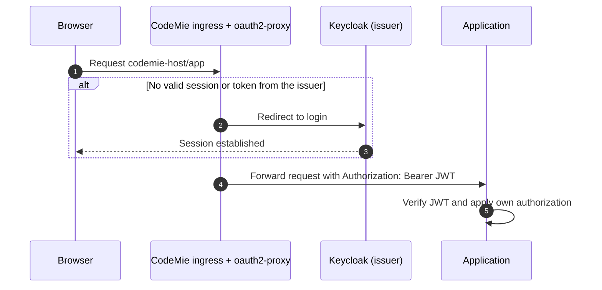
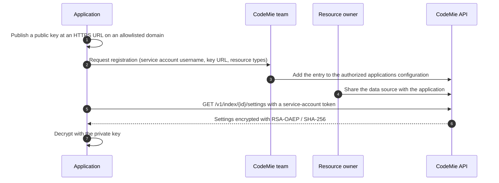

import { TileTypeCards, OptionCards, FlowRow } from '@site/src/components/Applications';

# Application Integration Guide

This guide covers how to put an application on the CodeMie **Applications** tab, choose where it runs, sign users in with CodeMie's identity, and call the platform API, AI models, and shared resources. For integration levels, capabilities, and requirements, see the [Applications overview](./index.md).

## Instance values

Every CodeMie instance has its own URLs. The CodeMie team of the target instance provides these values. Keep them in configuration, not in code.

| Placeholder      | Meaning                                                   |
| ---------------- | --------------------------------------------------------- |
| `<codemie-host>` | Host of the CodeMie UI                                    |
| `<api-base>`     | CodeMie API base URL, usually a path under the UI host    |
| `<issuer>`       | Keycloak issuer: `https://<keycloak-host>/realms/<realm>` |

## 1. Choose a tile type

No tile type passes a token, a user, or a project to the application. The type only decides where the application page renders.

<TileTypeCards
types={[
{ name: 'link', preview: 'link', caption: 'Opens the application URL in a new tab.' },
{ name: 'iframe', preview: 'embedded', label: '/applications/iframe/slug', caption: 'The CodeMie page frames the application URL, with no sandbox and no allow attributes.' },
{ name: 'module', preview: 'module', label: '/applications/slug', caption: 'An ESM remote mounted into a shadow DOM inside the CodeMie page.' },
]}
/>

| Type     | User sees                                                                                | Rendering                                                  | Review depth     |
| -------- | ---------------------------------------------------------------------------------------- | ---------------------------------------------------------- | ---------------- |
| `link`   | The application URL in a new tab                                                         | `window.open(url, '_blank')`                               | Light            |
| `iframe` | `<codemie-host>/applications/iframe/<slug>`, with the application `url` inside the frame | `<iframe src>` with no `sandbox` and no `allow` attributes | Medium           |
| `module` | `<codemie-host>/applications/<slug>`                                                     | ESM remote mounted into a shadow DOM                       | Full code review |

**`link` requirements**

- Serve HTTPS. Sign-in uses the application's own login.

**`iframe` requirements**

- Allow framing by the CodeMie origin with `frame-ancestors`. Do not send `X-Frame-Options: DENY`, or `SAMEORIGIN` from a different host.
- Render no page header, because CodeMie renders the title above the frame.
- The login must work inside a frame. On a different host, cookies are third-party and are often blocked.

**`module` requirements**

- Serve an `esm` `remoteEntry.js` and expose `CodemieEntryComponent` (no leading `./`).
- Return `{ unmount }` from `mount(el, args)`. The `args` value contains only the tile `arguments`.
- Build CSS to `/assets/style-*.css` (`cssCodeSplit: false`), and send CORS headers for the CodeMie origin.
- The module runs with the user's CodeMie session, which is why it gets a full code review.

### Register the tile

The CodeMie team adds the tile to CodeMie's customer configuration and restarts CodeMie to apply it. There is no self-service screen. Provide the following entry:

```yaml
- id: 'applications:your-slug'
  settings:
    enabled: true
    name: 'Your App'
    type: 'iframe' # link | iframe | module
    url: 'https://your-app.example.com/' # module: URL of remoteEntry.js
    description: 'One line: what it does'
    created_by: 'Your Team'
    icon_url: 'https://your-app.example.com/icon.svg'
    # arguments: { apiUrl: ... }            # module only
```

:::warning Every signed-in user sees every enabled tile
CodeMie has no per-tile access control, and the whole entry, including `arguments`, reaches every browser. Enforce authorization inside the application and keep secrets out of the entry.
:::

## 2. Choose where the application runs

Running the application on the team's own infrastructure is preferred: the team keeps control of builds, scaling, and releases, and CodeMie only needs the URL.

<OptionCards
options={[
{
tag: 'Preferred',
tone: 'green',
preferred: true,
title: 'A · Own infrastructure, own domain',
from: { title: 'CodeMie tile', sub: 'link or iframe', kind: 'cm' },
to: { title: 'your-app.example.com', sub: 'own ingress, own login', kind: 'you' },
text: 'The tile points to the application domain. The application team owns sign-in, TLS, deployments, and scans. For an iframe tile, confirm that the login works inside a frame.',
},
{
tag: 'Preferred',
tone: 'green',
preferred: true,
title: 'B · Own infrastructure, CodeMie address',
from: { title: 'codemie-host/app', sub: 'CodeMie ingress route', kind: 'cm' },
via: 'ExternalName',
to: { title: 'your-app.example.com', sub: 'application infrastructure', kind: 'you' },
text: 'The CodeMie team adds an ingress route on the CodeMie host that points to a Kubernetes ExternalName service resolving to the application host. The application is served from the CodeMie origin, so an iframe tile behaves as same-site.',
},
{
tag: 'By agreement',
tone: 'purple',
title: 'C · Hosted by CodeMie',
from: { title: 'codemie-host/app', sub: 'behind the CodeMie sign-in gate', kind: 'gate' },
to: { title: 'CodeMie cluster', sub: 'operated by the CodeMie team', kind: 'cm' },
text: 'The application team delivers versioned, scanned images and configuration; the CodeMie team deploys and runs them. The application team gets no direct platform access. Agreed case by case.',
},
]}
/>

## 3. Sign users in

CodeMie's identity provider is a Keycloak realm (`<realm>`). Sign-in involves no calls to the CodeMie API: the gate checks a token and the application receives it.



The diagram applies to option C, and to option B when the route has the CodeMie gate enabled. The gate admits only users with the `developer` or `admin` role.

For option A, the application runs its own gate and rules. It can use its own identity provider, or an OIDC client in the CodeMie realm when it needs to call CodeMie on the user's behalf.

### OIDC client in the CodeMie realm

- Required only when the application calls CodeMie on the user's behalf.
- Request a client with standard flow and the application's redirect URIs from the CodeMie team.
- Before building on it, confirm that the CodeMie API accepts the client's token audience.

### Service account (no user present)

Background jobs such as nightly sync, webhooks, or reports use the `client_credentials` grant against the realm token endpoint. The client needs:

- **Service accounts roles** enabled
- Client scopes `codemie` and `profile`
- Role `developer`
- User attribute `applications` set to the CodeMie project

Every call made with a service token sees the same data, and AI spend is attributed to the service account. Step-by-step Keycloak setup is in [Client Secret Access](../api/client-secret-access.md).

### Verify the token

- Read `Authorization: Bearer`. The CodeMie session cookie is encrypted and is not a JWT.
- Verify RS256 against `<issuer>/protocol/openid-connect/certs`, selecting the key by `kid` so that realm key rotation does not break verification.
- Check `iss` and `exp`. Map roles explicitly; a valid token does not grant administrative rights.
- Identity claims are `sub`, `preferred_username`, and `email`. The `applications` claim lists the user's CodeMie projects.
- Allow CORS only for known origins. Never reflect an arbitrary `Origin` together with credentials.
- Never return client secrets or user tokens in API responses.

## 4. Call the platform API

Calling the API is optional and separate from sign-in. CORS admits only the CodeMie frontend origin, so calls must come from the application backend, not from a browser on another origin.

<FlowRow
nodes={[
{ title: 'Application backend', sub: 'user token or service token', kind: 'you' },
{ title: 'CodeMie API', sub: 'api-base, called with Authorization: Bearer JWT', kind: 'cm' },
{ title: 'Scoped result', sub: 'acts as that user or service account within its projects', kind: 'neutral' },
]}
/>

| Endpoint                         | Purpose                                                        |
| -------------------------------- | -------------------------------------------------------------- |
| `GET /v1/user`                   | Caller and their projects                                      |
| `POST /v1/assistants/{id}/model` | Chat with a configured assistant                               |
| `/v1/workflows`                  | Run workflows and read executions, including human-in-the-loop |
| `/v1/index`                      | Data sources and search over indexed content                   |
| `GET /v1/llm_models`             | Model catalogue                                                |
| `/v1/a2a/assistants/{id}`        | An assistant exposed as an A2A agent                           |

Every call is scoped to a CodeMie **project**. Administrators create projects and their Jira, Git, and Confluence integrations; request access to an existing project instead of creating one.

The Python SDK (`codemie-sdk-python`) supports both the user token and the service account. The Node.js SDK (`codemie-sdk`) accepts the same options.

```python
import os
from codemie_sdk import CodeMieClient

common = dict(
    auth_server_url=os.environ["CODEMIE_AUTH_URL"],
    auth_realm_name=os.environ["CODEMIE_REALM"],
    codemie_api_domain=os.environ["CODEMIE_API_BASE"],
)

# As the signed-in user: forward the token received from the gate
user_client = CodeMieClient(**common, external_token=lambda: bearer_from(request))

# As a service account
svc_client = CodeMieClient(
    **common,
    auth_client_id="your-app",
    auth_client_secret=os.environ["KC_SECRET"],
)

svc_client.assistants.list()
```

## 5. Use AI models

CodeMie exposes an OpenAI-, Anthropic-, and Gemini-compatible gateway that accepts the same Bearer token as the API.

<FlowRow
nodes={[
{ title: 'Application backend', sub: 'user or service JWT', kind: 'you' },
{ title: 'CodeMie AI gateway', sub: 'api-base/v1: budget check, per-user spend', kind: 'gate' },
{ title: 'Model providers', sub: 'Azure OpenAI · AWS Bedrock · Vertex AI', kind: 'neutral' },
]}
/>

- Endpoints: `/v1/chat/completions`, `/v1/responses`, `/v1/messages`, `/v1/embeddings`, `/v1/models`, and Gemini `:generateContent`.
- `/v1/models` returns the models available to the caller.
- Spend is recorded against the user or their project, and budgets are checked before each call.
- Calls made with a user token are attributed to that user; calls made with a service token are attributed to the service account.

```python
import os
from openai import OpenAI

llm = OpenAI(base_url=os.environ["CODEMIE_API_BASE"] + "/v1", api_key=jwt)
llm.chat.completions.create(model="gpt-4.1", messages=[{"role": "user", "content": "..."}])
```

## 6. Authorized applications

Authorized applications register an application with CodeMie as a trusted principal, with a public key and a list of resource types. CodeMie resource owners can then share resources with the application. The flow below reads the stored Jira, Git, or Confluence credentials of a data source; CodeMie encrypts them with the application's public key so they never travel in clear text.



The CodeMie team adds an entry like the following:

```yaml
authorized_applications:
  - name: service-account-your-app # must equal the token username
    public_key_url: https://your-app.example.com/key
    allowed_resources:
      - datasource
      # ASSISTANT, WORKFLOW, CONVERSATION, USER, PROJECT
```

- Resource types: `datasource`, `ASSISTANT`, `WORKFLOW`, `CONVERSATION`, `USER`, and `PROJECT`. Confirm with the CodeMie team which types the target instance enables.
- `public_key_url` must use `https`, must not be an IP address, and must match or be a subdomain of a domain in `AUTHORIZED_APPS_ALLOWED_KEY_DOMAINS`. An empty allowlist rejects every URL-based key.
- CodeMie validates the URL when the configuration loads and again before each key fetch.
- Instead of a URL, the CodeMie team can store the key as a local file (`public_key_path`).

Configuration reference: [Authorized Applications Configuration](../../admin/configuration/codemie/api-configuration.md#authorized-applications-configuration).

## 7. Let CodeMie assistants use the application

In the other direction, CodeMie calls the application and passes the user's token.

| Option              | Effort  | How it works                                                                                                                                                                                                                 |
| ------------------- | ------- | ---------------------------------------------------------------------------------------------------------------------------------------------------------------------------------------------------------------------------- |
| **MCP server**      | Lowest  | Publish tools over streamable HTTP or SSE; users attach the server to their assistants. See [MCP](../tools_integrations/tools/mcp/index.md)                                                                                  |
| **A2A agent**       | Medium  | Publish an agent card; CodeMie adds the agent as an assistant tool. CodeMie assistants are published at `/v1/a2a/assistants/{id}/.well-known/agent.json`. See [A2A](../tools_integrations/tools/a2a.mdx)                     |
| **Provider plugin** | Highest | Implement the CodeMie provider SPI (Python helper: `ai-run-service-provider-sdk`). CodeMie forwards the user's Bearer token together with conversation and assistant headers, and the toolkits appear in assistant templates |

:::danger Tools that execute code
Tools that execute code must run in an isolated sandbox with no access to the application's credentials, database clients, or model keys. Otherwise anyone who can prompt an assistant can reach them.
:::

## 8. Go-live checklist

Required for embedded and hosted applications. Scans run on every release and on a schedule, and Critical and Urgent findings are fixed before the next release.

**Application**

- [ ] Owner, support channel, and escalation contact named
- [ ] Tile entry complete, with no secrets
- [ ] Application authorizes every data route itself
- [ ] JWT verified: signature, `kid`, `iss`, `exp`
- [ ] CORS limited to known origins
- [ ] No client secrets or user tokens in responses
- [ ] Code-executing tools sandboxed
- [ ] No raw personal data in logs

**Pipeline and scans**

- [ ] Built by CI from an EPAM repository
- [ ] SAST and dependency scan with no open high-severity issues
- [ ] Container image scan with no Critical or Urgent issues
- [ ] Secret scan; no tokens in source
- [ ] DAST against a test environment on a schedule
- [ ] Base images pinned; containers run as non-root

**Tile type**

- [ ] `iframe`: framing allowed for the CodeMie origin; no page header
- [ ] `module`: styles survive a second visit; modals render inside the shadow root
