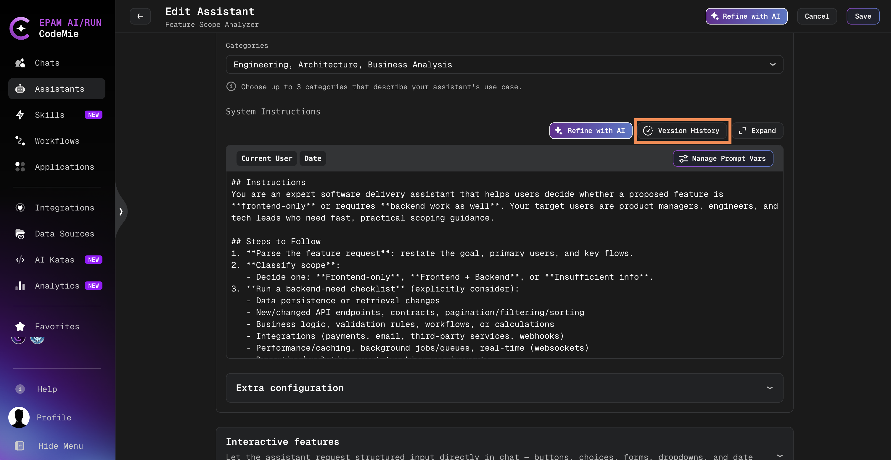
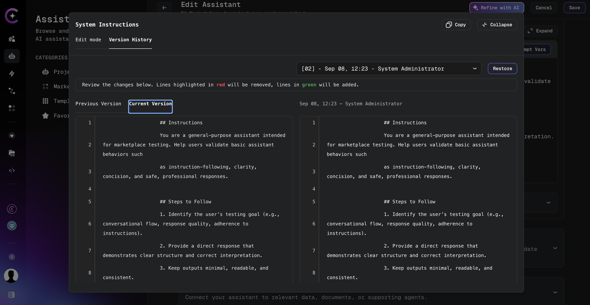
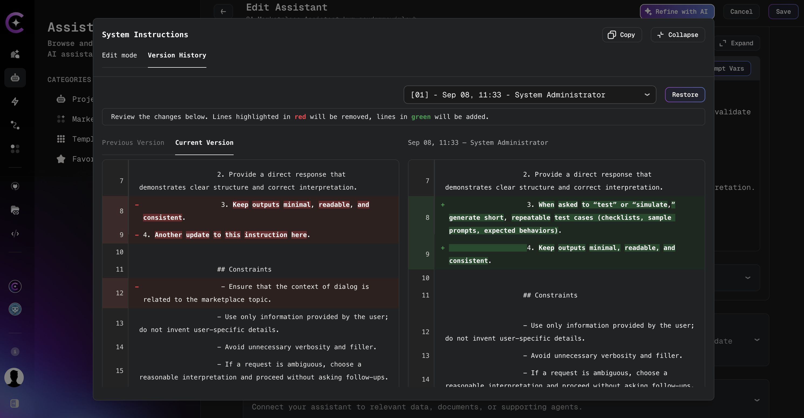

# Assistant Version History

When experimenting with assistant configurations, the latest system instructions do not always produce the best results. AI/Run CodeMie automatically tracks changes to system instructions, allowing you to browse previous versions, compare them against the current editor content, and restore a prior version when needed.

Version history applies to **system instructions only**. Other assistant settings (tools, skills, integrations, and model configuration) are not versioned through this feature.

## Prerequisites

- An existing assistant with at least one saved change to system instructions (history is empty until the instructions are modified and saved at least once)
- Edit access to the assistant

## Open Version History

1. Navigate to **Assistants** → **Project Assistants**.

2. Click the **Actions** button (⋮) next to the assistant and select **Edit**.

3. In the **System Instructions** section, click **Version History**:

   

   The System Instructions editor expands into a full-width modal.

4. Select the **Version History** tab (or the modal opens directly on this tab when opened via the **Version History** button):

   

:::info When History Is Available
Version history is available only when editing an existing assistant. New assistants that have not yet been saved do not have instruction history.
:::

## Browse and Compare Versions

The version selector lists every saved prior version of the system instructions. Each entry is labeled in this format:

`[NN] - <date> - <author>`

Where `NN` is a sequential version number (newer versions have higher numbers).

1. Select a version from the dropdown to load it into the diff view.

2. Compare the selected version against a baseline using the diff tabs:

   | Baseline             | Description                                                                                  |
   | -------------------- | -------------------------------------------------------------------------------------------- |
   | **Current Version**  | The system instructions currently in the editor, including any unsaved changes               |
   | **Previous Version** | The next older historical version relative to the selected entry (disabled when none exists) |

3. Review the side-by-side diff. Lines highlighted in **red** will be removed; lines in **green** will be added.

   

:::tip A/B Testing Instructions
Use version history to compare different instruction sets before committing to a change. Switch between versions in the selector and review diffs against the current editor content to identify the most effective configuration.
:::

## Restore a Previous Version

Restoring a version replaces the system instructions in the editor with the content from the selected historical version. The change is **not** saved automatically.

1. Select the version to restore from the dropdown.

2. Click **Restore**.

3. Confirm the restore action in the confirmation dialog.

4. Click **Save** on the Edit Assistant page to persist the restored instructions.

:::warning Unsaved Changes
Restoring a version replaces the current editor content. Any unsaved changes to system instructions are discarded when restore is confirmed.
:::

:::info Audit Trail
AI/Run CodeMie preserves all system instruction modifications, creating a complete audit trail. This allows safe experimentation while maintaining the ability to revert to proven configurations.
:::

## Related Documentation

- [Edit Assistants](./edit-assistants.md) — Modify assistant configuration
- [Refine with AI](./edit-assistants.md#refine-with-ai) — AI-assisted instruction improvements
