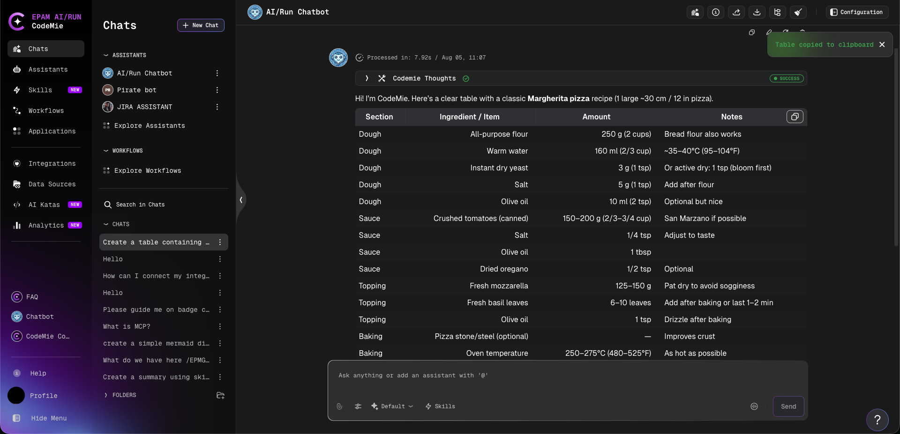

# Copy Table to Clipboard

When an assistant response includes a markdown table, a **Copy** button appears in the top-right corner of the table. Clicking the button copies the full table content to the clipboard as plain text, regardless of table size or scroll position.

A **"Table copied to clipboard"** confirmation message appears briefly after the copy is complete.

This makes it easy to reuse structured data from assistant responses — for example, pasting a table into a spreadsheet, document, or another tool without requiring manual text selection.

