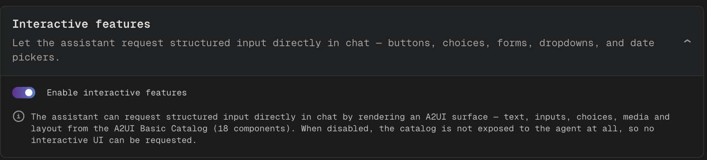
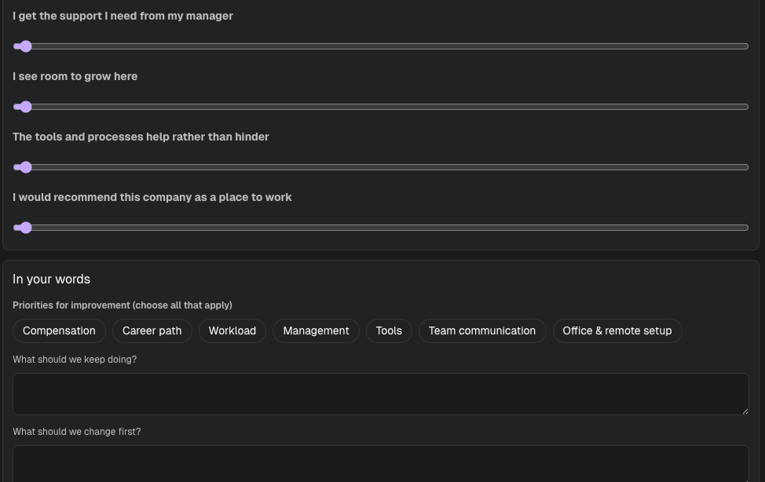

# Interactive Chat Elements

An assistant with interactive features enabled can ask for input by rendering a small interface
inside its chat message — buttons, choices, dropdowns, short forms, sliders and date pickers —
instead of describing the question in prose and parsing a free-text reply.

The answer returns to the assistant as structured data, so the values arrive already separated into
named fields rather than needing to be extracted from a sentence.

:::info Built on A2UI
This feature is an implementation of [A2UI](https://a2ui.org/introduction/what-is-a2ui/), an open
protocol for agents that describe user interfaces instead of returning plain text. CodeMie
implements protocol version **0.9.1** and renders the standard
[Basic Catalog](https://a2ui.org/specification/v0.9.1-basic-catalog-implementation-guide/) of
components — so the element vocabulary and its behavior come from the specification rather than
from CodeMie. The full protocol reference is the
[A2UI v0.9.1 specification](https://a2ui.org/specification/v0.9.1-a2ui/).
:::

## When interactive elements help

Interactive elements suit questions with a bounded set of answers:

- An explicit decision or approval before the assistant proceeds.
- A selection from a known list of options.
- A short set of related fields collected in one step, such as a request form.

They are a poor fit for open-ended input. A description, a block of code, or anything the assistant
cannot enumerate in advance is better asked for as plain text.

## Enabling interactive features

:::info Prerequisite
The **Interactive features** block appears only when the platform-level
`features:interactiveElements` flag is enabled for the deployment. If the block is missing from the
assistant form, see
[Customer Feature Configuration](../../admin/configuration/codemie/customer-feature-configuration.md).
:::

1. Open the assistant for editing — see [Create an Assistant](./create-assistant.md).
2. Expand the **Interactive features** block.
3. Turn on **Enable interactive features**.
4. Save the assistant.



While the switch is off, the element catalog is not exposed to the assistant at all, so no
interactive interface can be requested — regardless of how the system instructions are written.

## Instructing the assistant

The switch grants the capability; it does not decide when the capability is used. The assistant
receives a tool named `request_user_input`, described to it as a way to show interactive UI and wait
for a structured response, and chooses whether to call it.

Assistants that should prefer forms over prose need to be told so in the system instructions. An
instruction of this shape is usually enough:

```text
When information is needed from the user and the possible answers are known in advance,
ask for it with an interactive form rather than in prose. Use a single form for related
fields, and offer a submit action.
```

Two consequences of how the tool works are worth knowing while writing instructions:

- **The turn ends when the form is shown.** The assistant stops and waits; the answer arrives as
  the next message in the conversation. An assistant instructed to show a form and then continue
  reasoning in the same turn cannot do both.
- **One message can carry more than one form.** Each is tracked separately, so answering the second
  form does not disturb the first.

## What appears in chat

The form renders inside the assistant's message, and the reply is recorded as a separate turn in the
conversation, the same way a typed message would be. A single form can mix element types — the
example below combines rating sliders, a multiple-choice group, and free-text fields:



Behavior worth anticipating when reading a conversation:

| Situation                           | Result                                                                       |
| ----------------------------------- | ---------------------------------------------------------------------------- |
| A required field is empty on submit | Submission is refused with a prompt to complete the required fields          |
| The form has been answered          | It becomes read-only, and the recorded answer stays visible                  |
| An answered form is edited          | **Edit** on the message unlocks it; the new answer replaces the previous one |
| The assistant is still generating   | No form accepts input until generation finishes                              |
| An older message in the history     | Only the most recent unanswered form accepts input                           |
| A shared or read-only chat          | Forms render but accept no input                                             |

Because a re-answer replaces the earlier response rather than appending to it, a corrected answer
leaves one answer in the conversation, not two.

## Available elements

Interactive elements are drawn from the
[A2UI v0.9 Basic Catalog](https://a2ui.org/specification/v0.9.1-basic-catalog-implementation-guide/).
All 18 components of the catalog are rendered:

| Group  | Components                                                                   |
| ------ | ---------------------------------------------------------------------------- |
| Layout | `Card`, `Column`, `Row`, `Divider`, `List`, `Tabs`, `Modal`                  |
| Text   | `Text`, `Icon`                                                               |
| Input  | `Button`, `CheckBox`, `ChoicePicker`, `DateTimeInput`, `Slider`, `TextField` |
| Media  | `AudioPlayer`, `Image`, `Video`                                              |

Which of these an assistant may use can be narrowed per deployment through the optional catalog
override described in
[Customer Feature Configuration](../../admin/configuration/codemie/customer-feature-configuration.md).
Narrowing the catalog only restricts already-registered components; it cannot introduce new ones.

## Media in interactive elements

Images, video and audio inside an interactive element are not loaded automatically. A control naming
the source host is shown instead, and the request is made only after it is clicked.

This is deliberate. The content of an interactive element is authored by the assistant, and a media
URL is a request the browser would otherwise make unprompted, from the reader's own network. If the
URL fails validation, a placeholder is rendered and no request is made at all.

## Limitations

- Showing a form ends the assistant's turn.
- Element types are fixed by the catalog. New types require a platform change, not a configuration
  change.
- Clients that cannot render interactive elements receive no form. The assistant falls back to
  asking for the same information as plain text, so the conversation still works, just without the
  interface.

## Troubleshooting

| Symptom                                                   | Cause                                                     | Resolution                                                                 |
| --------------------------------------------------------- | --------------------------------------------------------- | -------------------------------------------------------------------------- |
| **Interactive features** block missing from the assistant | Platform flag disabled                                    | Ask an administrator to enable `features:interactiveElements`              |
| Assistant asks in prose although the switch is on         | The chat client cannot render interactive elements        | Reload the chat; a tab left open across an upgrade is the usual cause      |
| Assistant asks in prose in one assistant but not another  | The per-assistant switch is off                           | Enable **Interactive features** on that assistant                          |
| A message reads that an element could not be displayed    | The element falls outside the catalog this client renders | Report the assistant; its instructions request an unsupported element type |
| A form refuses to submit                                  | A required field is empty                                 | Complete the highlighted fields                                            |
| A form accepts no input                                   | It has already been answered                              | Use **Edit** on the message to re-answer it                                |

## Related documentation

- [Create an Assistant](./create-assistant.md)
- [Chat Input Settings](./chat-input-settings.md)
- [Customer Feature Configuration](../../admin/configuration/codemie/customer-feature-configuration.md)

External, for the protocol itself:

- [What is A2UI](https://a2ui.org/introduction/what-is-a2ui/) — protocol overview
- [A2UI v0.9.1 specification](https://a2ui.org/specification/v0.9.1-a2ui/) — the version implemented here
- [Basic Catalog implementation guide](https://a2ui.org/specification/v0.9.1-basic-catalog-implementation-guide/) — the component vocabulary
- [a2ui-project/a2ui](https://github.com/a2ui-project/a2ui) — protocol repository
