# Publish to Marketplace

Share your custom assistants with the AI/Run CodeMie community by publishing them to the Marketplace. Follow the publishing process to ensure your assistant is properly configured and secure.

:::info Marketplace review
When Marketplace management is enabled, every assistant published to the Marketplace passes automated quality checks and a manual review by a platform administrator before it becomes visible to other users. Marketplace management is enabled by default and can be disabled only with the `features:marketplaceManagement` feature flag in the backend YAML configuration — it cannot be switched on or off in the UI. When it is disabled, the review statuses, re-validation on edit, and Force-Publish described on this page are not available.
:::

## Publishing Process

1. Create and configure your assistant in the **Project Assistants** section.

2. On the assistant card, open the actions menu (**⋮**) and select **Publish to Marketplace**:

   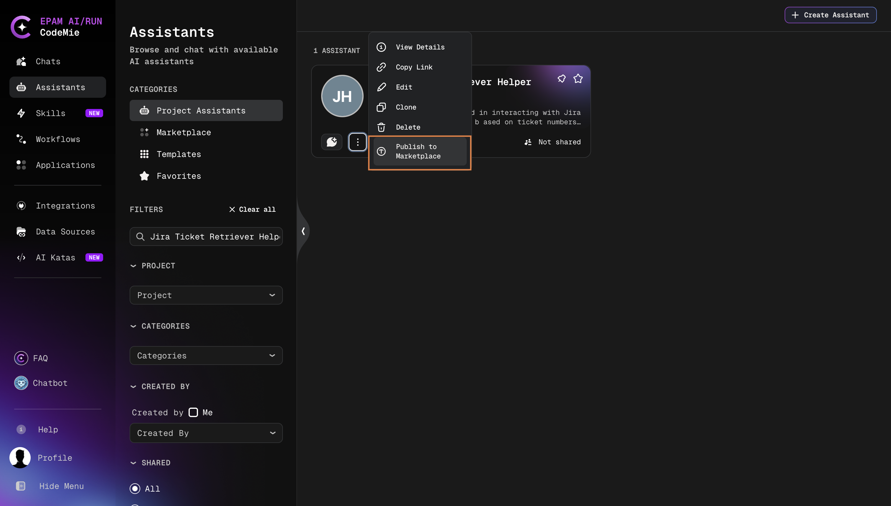

3. Review credentials, prompt variables, and categories as described in [Credential Policies](#credential-policies) and [Select Categories](#select-categories).

4. The system validates the assistant configuration against the Marketplace quality checks:

   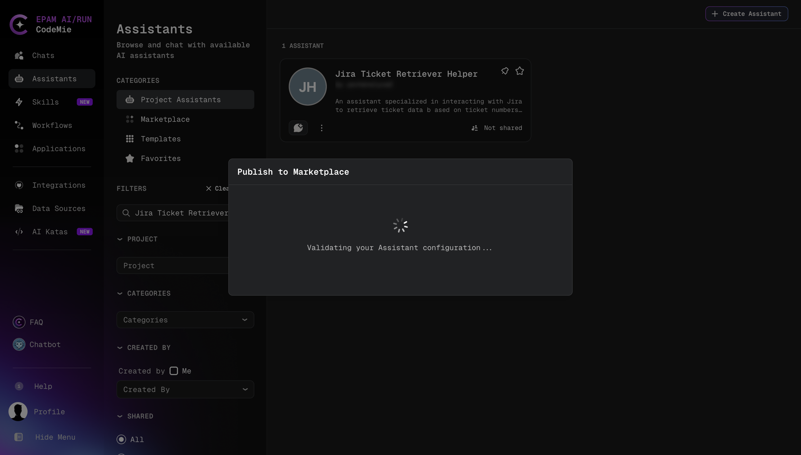

5. If the assistant passes the checks, it is sent for manual review. The **Sent for review** dialog confirms that the assistant is pending approval and will not be visible in the Marketplace until an administrator approves it:

   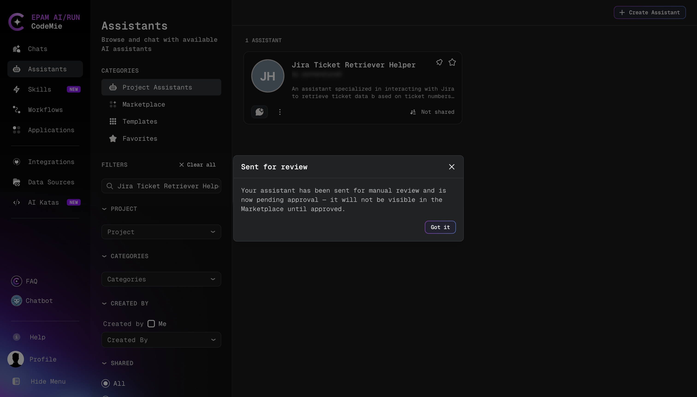

   If any check fails, the **Assistant Quality Validation Failed** dialog lists the issues to fix. See [Validation Checks](#validation-checks).

6. Track the review result by the status badge on the assistant card. See [Review Statuses](#review-statuses).

## Credential Policies

### Personal/Project Credential Detection

Before publishing, the system checks for sensitive credentials:

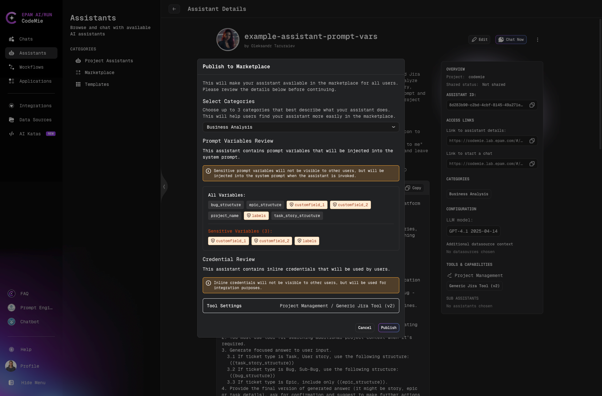

- If your assistant uses personal or project-specific credentials, a warning modal will appear
- The modal guides you through the process and prevents accidental credential exposure
- You must review and confirm before proceeding with publication

:::warning Credential Security
Always review credential warnings carefully. Publishing assistants with personal credentials may expose sensitive information to other users.
:::

### Prompt Variables Review

When publishing an assistant with prompt variables, the system displays a **Prompt Variables Review** section showing how variables will be handled:

**Variable Display:**

- **All Variables**: Lists all prompt variables used in the assistant's system instructions
- **Sensitive Variables**: Displays sensitive variables separately with count (e.g., "Sensitive Variables (3):")
  - Sensitive variables are marked with orange tags
  - These variables are displayed as button-style tags with capitalized names

**Security Notice:**

The system displays an important warning:

:::info
Sensitive prompt variables will not be visible to other users, but will be injected into the system prompt when the assistant is invoked.
:::

This ensures that:

- Users who clone your assistant from the marketplace will see placeholders for sensitive variables
- Sensitive variable values remain encrypted and hidden
- Users will need to provide their own values for sensitive variables when using the assistant
- The assistant functionality is preserved while protecting confidential information

## Select Categories

Choose up to **3 relevant categories** to help users discover your assistant:

| Category                      | Description                                                                       |
| ----------------------------- | --------------------------------------------------------------------------------- |
| **Migration & Modernization** | Cloud migrations, application modernization, legacy system updates                |
| **Support**                   | Chatbots, virtual help desks, FAQ systems, customer support automation            |
| **Business Analysis**         | Analyzing business needs and gathering requirements                               |
| **Product Management**        | Product roadmaps, lifecycle management, prioritization, stakeholder collaboration |
| **Data Analytics**            | Data analysis, visualization, actionable insights from raw data                   |
| **Engineering**               | Developer support, full-stack engineering, software engineering workflows         |
| **Quality Assurance**         | Testing, software reliability, automating QA processes                            |
| **DevOps**                    | Cloud systems, networking, infrastructure, DevOps workflows                       |
| **Security**                  | System security, vulnerability assessment, security automation                    |
| **Compliance**                | Regulatory compliance, automating auditing processes                              |
| **Project Management**        | Planning, tracking, project and task management                                   |
| **Customer Experience**       | Customer satisfaction, ticket routing, surveys, interaction automation            |
| **Monitoring & Alerts**       | System health monitoring, alert generation, proactive issue detection             |
| **UI/UX Design**              | Prototyping, wireframing, user experience research analysis                       |
| **Knowledge Management**      | Organizational knowledge, documentation, information retrieval                    |
| **Training**                  | Onboarding, employee training, internal knowledge sharing                         |
| **Architecture**              | Scalable and reliable technical architecture design                               |
| **Presales**                  | Client interactions, proposal generation, solution demonstrations                 |

:::info Category Management
Users with the [isAdmin](/user-guide/getting-started/glossary.md#jwt-attributes) permissions can create, edit, and delete categories. Learn more in [Assistant Categories Management](./assistant-categories-management.md).
:::

## Integration Requirements

- When publishing, your user integrations will be made available alongside the assistant
- If no suitable integrations are selected, you can set default integration fields
- The warning modal will not appear if no user credentials are selected

:::info Integration Sharing
Be mindful that publishing shares your integration configurations. Review integration settings before publishing.
:::

## Validation Checks

Before an assistant is submitted for review, the system analyzes its configuration. If any check fails, the results appear in the **Analysis Summary** section of the validation dialog. Each finding names the affected field (for example, **Name** or **Description**) and includes a recommendation on how to fix it.

When publishing an assistant, the findings are shown in the **Assistant Quality Validation Failed** dialog:

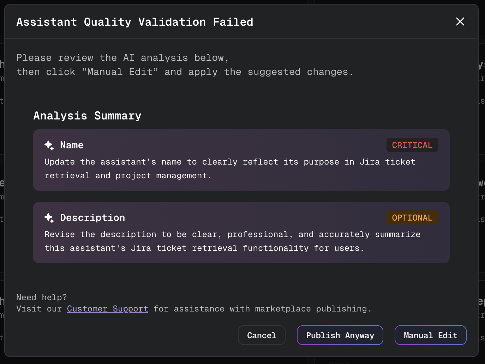

- **Manual Edit**: open the assistant editor to apply the suggested changes.
- **Cancel**: close the dialog without publishing.
- **Publish Anyway**: publish the assistant despite the findings. Available only to platform administrators and maintainers. See [Force-Publish for Administrators](#force-publish-for-administrators).

Regular users see the same dialog without the **Publish Anyway** button.

Findings have one of two severity levels:

| Severity     | Effect                                                                                         |
| ------------ | ---------------------------------------------------------------------------------------------- |
| **CRITICAL** | Blocks submission. The issue must be fixed before the assistant can be sent for review.        |
| **OPTIONAL** | Recommendation only. Fixing it improves the assistant's quality but does not block submission. |

The following checks are applied to every assistant:

| Check                             | Severity | Rule (default values)                                                                                                        |
| --------------------------------- | -------- | ---------------------------------------------------------------------------------------------------------------------------- |
| **Name length**                   | CRITICAL | The name must be 5–60 characters long.                                                                                       |
| **Name not generic**              | CRITICAL | The name must not be a generic name such as "assistant", "bot", "test", "demo", or "untitled".                               |
| **Description length**            | CRITICAL | The description must be at least 100 characters long.                                                                        |
| **Description differs from name** | OPTIONAL | The description must not repeat the name.                                                                                    |
| **System prompt length**          | CRITICAL | The system prompt must be at least 200 characters long.                                                                      |
| **Category**                      | CRITICAL | At least one category must be assigned.                                                                                      |
| **Substance**                     | CRITICAL | The assistant must have at least one tool, MCP server, skill, or data source, or a system prompt of at least 500 characters. |
| **No inline credentials**         | CRITICAL | The system prompt and context must not contain credentials such as AWS keys, GitHub tokens, or Bearer tokens.                |

In addition, the assistant is compared with assistants already published in the Marketplace. The similarity score ranges from 0 to 1:

| Similarity score (default) | Severity | Effect                                                                    |
| -------------------------- | -------- | ------------------------------------------------------------------------- |
| **0.70 or higher**         | CRITICAL | The assistant is treated as a near-duplicate of a published assistant.    |
| **0.55 or higher**         | OPTIONAL | The overlap is flagged for the reviewer but does not block the assistant. |

An AI-based quality analysis also reviews the configuration and suggests improvements, for example a clearer name or description.

:::note
Platform administrators can change the default thresholds on the **Config** tab of [Marketplace Management](../../admin/configuration/codemie/marketplace-management.mdx#configuration), so the exact limits depend on the deployment.
:::

## Review Statuses

After an assistant is submitted, a status badge next to the author name on the assistant card shows where it is in the review process. Assistants that were never submitted to the Marketplace show no badge.

| Status       | Meaning                                                                                                                             |
| ------------ | ----------------------------------------------------------------------------------------------------------------------------------- |
| **REVIEW**   | The assistant passed the automated checks and is waiting for an administrator's decision. It is not visible in the Marketplace yet. |
| **VERIFIED** | An administrator approved the assistant. It is published and visible to all users in the Marketplace.                               |
| **REJECTED** | An administrator rejected the assistant. The assistant is not published.                                                            |

**Pending review:**

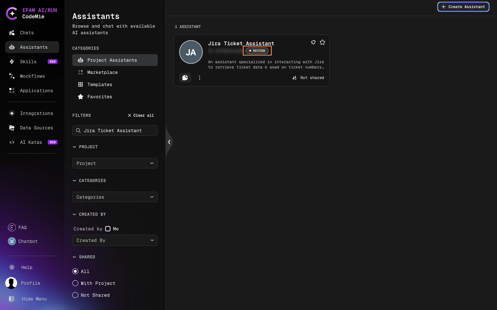

**Verified:** the **✓ VERIFIED** badge is also displayed on the assistant card in the Marketplace and in the assistant details header, so users can distinguish reviewed assistants.

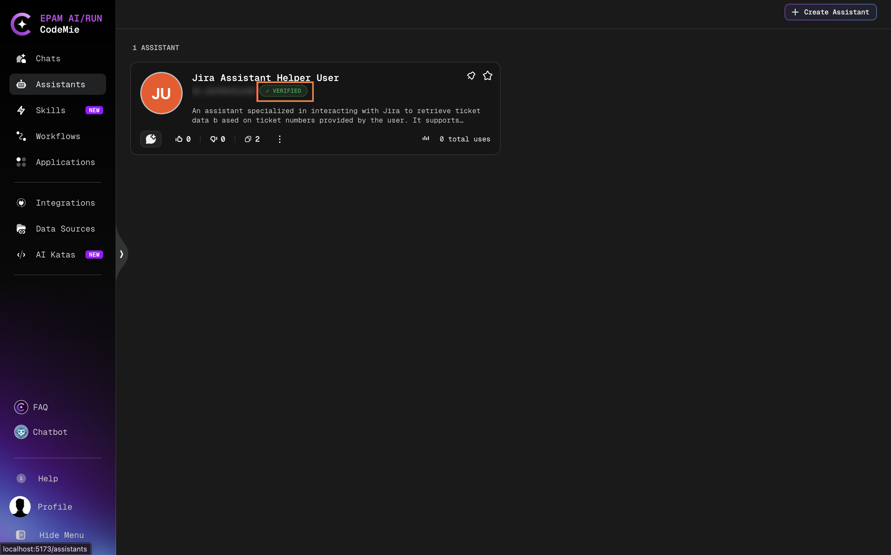

**Rejected:** hover over the **REJECTED** badge to see the reason provided by the administrator.

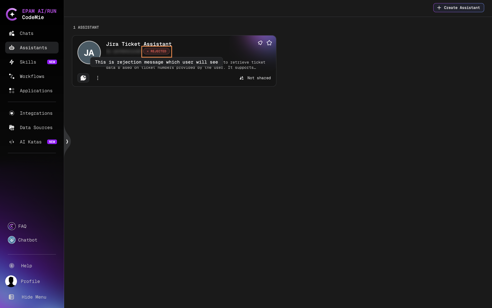

To resubmit a rejected assistant, update its configuration according to the rejection reason and publish it to the Marketplace again.

## Editing a Published or In-Review Assistant

Any change to an assistant that is published (**VERIFIED**) or waiting for review (**REVIEW**) must be validated and reviewed again.

1. Edit the assistant and click **Save**.

2. The **Save changes** dialog warns that saving will unpublish the assistant and send it for re-validation. The assistant stays unavailable in the Marketplace until the review is complete:

   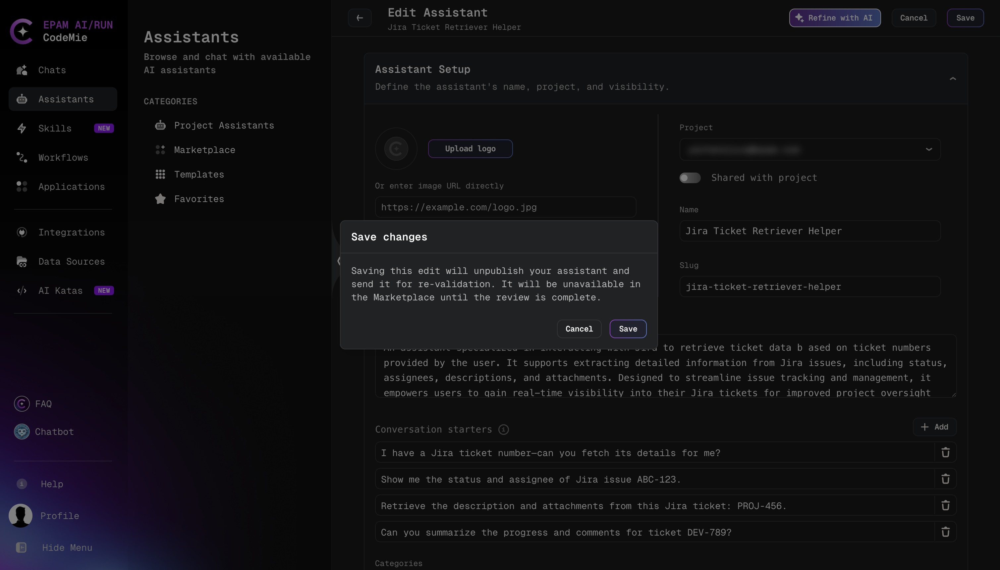
   - Click **Cancel** to discard the save. The assistant keeps its current status.
   - Click **Save** to save the changes and run the validation checks.

3. If the updated assistant passes the checks, it is sent for manual review again, and the **Sent for review** dialog appears. The assistant status changes to **REVIEW**.

4. If the updated assistant fails the checks, the **Assistant Verification Failed** dialog shows the findings, and a banner describes the current Marketplace state of the assistant:

   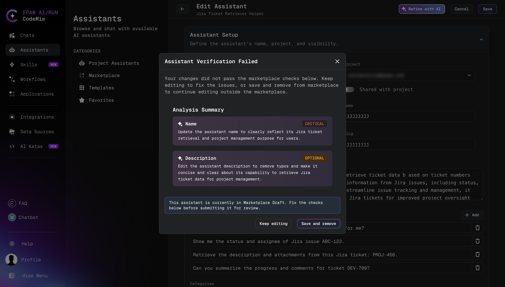

   Choose one of the options:
   - **Keep editing**: return to the editor and fix the reported issues.
   - **Save and remove** (assistant with the **REVIEW** status): save the changes and remove the assistant from the review queue.
   - **Save & Unpublish** (assistant with the **VERIFIED** status): save the changes and unpublish the assistant from the Marketplace.

   After either save option, the assistant can be edited further outside the Marketplace and published again later.

The same flow applies when an assistant is edited from a chat. Clicking **Configuration** in the chat header opens the **Configure & Test** panel; clicking **Save** in the panel for an assistant with the **REVIEW** or **VERIFIED** status shows the same **Save changes** warning and runs the same validation checks:

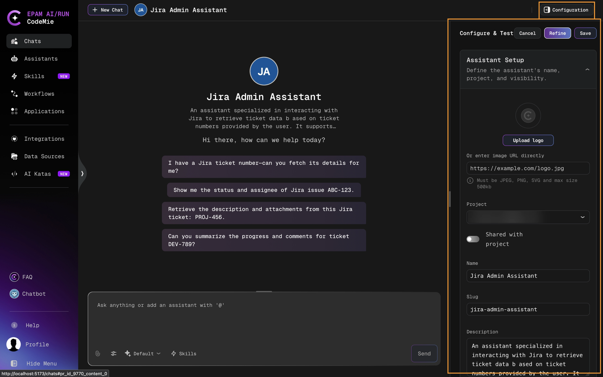

:::tip
Group several changes into a single edit. Each save of a published assistant removes it from the Marketplace until an administrator approves it again.
:::

## Force-Publish for Administrators

Platform administrators and maintainers follow a shortened publishing flow:

- If their assistant passes the validation checks, it is published directly with the **VERIFIED** status, without waiting in the review queue.
- If CRITICAL findings block the assistant, it can be force-published with a justification:
  1. Open the force-publish form:
     - When publishing an assistant, click **Publish Anyway** in the **Assistant Quality Validation Failed** dialog. The **Assistant Verification Failed** dialog opens with the justification field.
     - When saving changes to an assistant in the Marketplace, the **Assistant Verification Failed** dialog shows the justification field directly.
  2. In the **Why is it safe to publish anyway?** field, describe why the checks should be overridden. The justification must be at least 20 characters long; the **Confirm Force-Publish** button stays disabled until then.
  3. Click **Confirm Force-Publish**. The assistant is published with the **VERIFIED** status.

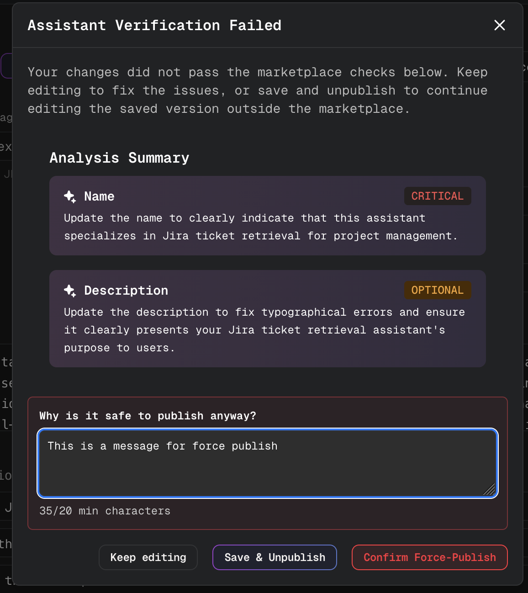

The justification, the administrator who overrode the checks, and the bypassed CRITICAL findings are stored with the publishing decision for audit purposes. The force-publish options are not available to regular users.

For information about reviewing submitted assistants, see [Marketplace Management](../../admin/configuration/codemie/marketplace-management.mdx).

## After Publishing

Once approved (or published directly when Marketplace management is disabled), your assistant appears in the **Marketplace** tab:

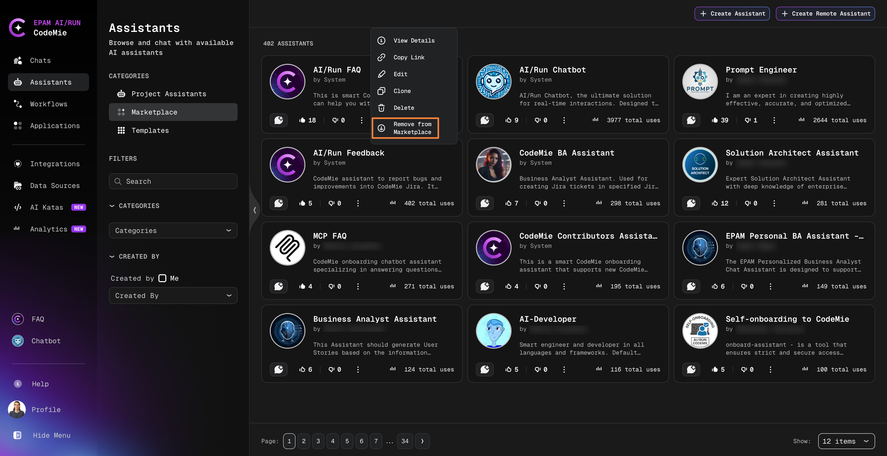

You maintain full control with these options:

- **View Details**: See how users interact with your assistant
- **Edit**: Update configuration and settings (triggers re-validation and review, see [Editing a Published or In-Review Assistant](#editing-a-published-or-in-review-assistant))
- **Delete**: Permanently remove the assistant
- **Remove from Marketplace**: Return the assistant to your Project Assistants tab

:::tip Maintenance
Regularly update your published assistants to fix issues, improve performance, and incorporate user feedback.
:::
