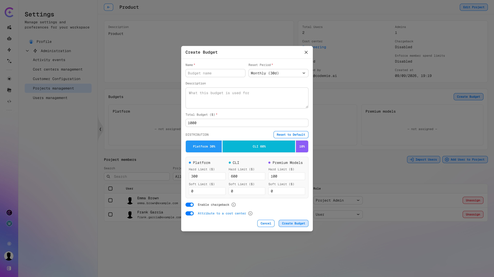
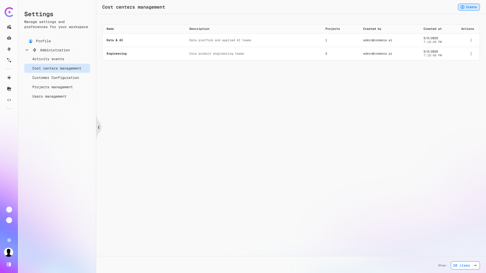

import EnterpriseFeature from '@site/src/components/EnterpriseFeature';

# Chargeback and Cost Centers

<EnterpriseFeature />

A [project budget](./project-budgets.md) decides how much a project may spend. Chargeback and cost
centers decide **who pays for it**.

- **Chargeback** marks a project's spend as billable, so it can be recovered from the team that
  incurred it rather than absorbed centrally.
- A **cost center** groups several projects — a program, a department, or a client engagement — so
  their combined AI spend settles on one bill.

The two are independent of enforcement: neither blocks a request or changes a limit. They determine
where the spend is attributed for internal billing.

## Chargeback

### Enabling Chargeback

Chargeback is configured on the project's budget.

1. Go to **Administration → Projects Management** and select the project.
2. Open the budget dialog — **Create Budget** for a new budget, or **Manage Budget** for an existing
   one.
3. Switch on **Enable chargeback**.
4. Optionally switch on **Attribute to a cost center**, which appears once chargeback is enabled.
5. Save the budget.

### Attribution Targets

| Setting                                                     | Where the spend is billed                                                                   |
| ----------------------------------------------------------- | ------------------------------------------------------------------------------------------- |
| **Enable chargeback** off                                   | Spend is not tracked for internal billing                                                   |
| **Enable chargeback** on                                    | Spend is billed to the project's own billing code                                           |
| **Enable chargeback** on, **Attribute to a cost center** on | Spend rolls up to the cost center assigned to the project instead of the project's own code |

:::note
**Attribute to a cost center** only takes effect when the project has a cost center assigned. Assign
one through **Edit Project → Cost center**. See [Assigning a Project to a Cost Center](#assigning-a-project-to-a-cost-center).
:::

The current state is visible on the project page without opening the budget: the information panel
shows **Chargeback** as `Enabled` or `Disabled`, alongside the **Cost center** the project belongs
to.

## Cost Centers

A cost center is a grouping label that aggregates the spend of every project assigned to it. It
holds **no budget of its own** — limits live on the projects, and the cost center simply adds up
what they spend.

This keeps the two concerns separate: a project budget controls consumption, while a cost center
controls reporting and billing.

### Managing Cost Centers

Path: **Profile → Settings → Administration → Cost centers management**

The list shows every cost center with its description, the number of projects assigned to it, and
creation details.

| Column          | Description                                 |
| --------------- | ------------------------------------------- |
| **Name**        | Cost center identifier                      |
| **Description** | What the cost center covers                 |
| **Projects**    | Number of projects currently assigned to it |
| **Created by**  | User who created the cost center            |
| **Created at**  | Creation timestamp                          |
| **Actions**     | Edit and delete the cost center             |

### Creating a Cost Center

1. Go to **Administration → Cost centers management**.
2. Click **Create**.
3. Enter a **Name** and a **Description**.
4. Save.

:::warning
Cost center names must match the pattern configured by `COST_CENTER_NAME_PATTERN`, which defaults to
two lowercase alphanumeric segments joined by a hyphen (for example, `platform-core`). Names that do
not match are rejected. See [Cost Center configuration](../../admin/configuration/codemie/api-configuration.md#cost-center).
:::

### Assigning a Project to a Cost Center

1. Open the project under **Administration → Projects Management**.
2. Click **Edit Project**.
3. Select the target cost center in the **Cost center** field.
4. Click **Save**.

The project page then shows the cost center in its information panel, and the **Projects** count on
the cost center increases. A project belongs to at most one cost center at a time; clearing the
field removes the association.

:::info
Assigning a cost center does not by itself redirect billing. The project's budget must also have
both **Enable chargeback** and **Attribute to a cost center** switched on for its spend to roll up.
:::

## Putting It Together

A typical rollout across a department:

1. Create a cost center for the department under **Cost centers management**.
2. Give each project in the department a budget with the categories and limits that fit the team.
3. Assign each project to the cost center through **Edit Project**.
4. On each project's budget, switch on **Enable chargeback** and **Attribute to a cost center**.

Every project then carries its own enforced limit, while the department receives a single combined
bill for their AI spend.

## See Also

- [Project Budgets](./project-budgets.md) — creating budgets, tracking spend, and member allocations
- [Budget Management](./index.md) — budget types, categories, and priority
- [API Configuration Reference](../../admin/configuration/codemie/api-configuration.md#cost-center) — the `COST_CENTER_NAME_PATTERN` setting
