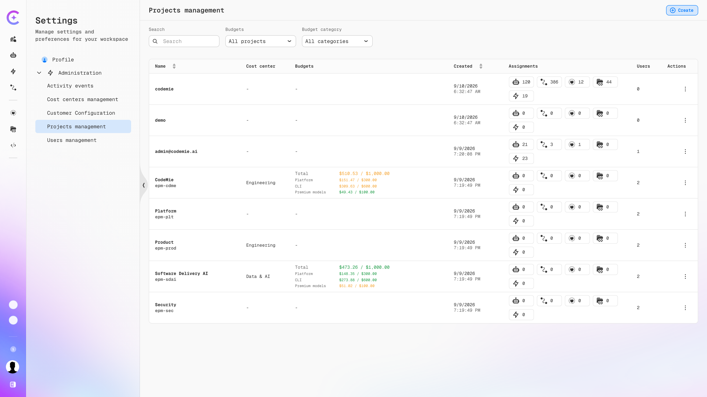
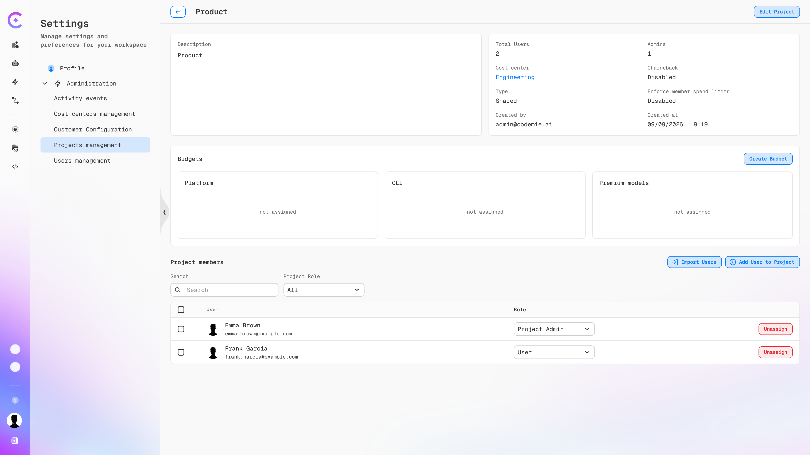
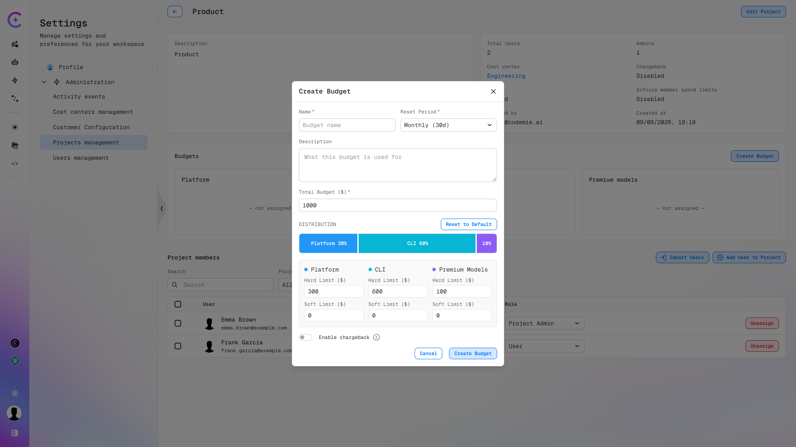
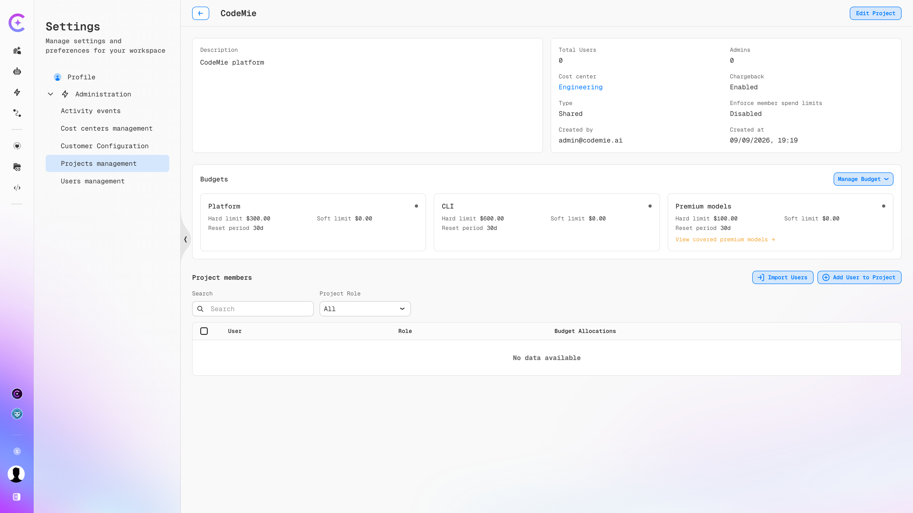
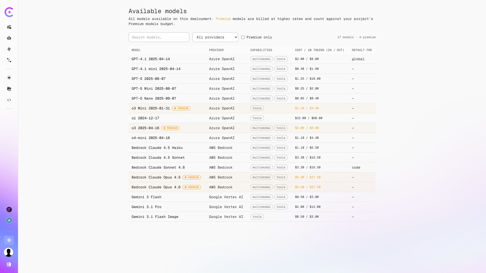
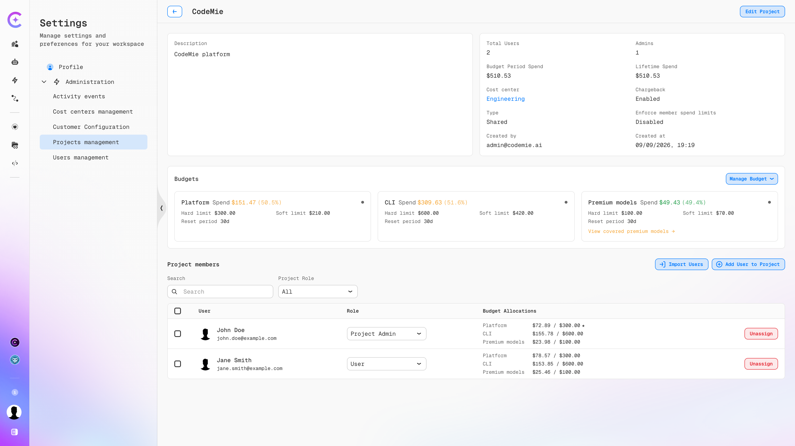
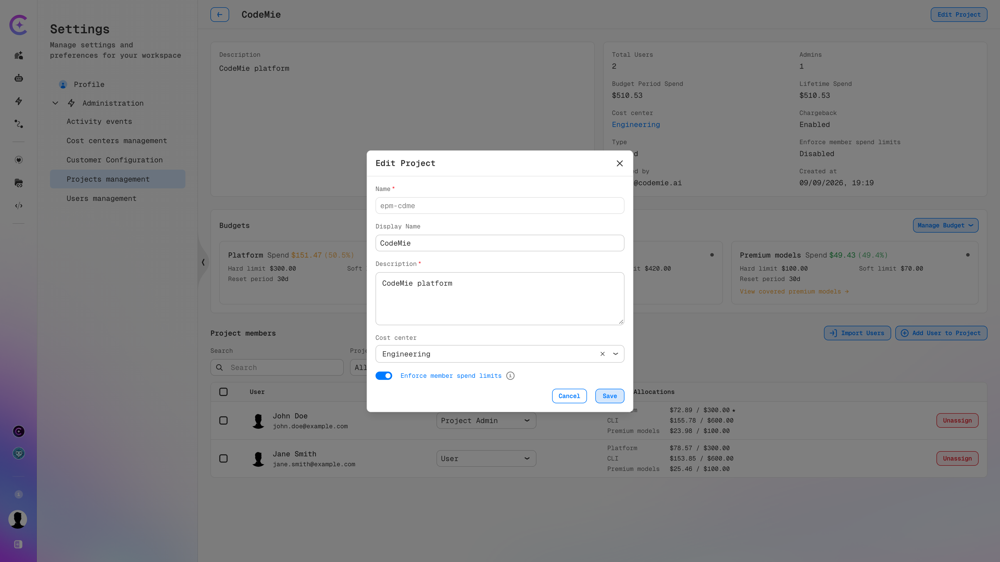
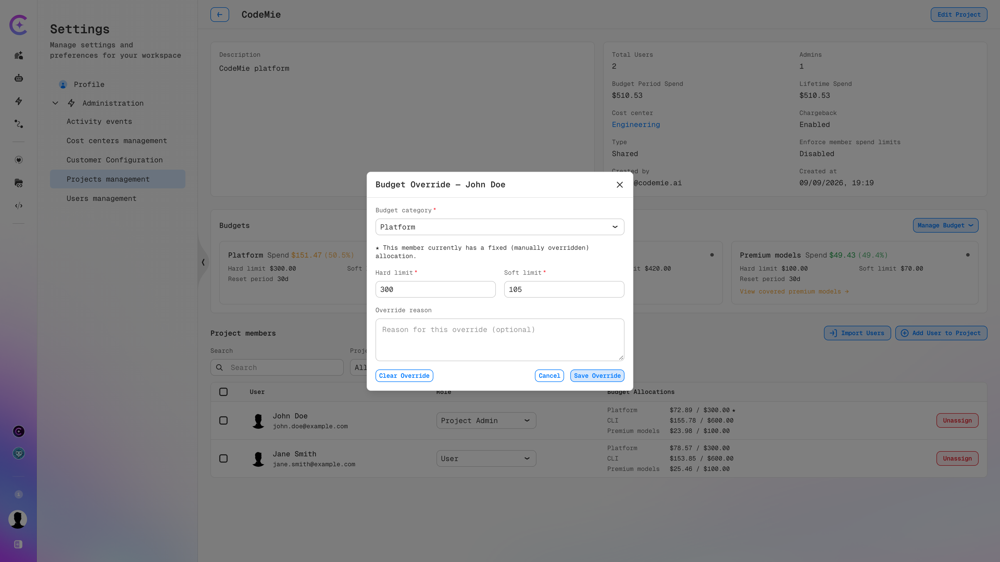

import EnterpriseFeature from '@site/src/components/EnterpriseFeature';

# Project Budgets

<EnterpriseFeature />

A project budget caps how much a single project can spend on LLM usage over a reset period, and
splits that cap across the three [budget categories](./index.md#budget-categories): Platform, CLI,
and Premium Models. Keeping the categories separate means a runaway CLI script cannot drain the
allowance reserved for the web UI.

This page covers creating a project budget, tracking spend against it, and controlling how much of
it each member can consume. For how a project budget interacts with personal and default budgets,
see [Budget Priority](./index.md#budget-priority).

## Access

Path: **Profile → Settings → Administration → Projects Management → select a project**

Creating and editing project budgets requires the **Maintainer** role. Project Admins cannot manage
budgets in any project — including their own. See [Access](./index.md#access) for the full
permission matrix.

## Reviewing Projects and Their Budgets

The **Projects management** list shows every project on the platform along with its cost center and
budget state.

The **Budgets** column shows the project total and a per-category breakdown in
`$spent / $limit` format. Values are colored by consumption, so projects approaching their cap stand
out at a glance. Projects with no budget show a dash.

Two filters narrow the list:

| Filter              | Purpose                                                        |
| ------------------- | -------------------------------------------------------------- |
| **Budgets**         | Show all projects, or only those with (or without) a budget    |
| **Budget category** | Show only projects that have a budget in the selected category |

## Creating a Project Budget

A project without a budget shows three empty category cards and a **Create Budget** button.

1. Click the **Profile** icon in the bottom-left corner and select **Settings**.
2. Go to **Administration → Projects Management** and select the project.
3. In the **Budgets** section, click **Create Budget**.
4. Complete the dialog described below.
5. Click **Create Budget**.

### Budget Fields

| Field                | Required | Description                                                                                                   |
| -------------------- | -------- | ------------------------------------------------------------------------------------------------------------- |
| **Name**             | Yes      | Human-readable label for the budget. The budget ID is generated from it automatically                         |
| **Reset Period**     | Yes      | How often spend counters reset — for example, `Monthly (30d)` or `Weekly (7d)`                                |
| **Description**      | No       | Note on what the budget is used for                                                                           |
| **Total Budget ($)** | Yes      | The project's overall cap in USD. This amount is divided across the three categories                          |
| **Hard Limit ($)**   | Yes      | Per category. Enforcement cap — requests in that category are blocked once the amount is reached. Must be > 0 |
| **Soft Limit ($)**   | No       | Per category. Warning threshold — requests are not blocked when it is crossed                                 |

### Distributing the Total Across Categories

Entering a **Total Budget** splits it across the categories using the default weighting — 30%
Platform, 60% CLI, 10% Premium Models — and fills the per-category **Hard Limit** fields
accordingly. A $1,000 total therefore yields $300 Platform, $600 CLI, and $100 Premium Models.

To rebalance, either drag the segment boundaries on the **DISTRIBUTION** bar or type the amounts
directly into the **Hard Limit** fields. **Reset to Default** restores the 30/60/10 split.

Set a **Soft Limit** per category to receive a warning before the hard limit blocks anything. Soft
limits default to `0`, which disables the warning.

:::note
A single dialog creates budgets for all three categories at once. Only one budget per category per
project is allowed.
:::

The dialog also carries the **Enable chargeback** and **Attribute to a cost center** toggles. See
[Chargeback and Cost Centers](./chargeback-cost-centers.md).

Once created, the category cards show the configured limits and reset period, and the **Create
Budget** button is replaced by a **Manage Budget** dropdown for later edits.

### Premium Model Coverage

The Premium models card carries a **View covered premium models** link, which opens the deployment's
model catalog with premium models flagged and priced.

Each row lists the provider, capabilities, and cost per 1M input/output tokens. Use the **Premium
only** checkbox to filter the list down to the models that draw on the Premium Models budget.

:::note
Which models count as premium is set at deployment time through the `LITELLM_PREMIUM_MODELS_ALIASES`
environment variable. See [Configure Premium Model Aliases](../../admin/configuration/extensions/litellm-proxy/budget-configuration.md#step-2-configure-premium-model-aliases).
:::

## Tracking Spend

Once a budget is live, the project page reports consumption against it without any export step.

### Project Summary

The information panel at the top of the project page reports:

| Field                           | Description                                                                |
| ------------------------------- | -------------------------------------------------------------------------- |
| **Budget Period Spend**         | Amount spent in the current reset period across all categories             |
| **Lifetime Spend**              | Cumulative spend since the project was created, preserved across resets    |
| **Cost center**                 | Cost center this project's spend rolls up to, if one is assigned           |
| **Chargeback**                  | Whether the project's spend is tracked for internal billing                |
| **Type**                        | `Shared` for a team project, `Personal` for a user's personal space        |
| **Enforce member spend limits** | Whether per-member allocations are enforced or the budget is a shared pool |

### Category Cards

Each category card reports **Spend** as an absolute amount and as a percentage of that category's
hard limit — for example, `Spend $151.47 (50.5%)` against a `$300.00` hard limit. The card also
repeats the hard limit, soft limit, and reset period.

:::info
Spend figures come from a background collector that polls LiteLLM on a schedule — nightly by
default. Figures may lag actual usage by up to one collection cycle. Enforcement does not depend on
this job: hard limits are applied in real time. See [Spending Data Update Frequency](./index.md#spending-data-update-frequency).
:::

## Member Allocations

The **Project members** table carries a **Budget Allocations** column showing each member's spend
against their allocated limit, per category, in `$spent / $allocated` format.

A star (★) next to an allocation marks a member whose limit is a fixed
[override](#overriding-a-members-allocation) rather than an even share of the category.

### Distribution Modes

How the project budget is shared among members is controlled by **Enforce member spend limits** on
the project itself, not on the budget.

To change it, open the project and click **Edit Project**, then toggle **Enforce member spend
limits** and click **Save**.

**Disabled (default) — shared pool**

Individual shares are calculated and stored in CodeMie, but no per-member cap is enforced:

- Any member can draw on the whole project budget until the project collectively exhausts it
- One member may spend $5 and another $50 without either being blocked
- A member's personal budget is not consulted — the shared project limit governs the whole team

**Enabled — enforced per-member caps**

Each member receives a hard individual limit, and requests beyond it are blocked:

- A $100 category budget across 10 members gives each member $10
- If one member holds a $20 override, the remaining nine split the rest: ($100 − $20) ÷ 9 ≈ $8.89 each

### Overriding a Member's Allocation

An override pins one member to a fixed limit instead of the even share — a larger allowance for a
heavy user, or a smaller one to rein someone in.

1. In the **Project members** table, click the member's allocation for the category to change.
2. The **Budget Override** dialog opens.

3. Confirm or change the **Budget category**.
4. Set the **Hard limit** and **Soft limit** for this member.
5. Optionally record an **Override reason** for audit purposes.
6. Click **Save Override**.

The member switches to fixed allocation mode, their amount is locked, and the rest of the project
budget is re-divided evenly among the members still on an even share. Click **Clear Override** to
return the member to the even split.

:::warning
A fixed override cannot exceed the project's hard limit for that category.
:::

| Enforce member spend limits | Override behavior                                                                                                           |
| --------------------------- | --------------------------------------------------------------------------------------------------------------------------- |
| **Enabled**                 | The override sets a real per-member cap. Remaining budget is recalculated and redistributed among members without overrides |
| **Disabled**                | The override is recorded in CodeMie, but no per-member restriction applies — all members draw on the shared pool            |

### Rebalance

Rebalance recalculates the distribution among project members and syncs the result with LiteLLM. Run
it from the **Manage Budget** dropdown.

Rebalance runs **automatically** when:

- An override is set or cleared
- **Enforce member spend limits** is changed
- A member is removed from the project

Rebalance must be run **manually** when:

- New members are added to the project
- The total project budget changes
- Uneven distribution has accumulated and needs correcting

:::warning
A new member joining a project receives a copy of the current even share rather than triggering a
redistribution, so the total allocated amount can exceed the project limit until a rebalance is run.

Example: a project with 3 members and a $100 budget gives each member $33. Adding a 4th member
grants them $33 as well, bringing the total allocated to $132 against a $100 limit. A manual
rebalance corrects this to $25 each.
:::

:::info
When a reset period expires, spend counters in LiteLLM reset automatically, but member shares are
not recalculated. Rebalance is not part of the reset.
:::

:::warning
Recreating a project budget causes LiteLLM to issue a new key with a fresh spend counter. The
previous key's counter is reset, but historical spend is preserved in platform analytics
(Elasticsearch), and total expenditure will not exceed the combined sum of both keys.
:::

## See Also

- [Budget Management](./index.md) — budget types, categories, priority, and enforcement behavior
- [Chargeback and Cost Centers](./chargeback-cost-centers.md) — internal billing and rolling spend up across projects
- [Project Budget Management](../../admin/configuration/codemie/project-budget-management.md) — platform configuration and background jobs
- [Projects Management](../project-user-management/projects.md) — creating projects and managing members
