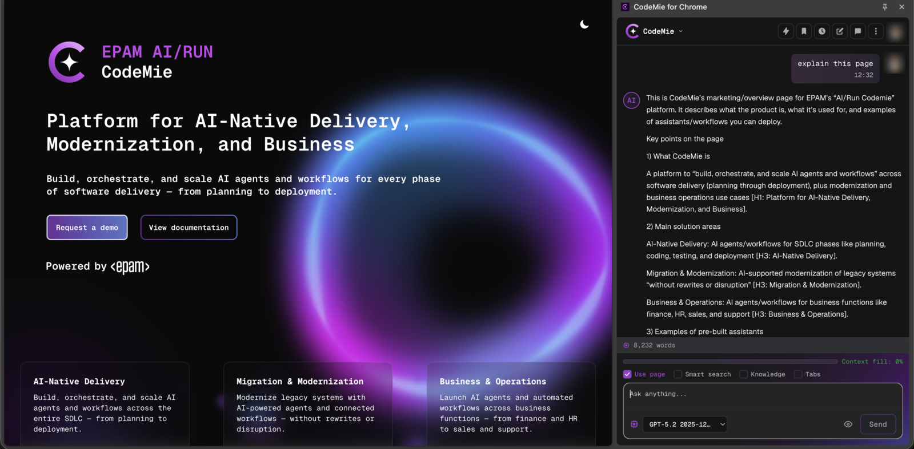
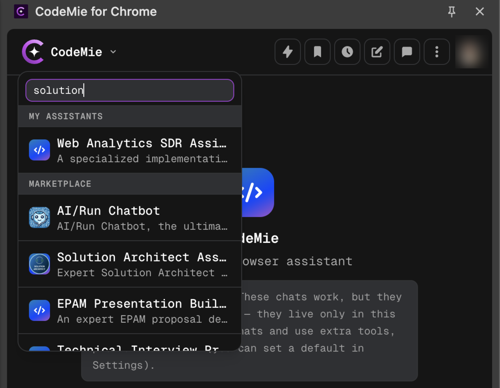
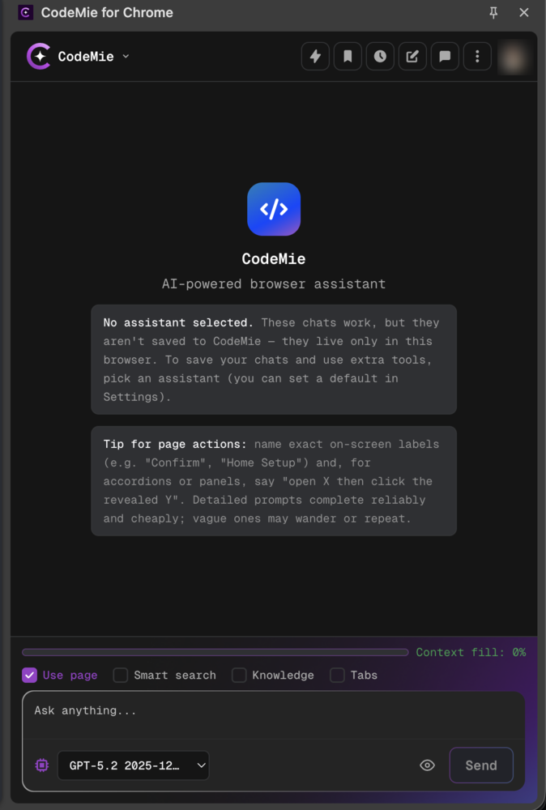
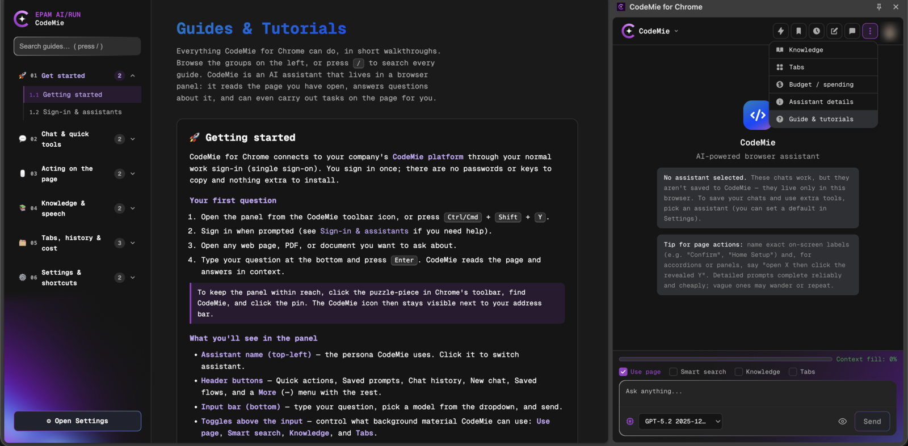

# Chrome Extension

EPAM AI/Run CodeMie for the browser puts an AI assistant in a Chrome side panel — one that can read the
page you are working on and act on it when you ask. It connects to your organization's CodeMie instance
through your normal work sign-in, so there is no separate account to create and no API key to paste.

---

## What you can do

| Capability                 | What it means in practice                                                                                            |
| -------------------------- | -------------------------------------------------------------------------------------------------------------------- |
| Ask about the current page | Summarize it, explain a section, pull out structured data, or ask questions answered from what is actually on screen |
| Ask about a selection      | Select text on any page and send it straight to the assistant from the right-click menu                              |
| Act on the page            | Let the assistant click buttons, fill forms, and step through multi-page flows on your behalf                        |
| Record and replay          | Capture a sequence of actions once, then replay it later                                                             |
| Bring in more context      | Add web search results or other open tabs when one page is not enough                                                |
| Use your own tools         | Connect MCP servers and call their tools from the panel                                                              |
| Keep your conversations    | Chats sync with your CodeMie account across devices, or stay local if you choose a temporary chat                    |

:::info
The assistant works on ordinary `http` and `https` pages. Chrome blocks extensions from running on
browser-internal pages, so the panel will not read `chrome://` pages, the New Tab page, the PDF viewer, or
the Chrome Web Store.
:::

---

## Choosing an assistant

The panel can run against any assistant you have access to — your own, or one shared through the
marketplace. Switch assistants from the name at the top-left of the panel.

Chats started without an assistant selected work, but stay local to the browser — they are not saved to
CodeMie. Pick an assistant to save conversations and unlock the extra tools attached to it. A default
assistant can be set in the extension settings.

---

## Controls

Everything the assistant uses as background material is controlled from the row of toggles above the
input bar.

| Control      | Effect                                                                        |
| ------------ | ----------------------------------------------------------------------------- |
| Use page     | Sends the current page as context for the question                            |
| Smart search | Searches long pages for the most relevant parts instead of sending everything |
| Knowledge    | Draws on indexed knowledge from your CodeMie data sources                     |
| Tabs         | Adds other open browser tabs as extra context                                 |
| Model picker | Chooses which model answers this turn                                         |

---

## Built-in guides

The extension ships with its own walkthroughs, covering every feature in short steps — getting started,
chat and quick tools, acting on the page, knowledge and speech, tabs and cost, and settings. Open them
from the **More** menu in the panel header, under **Guide & tutorials**.

:::tip
The in-app guides are the most detailed reference for day-to-day use and are always in step with the
version you have installed. This section covers installation and privacy; the guides cover the features.
:::

---

## Requirements

- Google Chrome 114 or newer — the extension uses Chrome's side panel API
- An account on your organization's CodeMie instance
- The URL of that instance, which your CodeMie administrator can provide

---

## Next steps

- [Installation and setup](./installation.md) - install the extension, connect it to your CodeMie
  instance, and sign in
- [Privacy policy](./privacy-policy.md) - what the extension reads, what it sends, and where that data
  goes
