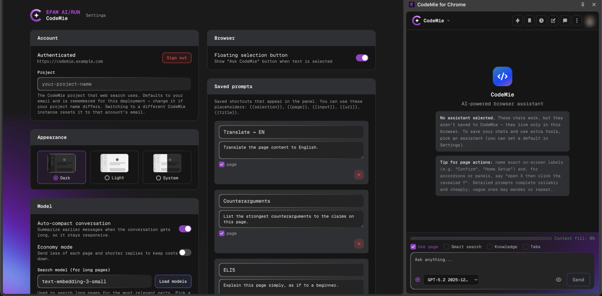

# Installation and Setup

Installing the extension takes a few minutes. Most of it is Chrome's own install flow; the CodeMie-specific
part is pointing the extension at your instance and signing in once.

---

## Before you start

- Google Chrome 114 or newer
- An account on your organization's CodeMie instance
- The URL of that instance — ask your CodeMie administrator if you do not know it

---

## Step 1: Install the extension

:::info
The extension is currently pending review on the Chrome Web Store. This page will be updated with the
install link as soon as it is published. Until then, your CodeMie administrator can supply the package
directly.
:::

Once the listing is live, install it from the Chrome Web Store and confirm the permission prompt Chrome
shows. The extension needs access to the pages you use it on so it can read them and carry out the actions
you ask for.

## Step 2: Pin it to the toolbar

Chrome hides new extensions behind the puzzle-piece icon. Click that icon, find **EPAM AI/Run CodeMie**,
and click the pin. The CodeMie icon then stays visible next to the address bar.

## Step 3: Connect to your CodeMie instance

Right-click the CodeMie toolbar icon and choose **Options**, or open the settings from the gear in the
panel. Enter the URL of your CodeMie instance in the **Account** section.

## Step 4: Sign in

Click **Sign in**. Chrome opens your organization's single sign-on page in a new tab. Authenticate there as
you normally would.

:::note
During sign-in the browser briefly opens a local callback address that does not load a page. That is
expected — the extension reads the result from the address and completes the sign-in itself. You can close
the tab if it stays open.
:::

## Step 5: Open the panel

Click the CodeMie toolbar icon, or use the keyboard shortcut:

| Action          | Windows and Linux      | macOS                 |
| --------------- | ---------------------- | --------------------- |
| Open the panel  | `Ctrl` + `Shift` + `Y` | `Cmd` + `Shift` + `Y` |
| Close the panel | `Ctrl` + `Shift` + `U` | `Cmd` + `Shift` + `U` |

Open any ordinary web page, type a question at the bottom of the panel, and press `Enter`.

:::tip
If a shortcut does nothing, another extension has probably claimed it. Reassign it at
`chrome://extensions/shortcuts`.
:::

---

## Optional settings

The options page also controls:

- **Appearance** - dark, light, or follow the system theme
- **Default assistant** - which assistant new chats start with
- **Saved prompts** - reusable prompts that appear as shortcuts in the panel
- **Floating selection button** - whether an "Ask CodeMie" button appears when you select text
- **Model behavior** - auto-compacting long conversations, economy mode, and the search model used for
  long pages
- **MCP servers** - your own tool servers, reachable over HTTPS

---

## Troubleshooting

| Symptom                             | What to check                                                                                                                                                                |
| ----------------------------------- | ---------------------------------------------------------------------------------------------------------------------------------------------------------------------------- |
| The panel does nothing on a page    | The extension only runs on `http` and `https` pages. Chrome blocks it on `chrome://` pages, the New Tab page, the PDF viewer, and the Chrome Web Store. Try an ordinary site |
| Sign-in returns to the login screen | The session has expired. Sessions are not refreshed automatically — sign in again                                                                                            |
| Sign-in fails immediately           | Check the instance URL in the options page for a typo, and confirm with your administrator that your account is active                                                       |
| The keyboard shortcut is ignored    | Another extension has claimed it. Reassign at `chrome://extensions/shortcuts`                                                                                                |
| Answers ignore the page             | Confirm the **Use page** toggle above the input bar is on                                                                                                                    |

---

## Next steps

- [Privacy policy](./privacy-policy.md) - what the extension reads and where that data goes
- Open **Guide & tutorials** from the **More** menu in the panel for the full feature walkthroughs
