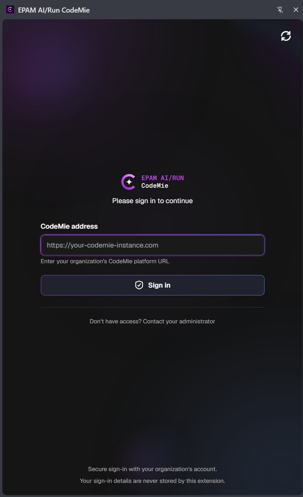

# Installation and Setup

Installing takes a few minutes. Most of it is the normal Chrome install process. The only CodeMie-specific
part is typing in your organization's CodeMie address and signing in. You'll need to sign in again if you
restart Chrome or don't use the extension for a while.

---

## Before you start

- Google Chrome 114 or newer
- An account on your organization's CodeMie
- The address of that CodeMie instance — ask your CodeMie administrator if you don't have it

---

## Step 1: Install the extension

Open [EPAM AI/Run CodeMie in the Chrome Web Store](https://chromewebstore.google.com/detail/epam-airun-codemie/fhjgonmmblodipinpnhohbdbcobgeemp),
click **Add to Chrome**, then **Add extension** to confirm. Chrome will show you what the extension can
access before you install — take a look, then continue.

## Step 2: Pin it to the toolbar

Chrome hides new extensions behind the puzzle-piece icon. Click that icon, find **EPAM AI/Run CodeMie**,
and click the pin. The CodeMie icon then stays visible next to the address bar.

## Step 3: Open the sign-in screen

Click the CodeMie toolbar icon to open the side panel. On the sign-in screen, type your organization's
CodeMie address into the **CodeMie address** box — for example `https://your-codemie-instance.example`.

## Step 4: Sign in

Click **Sign in**. This opens your organization's normal sign-in page in a new tab — sign in there as you
usually would. Next time, the extension remembers the address you used.

:::note
While signing in, you might briefly see a blank tab open and close on its own. That's expected — it's how
the extension finishes signing you in. You can close it if it stays open.
:::

:::note
You'll need to sign in again after closing and reopening Chrome, or if you haven't used the extension for
a while — sign-in doesn't refresh itself automatically.
:::

## Step 5: Open the panel

Click the CodeMie toolbar icon anytime, or use a keyboard shortcut:

| Action          | Windows and Linux      | macOS                 |
| --------------- | ---------------------- | --------------------- |
| Open the panel  | `Ctrl` + `Shift` + `Y` | `Cmd` + `Shift` + `Y` |
| Close the panel | `Ctrl` + `Shift` + `U` | `Cmd` + `Shift` + `U` |

Open any regular web page, type a question at the bottom of the panel, and press `Enter`.

:::tip
If the shortcut doesn't do anything, another extension is probably already using it. Change it at
`chrome://extensions/shortcuts`.
:::

---

## Optional settings

The settings page also lets you control:

- **Account** — see who you're signed in as, and set which project web search uses
- **Appearance** — light, dark, or match your system
- **Model** — how long conversations are automatically shortened, and which model handles long pages
- **Chat history** — which assistant new chats start with, and whether chats without one are saved
- **Act on the page** — turn page actions on or off, and limit how many steps the assistant can take
- **Browser** — turn the floating "Ask CodeMie" button on or off when you select text
- **Saved prompts** — save prompts you use often as quick shortcuts
- **Advanced** — extra options, including what's shared for usage tracking
- **Text-to-speech** — pick a voice, and choose whether answers are read aloud automatically
- **Per-site overrides** — use a different model or instructions on specific websites

---

## Troubleshooting

| Problem                                | What to try                                                                                                                                              |
| --------------------------------------- | ----------------------------------------------------------------------------------------------------------------------------------------------------------------- |
| The panel does nothing on this page     | The assistant only works on regular web pages and PDFs opened from a link. It can't open internal Chrome pages, the Chrome Web Store, or PDFs saved on your computer. If a PDF doesn't seem to work, reload the page or open the PDF's original link |
| Sign-in sends me back to the login screen | Your sign-in has probably expired, or Chrome restarted. Just sign in again                                                                              |
| Sign-in fails right away                | Check the **CodeMie address** for typos, and ask your administrator to confirm your account is active                                                   |
| The keyboard shortcut doesn't work      | Another extension is probably using it. Change it at `chrome://extensions/shortcuts`                                                                    |
| Answers don't seem to use the page      | Click the sources button above the input box and make sure **Use page** is switched on                                                                  |

---

## Next steps

- [Privacy policy](./privacy-policy.md) — what the extension reads and where that data goes
- Click your avatar in the top-right of the panel and open **Guide & tutorials** for full feature
  walkthroughs
