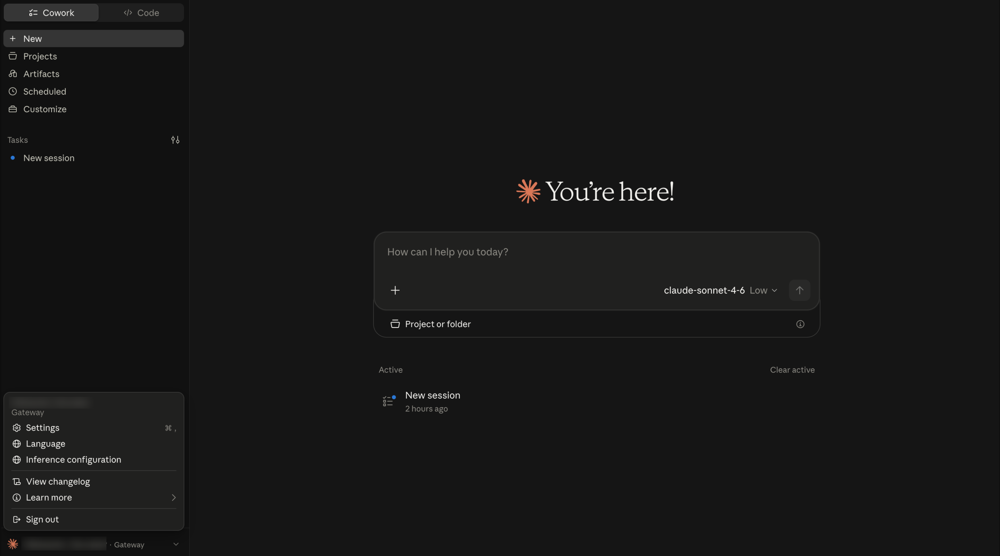
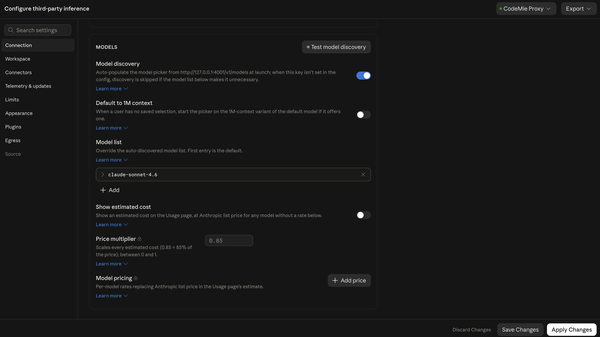
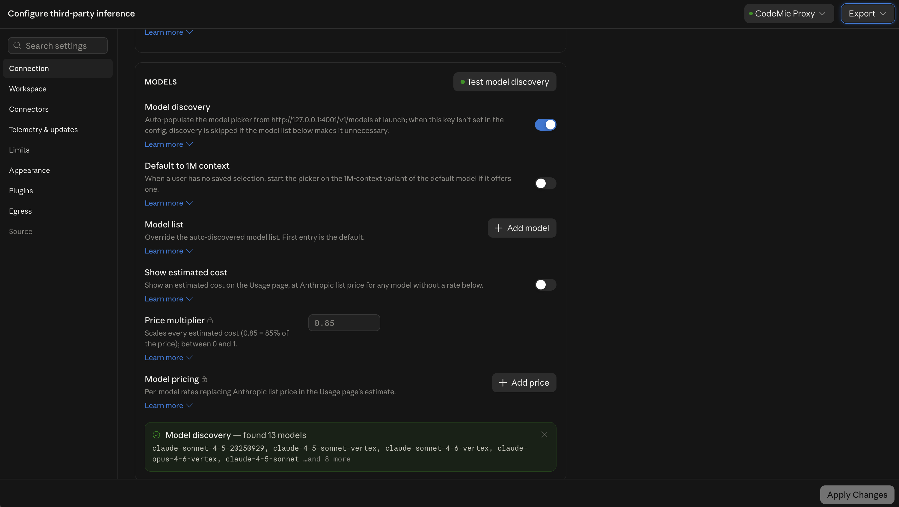

import EnterpriseFeature from '@site/src/components/EnterpriseFeature';

# Claude Desktop Integration

<EnterpriseFeature />

Claude Desktop can be connected to the CodeMie gateway via the CodeMie CLI local proxy daemon.
Once connected, the full CodeMie model catalog becomes available in Claude Desktop's model
selector — powered by the organization's configured LLM providers, SSO authentication, and
governance policies. No Anthropic subscription is required.

## Prerequisites

- CodeMie CLI installed: `npm install -g @codemie-ai/cli`
- Logged in with an SSO-backed CodeMie profile: `codemie login`
- Claude Desktop installed

## Setup

A single command connects Claude Desktop to the CodeMie proxy:

```bash
codemie proxy connect --claude-desktop
```

This command:

- Starts (or reuses) the local CodeMie proxy daemon on `http://127.0.0.1:4001`
- Writes the inference gateway configuration to Claude Desktop's config library
- Fetches available Claude-compatible models from the CodeMie gateway and writes them to the
  Desktop model list
- Registers managed MCP servers from the organization's CodeMie configuration

After the command completes, restart Claude Desktop. The active profile is shown at the bottom
of the sidebar as `· Gateway`.



## Verifying model discovery

The model list refreshes automatically at every Claude Desktop launch. To verify or manually
trigger model discovery after setup:

1. In Claude Desktop, click the profile name at the bottom left to open the menu, then select
   **Settings**.
2. Select **Inference configuration**.
3. On the **Connection** tab, scroll to the **Models** section.
4. In the **Model list** field, remove any existing entries (e.g., the default
   `claude-sonnet-4.6`) by clicking the **×** button on each one. Entries in this list
   override auto-discovery — the list must be empty for the full gateway catalog to populate.

   

5. Click **Test model discovery**. The gateway at `http://127.0.0.1:4001/v1/models` is queried
   and a banner at the bottom of the section reports the result, for example
   _"Model discovery — found 13 models"_.
6. Click **Apply Changes**, then restart Claude Desktop.

All discovered models appear in Claude Desktop's model picker.



## Proxy status

Check whether the proxy daemon is running:

```bash
codemie proxy status
```

Use `--deep` to also verify upstream CodeMie gateway reachability:

```bash
codemie proxy status --deep
```

## Options

| Option             | Description                                                             |
| ------------------ | ----------------------------------------------------------------------- |
| `--profile <name>` | Use a specific profile for this run without changing the active profile |
| `--force`          | Stop any existing proxy and start a fresh one                           |
| `--verbose`        | Show gateway URLs and config file paths for debugging                   |

## Config file locations

The command writes Claude Desktop's inference gateway configuration to the platform-specific
config library directory:

| Platform | Path                                                                                |
| -------- | ----------------------------------------------------------------------------------- |
| macOS    | `~/Library/Application Support/Claude-3p/configLibrary/`                            |
| Windows  | `%LOCALAPPDATA%\Claude-3p\configLibrary\`                                           |
| Linux    | `$XDG_CONFIG_HOME/Claude-3p/configLibrary/` or `~/.config/Claude-3p/configLibrary/` |
