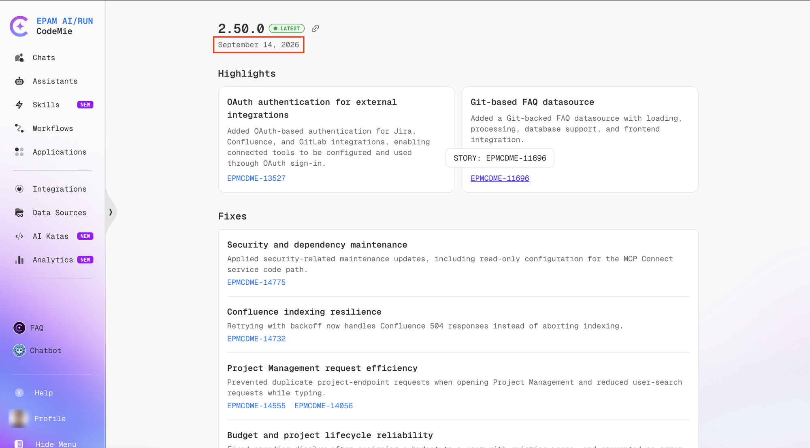

# Release Notes

The **Release Notes** page provides an overview of the latest platform updates, including new features, improvements, and bug fixes shipped in each CodeMie release. It is accessible from the [Help Center](./help-center.md) via the **See What's New** button.

## Overview

Each release entry is identified by a version number and the date it was deployed. The latest release is marked with a **LATEST** badge. Releases are listed in reverse chronological order — the most recent version appears first.



A release entry is organized into two main sections:

- **Highlights** — New capabilities and major improvements introduced in the release.
- **Fixes** — Resolved issues and stability improvements.

Each item in Highlights and Fixes includes a short description and may include a link to the relevant documentation.

## Accessing Release Notes

To open the Release Notes page:

1. Click **Help** (the question mark icon) in the bottom-left sidebar.
2. On the Help Center page, locate the **Product Updates** section.
3. Click **See What's New**.

## Release History

The platform exposes deployment version history through the `/v1/deployment-versions` API endpoint. The response includes the version string and the UTC timestamp of when each version was deployed:

```json
{
  "deployments": [
    {
      "version": "2.50.0",
      "deployedAt": "2026-09-14T08:49:31.760636Z"
    },
    {
      "version": "2.49.0",
      "deployedAt": "2026-09-10T13:17:26.813753Z"
    }
  ]
}
```

The in-app Release Notes page renders this data alongside the corresponding feature and fix details for each version.

:::info
Release history is limited to the versions deployed in the current environment. Earlier versions not present in the deployment history are not shown in the in-app Release Notes view.
:::

## Admin Release Notes

For information about third-party component updates and configuration changes affecting administrators, see the [Admin Release Notes](../../admin/update/release-notes.md).
