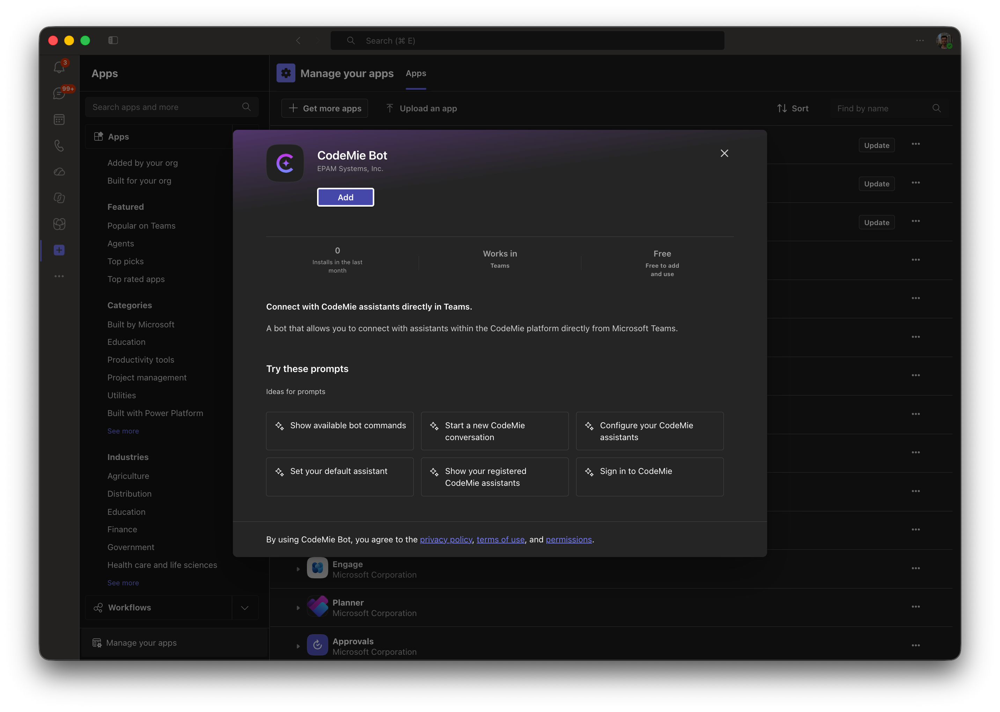
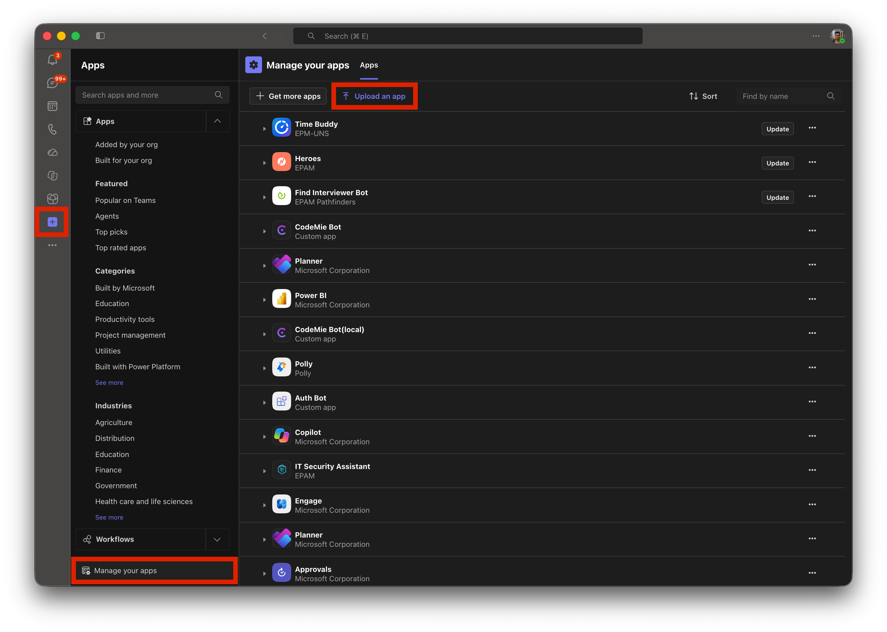
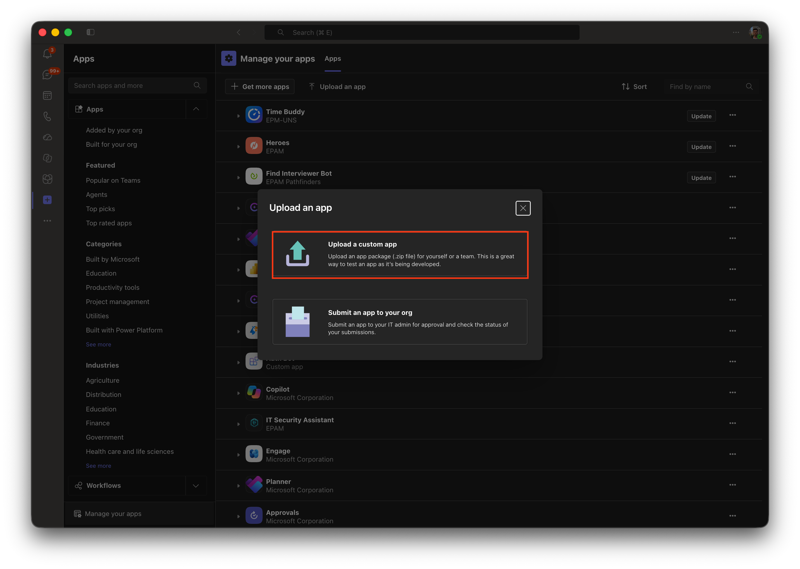
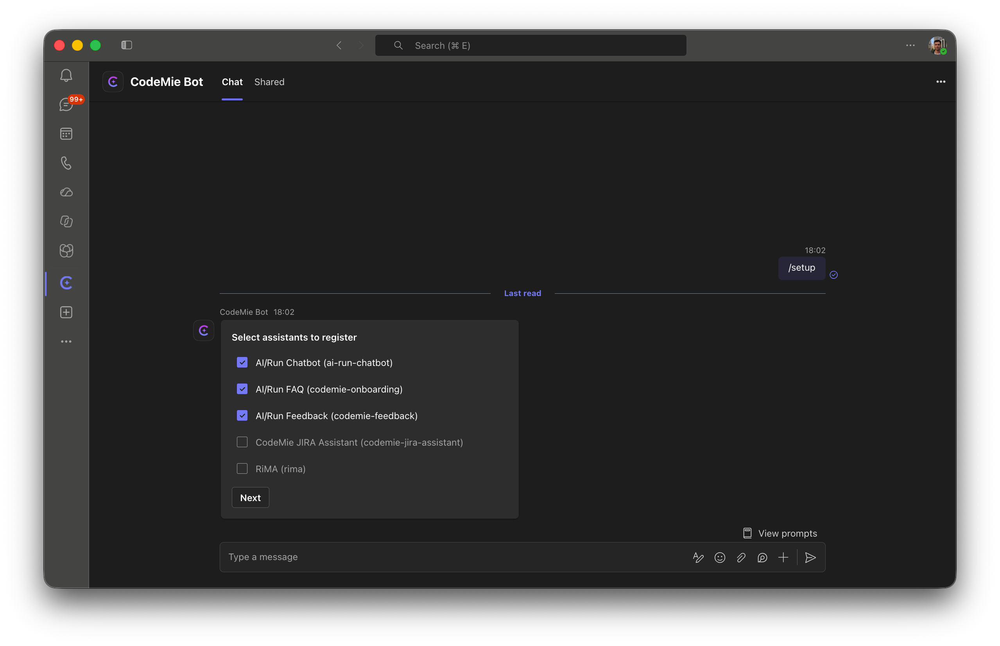
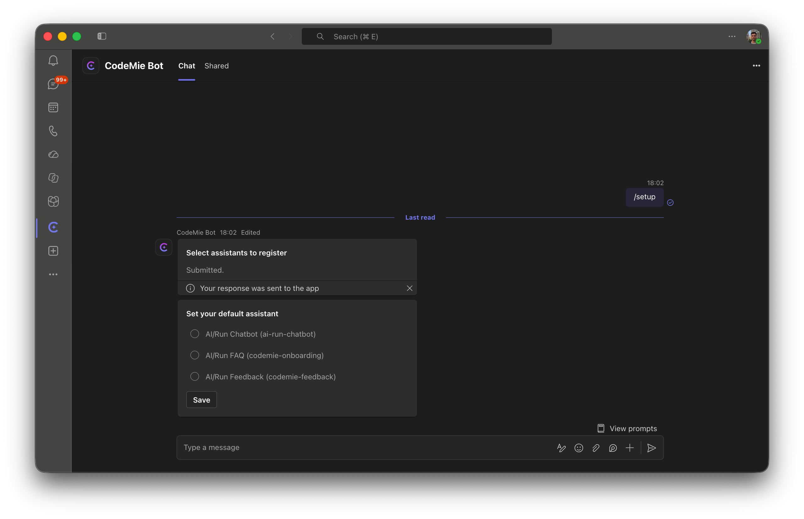
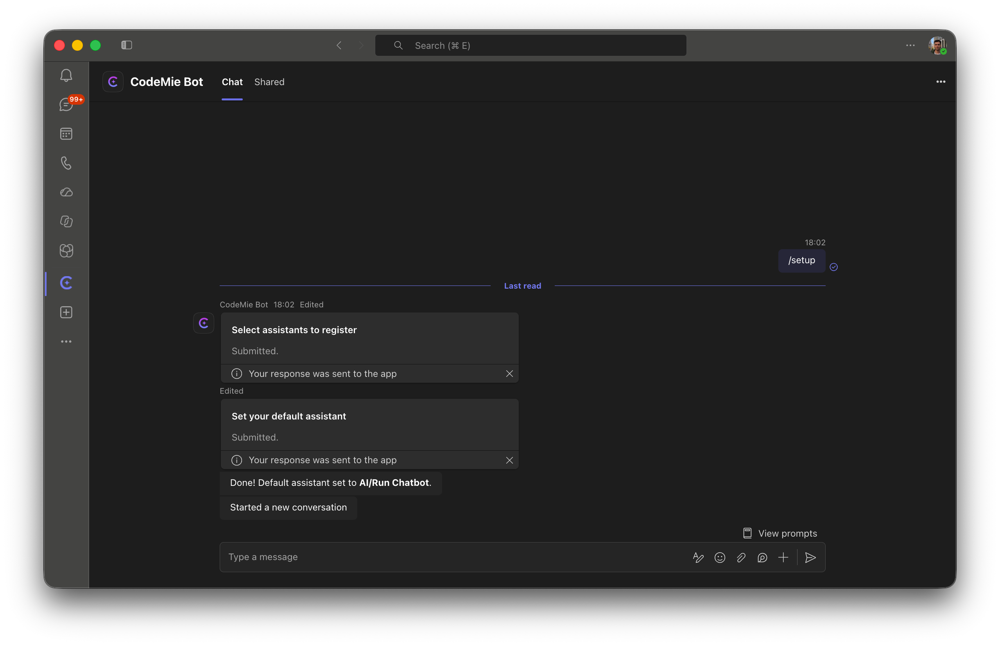

# Microsoft Teams Bot

The CodeMie Bot is a Microsoft Teams app that connects AI/Run CodeMie assistants directly into Teams conversations. Once installed and configured, an assistant can be reached from a personal chat, a group chat, or a channel — with streamed responses, Teams conversation history passed in as context, and file attachments in personal chats.

Setting it up has two parts: installing the app in Teams, and exposing assistants to it through a [MS Teams Bot integration](./integration.md) in CodeMie.

## Install the Bot in Microsoft Teams

The bot can be added to Teams in one of two ways, depending on how the organization has made it available.

### Option A: Add from the organization's app catalog

If an admin has already published the CodeMie Bot to the organization's app catalog, it can be added like any other Teams app:

1. In Teams, open **Apps**, then search for **CodeMie Bot** (or find it under **Built for your org**).
2. Review the app details, then click **Add** for personal use, or **Open** to add the bot to a specific group chat or channel:

### Option B: Sideload a custom app package

Before the bot is published to the org catalog — for example during evaluation or a self-hosted deployment — it can be sideloaded from a `.zip` app package.

:::note Prerequisite
Custom app upload must be allowed by tenant policy: **Teams Admin Center → Teams apps → Setup policies → Upload custom apps**. Contact a Teams admin if the upload option below is not available.
:::

1. In Teams, go to **Apps → Manage your apps → Upload an app**:

2. Choose **Upload a custom app**, then select the built package `.zip` file:

3. Review the app details and click **Add**.

### Choosing where to add the bot

The bot supports three scopes:

- **Personal** — a 1:1 chat with the bot. File attachments are only supported here.
- **Group chat** — added to an existing group chat; the bot only responds when @mentioned.
- **Team/channel** — added to a channel; the bot only responds when @mentioned.

## Expose Assistants to the Bot

Before an assistant can be used from Teams, it needs to be exposed to the bot through an **MS Teams Bot** integration in CodeMie — this determines which assistants are offered when running `/setup` inside Teams. See [MS Teams Bot Integration](./integration.md) for the full setup steps and the difference between User and Project scope.

## Sign In from Teams

On the first message sent to the bot, it replies with a sign-in card. Following it opens CodeMie's sign-in flow (brokered by Azure Bot Service), after which the bot can act on the signed-in user's behalf.

- `/signin` — starts the sign-in flow again if needed.
- `/signout` — ends the session; a subsequent message prompts to sign in again.

## Register and Select Assistants

With at least one MS Teams Bot integration configured, run `/setup` in the chat, group chat, or channel to register assistants and pick a default:

1. The bot replies with a **Select assistants to register** card listing the assistants exposed via the integration for the current scope. Check the ones to register and click **Next**:

2. If more than one assistant was selected, the bot replies with a **Set your default assistant** card listing the assistants just registered. Pick one and click **Save**. If only one assistant was selected, it is set as the default automatically and this step is skipped:

3. Both cards are marked **Submitted**, the bot confirms the default assistant, and starts a new conversation automatically:

- `/setup` — opens the assistant-registration flow above.
- `/default` — reopens the default-assistant picker, limited to already-registered assistants.
- `/list` — shows the assistants registered for the current scope, marking the default one; an assistant that is no longer exposed via the integration is marked as removed.
- `/new` — starts a fresh conversation with the default assistant.

Each personal chat, group chat, and channel keeps its own independent registration and default.

## Using the Bot in a 1:1 Personal Chat

Any message that is not a command is sent to the resolved assistant, with the response streamed back. File attachments are supported; a file sent without accompanying text is treated as a request to analyze or describe it.

## Using the Bot in Group Chats and Channels

- The bot only responds when @mentioned.
- `/setup` must have been run for that group chat or channel before the bot responds to any message.
- Attachments are not supported here; a message notes that attachments should be sent in a personal chat instead.
- When more than one assistant is registered for the scope, messages are automatically routed to the best-matching one; a specific assistant can be forced for a single message by prefixing it with `/<assistant-slug>` (the slug shown by `/list`).

:::note
A group chat or channel can only use assistants that are shared with the project or marked global.
:::

## Command Reference

| Command             | Description                                                                   |
| ------------------- | ----------------------------------------------------------------------------- |
| `/help`             | Lists all available commands.                                                 |
| `/signin`           | Starts the sign-in flow.                                                      |
| `/signout`          | Ends the current session.                                                     |
| `/setup`            | Opens the assistant-registration card for the current scope.                  |
| `/default`          | Opens the default-assistant picker for the current scope.                     |
| `/list`             | Shows the assistants registered for the current scope.                        |
| `/new`              | Starts a new conversation with the default assistant.                         |
| `/<assistant-slug>` | Prefix on a message to route that message to a specific registered assistant. |

## FAQ

| Question                                                                                | Answer                                                                                                                                                       |
| --------------------------------------------------------------------------------------- | ------------------------------------------------------------------------------------------------------------------------------------------------------------ |
| Why is "Upload a custom app" missing in Teams?                                          | Sideloading is disabled by tenant policy — contact a Teams admin.                                                                                            |
| Why does the bot not respond in a group chat or channel?                                | The bot was not @mentioned, or `/setup` has not been run for that group chat or channel yet.                                                                 |
| Why does the bot say "This group/channel has not been configured yet"?                  | Run `/setup` in that group chat or channel to register an assistant.                                                                                         |
| Why does the bot say "You're not signed in" in a group chat or channel?                 | Message the bot directly in a personal chat to complete sign-in, then try again.                                                                             |
| Why did an assistant registered with `/setup` disappear, or show as removed in `/list`? | The assistant is no longer exposed by the MS Teams Bot integration — check the integration's **Assistants** field in CodeMie.                                |
| Why does attachment upload fail in a group chat or channel?                             | Attachments are only supported in personal chats.                                                                                                            |
| Why doesn't typing `/` show a command autocomplete menu in a personal chat?             | Slash-command autocomplete is not supported in personal chats — this is a Microsoft Teams limitation. Commands still work when typed in full, e.g. `/setup`. |

## See Also

- [MS Teams Bot Integration](./integration.md) — configuring which assistants the bot can use
- [Integrations](../tools_integrations/integrations/index.md) — integration scopes and default selection
