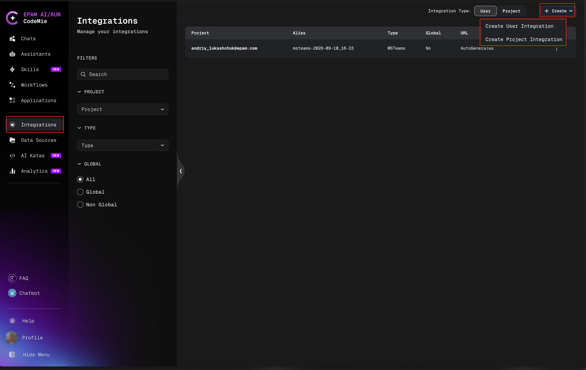
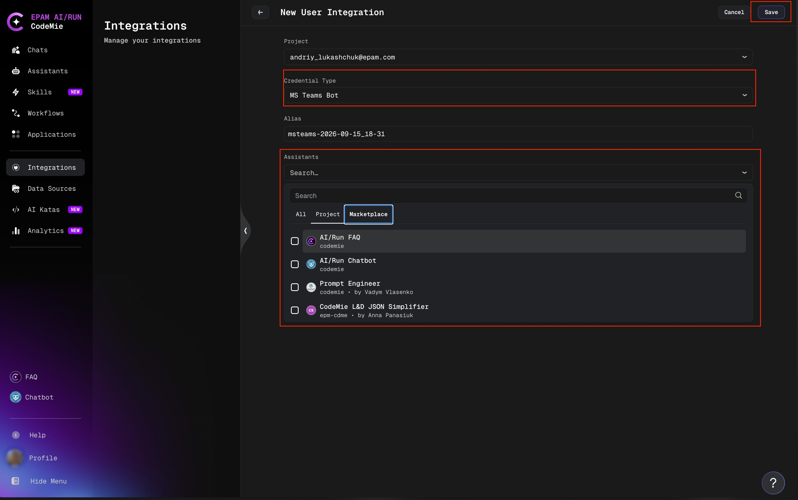

# MS Teams Bot Integration

The **MS Teams Bot** integration determines which assistants the CodeMie Bot can offer inside Microsoft Teams. It does not add a capability to an assistant the way a tool does — instead, it tells the bot which assistants it is allowed to expose when a user runs `/setup` in Teams. See [Microsoft Teams Bot](./index.md) for installing the bot in Teams and using it once it's set up.

## Create the Integration

1. In AI/Run CodeMie, open the **Integrations** tab, choose **User** or **Project**, and click **+ Create**:

2. Set **Credential Type** to **MS Teams Bot**, then select the assistants to expose in the **Assistants** field:

3. Click **Save**.

## Fields

| Field               | Description                                                                                                                                      |
| ------------------- | ------------------------------------------------------------------------------------------------------------------------------------------------ |
| **Project**         | The project the integration belongs to.                                                                                                          |
| **Credential Type** | `MS Teams Bot`.                                                                                                                                  |
| **Alias**           | Name for the integration, shown in the integrations list.                                                                                        |
| **Assistants**      | Multiselect of the assistants exposed to the bot for this integration's scope, searchable across **All**, **Project**, and **Marketplace** tabs. |

## User vs. Project Scope

| Integration scope | Created under                                                           | Exposed to                                            |
| ----------------- | ----------------------------------------------------------------------- | ----------------------------------------------------- |
| **User**          | **Integrations → User**                                                 | The Teams user who created it, in personal chats only |
| **Project**       | **Integrations → Project** (requires `isAdmin` or `applications_admin`) | Any group chat or channel where `/setup` is run       |

See [Integrations](../tools_integrations/integrations/index.md) for the full explanation of integration scopes, priority, and how a default is picked when more than one exists.

:::note
A group chat or channel can only use assistants that are shared with the project or marked global — a private personal assistant is not offered there even if it is selected in a User integration.
:::
