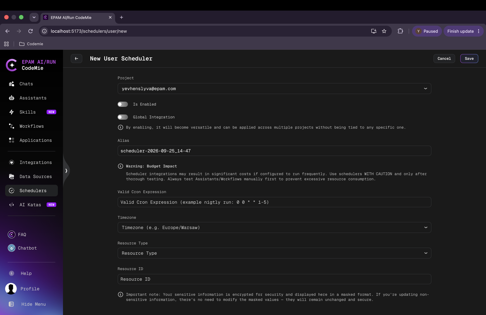

# Creating a Scheduler

Schedulers can be created directly from the Schedulers page using the **+ Create** button in the top-right corner.

## User and Project Schedulers

The **Scheduler Type** switch distinguishes two kinds of schedulers:

- **User schedulers** — owned by and visible only to the creating user; available to all users.
- **Project schedulers** — shared across the project; available to project administrators and platform administrators only.

The **+ Create** button behavior depends on the current user's role:

- **Regular users** — clicking **+ Create** opens the creation form immediately, set to User scheduler type.
- **Administrators** — clicking **+ Create** opens a dropdown offering **Create User Scheduler** or **Create Project Scheduler**.

## Scheduler Creation Form



The form contains the following fields:

### Project

Select the project under which the scheduler will operate. The dropdown lists all projects accessible to the user.

### Is Enabled

Toggle to control whether the scheduler begins running immediately after saving. Disabled schedulers are saved but do not fire until explicitly enabled.

### Global Integration

When enabled, the scheduler is not tied to a specific project and can be applied across multiple projects. Leave this off for project-specific automation.

### Alias

A human-readable name for the scheduler. An alias is auto-generated in the format `scheduler-YYYY-MM-DD_HH-MM` but can be replaced with a custom name.

### Valid Cron Expression

The schedule defined using [standard cron syntax](https://en.wikipedia.org/wiki/Cron). The field accepts five-field cron expressions.

**Common examples:**

```
# Every hour
0 * * * *

# Every day at midnight
0 0 * * *

# Every weekday at 9:00 AM
0 9 * * MON-FRI

# Every 15 minutes
*/15 * * * *

# Nightly run (weekdays only)
0 0 * * 1-5
```

:::info Minimum Interval
Schedulers must run no more frequently than once per hour. Expressions that exceed this frequency are rejected at save time.
:::

:::warning Budget Impact
Schedulers may incur significant costs if configured to run frequently. Always test Assistants and Workflows manually before enabling an automated schedule to prevent excessive resource consumption.
:::

The schedule is displayed in the schedulers list as a human-readable description (e.g., "At 45 minutes past the hour") rather than the raw cron expression.

### Timezone

The timezone in which the cron expression is evaluated. For example, `0 9 * * *` with `Europe/Warsaw` fires at 9:00 AM Warsaw local time. Changing the timezone after creation shifts the schedule accordingly.

### Resource Type

The type of resource to trigger on each execution. Available options:

- **Assistant** — sends an initial prompt to a CodeMie assistant and creates a new chat session.
- **Workflow** — triggers a workflow execution, optionally with a starting prompt.
- **Datasource** — triggers a data source reindex.

### Resource ID

The identifier of the specific resource to trigger. After selecting a Resource Type, enter the ID of the target assistant, workflow, or data source.

:::note
Sensitive information in the Resource ID field is encrypted and displayed in masked format. Non-sensitive fields do not need to be re-entered when editing.
:::

## Saving the Scheduler

Click **Save** to create the scheduler. After saving, the Schedulers page reloads with the new scheduler visible in the list.

Click **Cancel** to discard the form and return to the Schedulers page without creating a scheduler.
