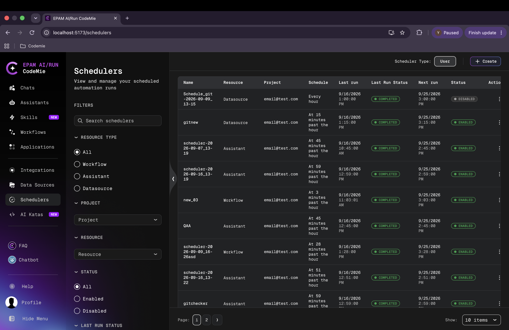
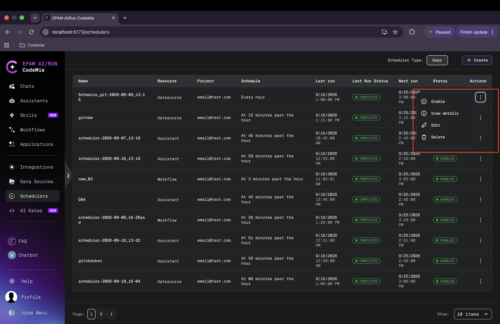

# Schedulers

Schedulers automate the execution of CodeMie resources — **Assistants**, **Workflows**, and **Data Sources** — on a recurring cron-based schedule. Instead of triggering resources manually, a scheduler fires them automatically at configured intervals, maintaining a full history of every run.

## Schedulers List

The **Schedulers** section is accessible from the left navigation. It displays all schedulers associated with the current account, showing at a glance when each last ran, what its result was, and when it is scheduled to run next.

Each row in the table shows:

| Column              | Description                                                               |
| ------------------- | ------------------------------------------------------------------------- |
| **Name**            | The scheduler alias (auto-generated or user-defined)                      |
| **Resource**        | The type of resource being triggered (Assistant, Workflow, or Datasource) |
| **Project**         | The project the scheduler belongs to                                      |
| **Schedule**        | A human-readable description of the cron schedule                         |
| **Last run**        | Timestamp of the most recent execution                                    |
| **Last Run Status** | Outcome of the last run (Completed or Failed)                             |
| **Next run**        | Timestamp of the next scheduled execution                                 |
| **Status**          | Whether the scheduler is currently Enabled or Disabled                    |

## Scheduler Type

The **Scheduler Type** toggle in the top-right corner switches between **User** schedulers (created by the current user) and other views. The default view shows user-owned schedulers.

## Filtering

The left panel provides filters to narrow the list:

- **Resource Type** — All, Workflow, Assistant, or Datasource
- **Project** — Filter by project
- **Resource** — Filter by a specific resource
- **Status** — Enabled or Disabled
- **Last Run Status** — filter by Completed or Failed outcomes

A search field at the top of the filter panel supports searching by scheduler name.

## Scheduler Actions

Each scheduler row has a **⋮** actions menu with the following options:

| Action               | Description                                        |
| -------------------- | -------------------------------------------------- |
| **Enable / Disable** | Toggle the scheduler on or off without deleting it |
| **View details**     | Open the scheduler's run history page              |
| **Edit**             | Modify the scheduler configuration                 |
| **Delete**           | Permanently remove the scheduler                   |

Disabling a scheduler stops future runs without losing the configuration or run history.
