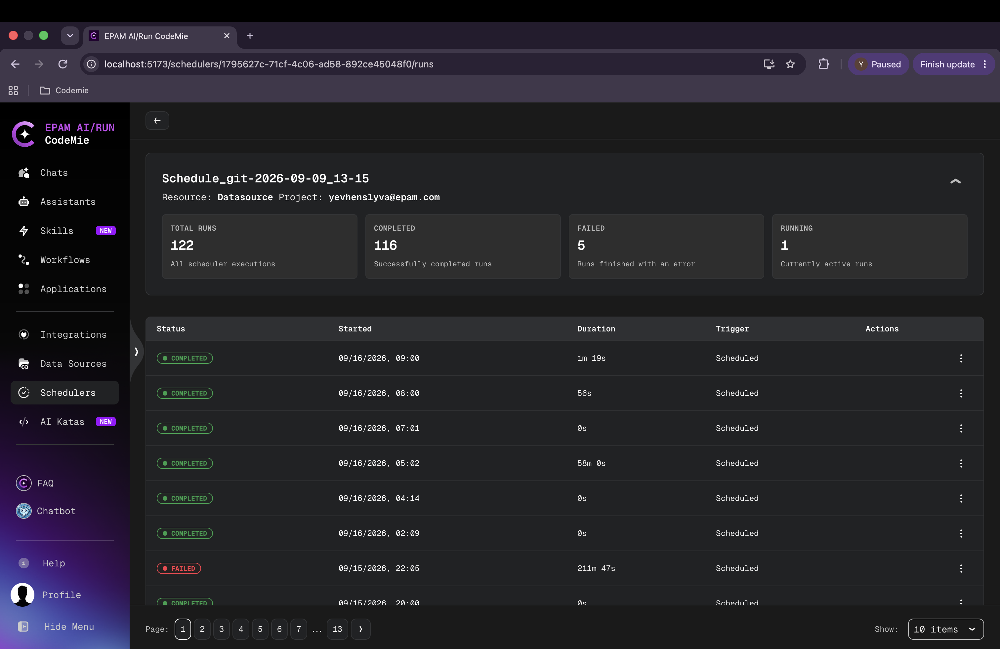
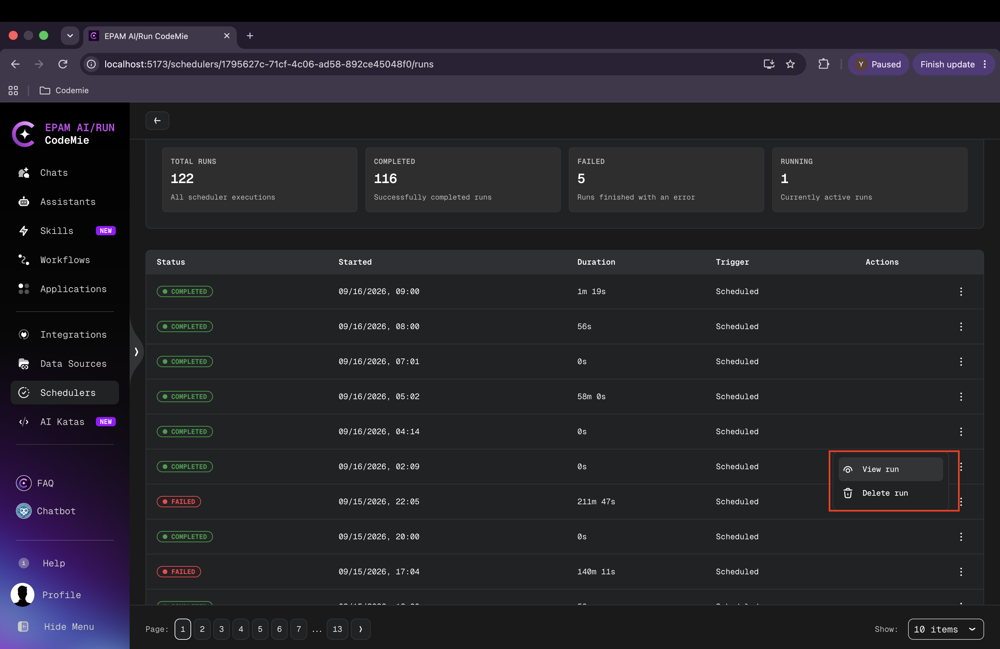
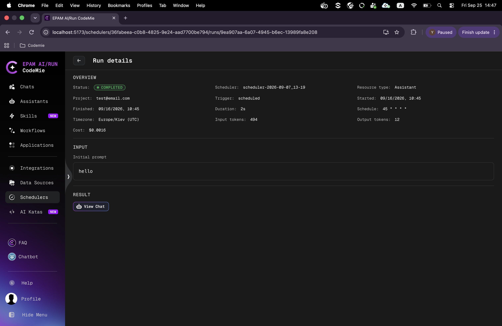
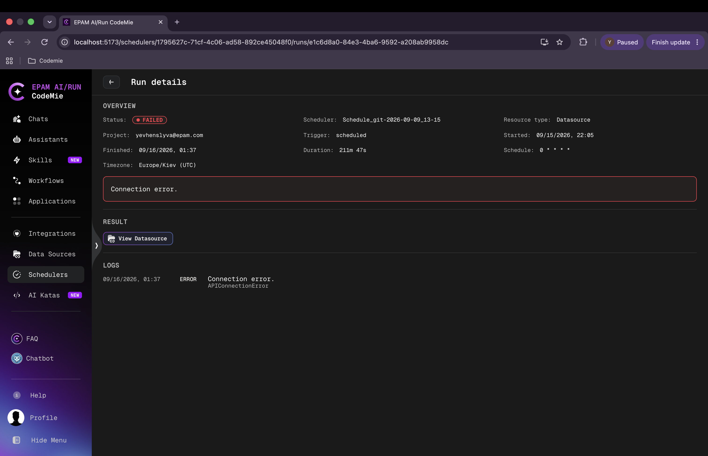

# Monitoring Scheduler Runs

Each scheduler maintains a complete history of its executions. The run history page provides aggregate statistics and a detailed log of every run, including its status, duration, token usage, and cost.

## Viewing Run History

To open the run history for a scheduler, click **⋮** on its row in the Schedulers list and select **View details**.

The page header shows the scheduler name, the resource type, and the project.

### Statistics

Four summary tiles at the top display aggregated metrics for the scheduler:

| Metric         | Description                                                          |
| -------------- | -------------------------------------------------------------------- |
| **Total Runs** | Total number of executions, including completed, failed, and running |
| **Completed**  | Number of runs that finished successfully                            |
| **Failed**     | Number of runs that ended with an error                              |
| **Running**    | Number of currently active runs                                      |

### Runs Table

The table lists individual executions in reverse chronological order. Each row shows:

- **Status** — Completed (green) or Failed (red)
- **Started** — Date and time the run began
- **Duration** — How long the run took to complete
- **Trigger** — How the run was initiated (`Scheduled` for automatic runs)
- **Actions** — Per-run action menu

### Filtering Runs

Runs can be filtered by status (Completed, Failed, Running) using the filter controls. Pagination is available for schedulers with many executions.

## Run Actions

Click **⋮** on a run row to access per-run actions:

- **View run** — Open the Run Details page for that execution.
- **Delete run** — Permanently remove the run record. The statistics cards update immediately to reflect the deletion.

## Run Details

Clicking **View run** opens the Run Details page, which provides a full breakdown of the execution.

### Successful Run

The Overview section shows:

| Field                  | Description                                                                 |
| ---------------------- | --------------------------------------------------------------------------- |
| **Status**             | `COMPLETED`                                                                 |
| **Scheduler**          | Name of the scheduler that triggered the run                                |
| **Resource type**      | The type of resource that was executed (Assistant, Workflow, or Datasource) |
| **Project**            | The project context                                                         |
| **Trigger**            | `scheduled` for automatic runs                                              |
| **Started / Finished** | Start and end timestamps                                                    |
| **Duration**           | Total execution time                                                        |
| **Timezone**           | The timezone in which the schedule was evaluated                            |
| **Input tokens**       | Number of tokens consumed as input                                          |
| **Output tokens**      | Number of tokens generated as output                                        |
| **Cost**               | Estimated cost of the run in USD                                            |
| **Schedule**           | The cron expression that produced this run                                  |

**Input section** — For Assistant and Workflow schedulers, the initial prompt provided when the scheduler was configured is shown here.

**Result section** — Links to the resource that was produced:

- Assistant runs include a **View Chat** button that opens the assistant chat session created by this run.
- Workflow runs link to the workflow execution.
- Datasource runs link to the data source.

### Failed Run

Failed runs display the same overview fields, with **Status** shown as `FAILED`. An error message is highlighted in a red box at the top of the page.

The **Logs** section lists chronological log entries with timestamps, error codes, and messages to help diagnose the cause of failure.

The **Result** section links to the associated resource (e.g., **View Datasource**) so the resource configuration can be inspected directly.

:::tip Investigating Failures
When a run fails, check the Logs section for error codes such as `APIConnectionError` or `Connection error.` These typically indicate a connectivity issue with the resource (e.g., a data source that is no longer reachable). Verify the resource configuration and re-run manually to confirm the issue is resolved before relying on the schedule again.
:::
