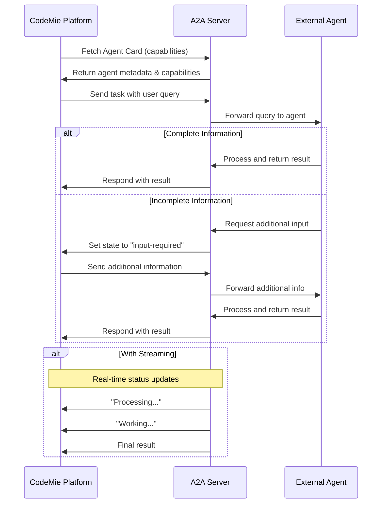
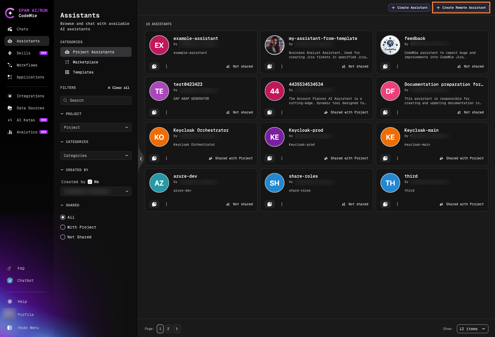
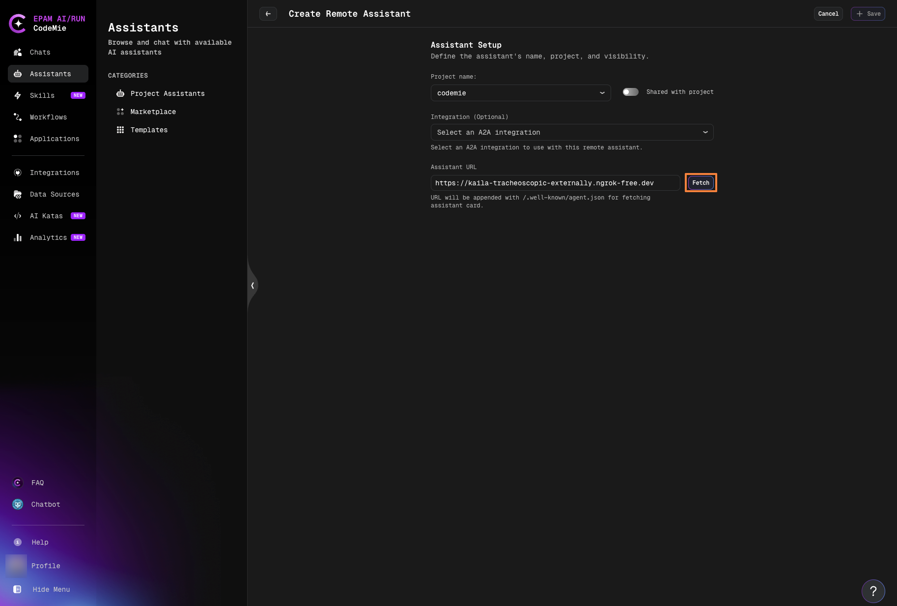
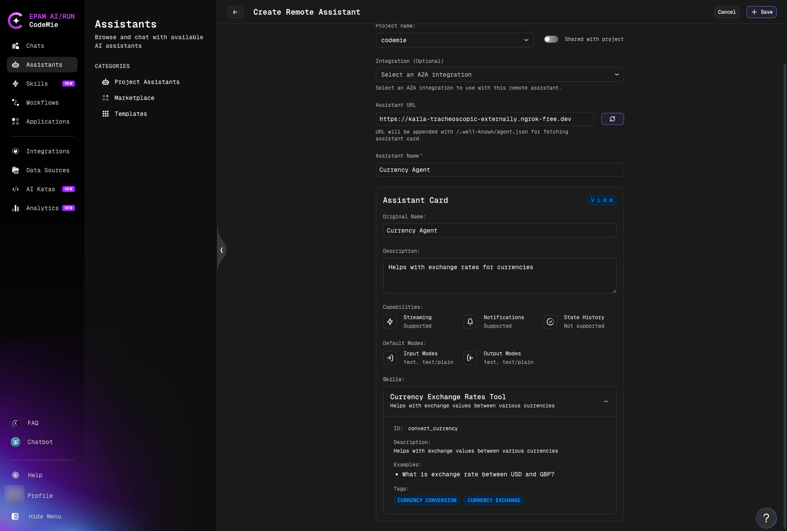
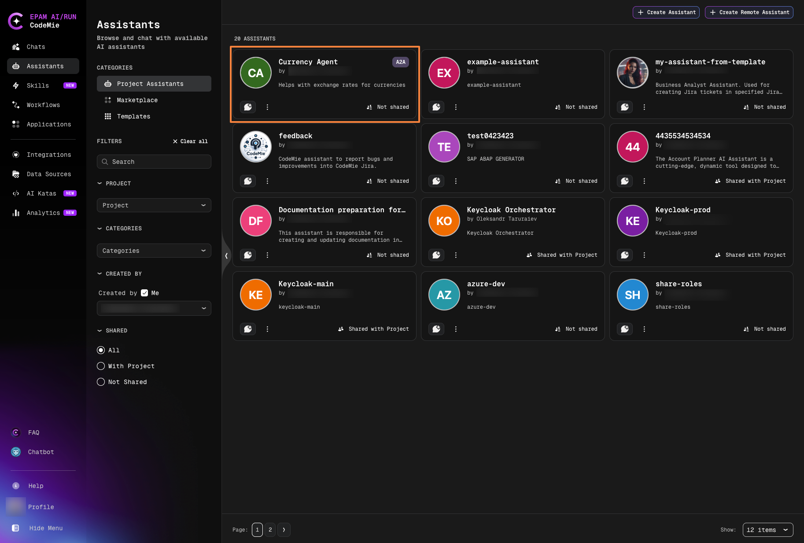
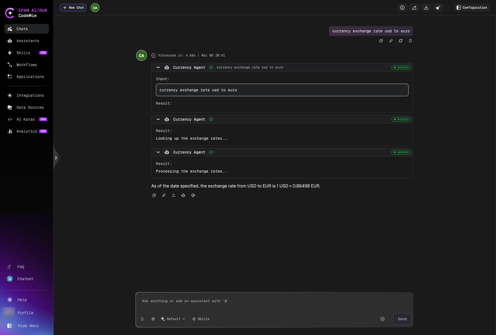
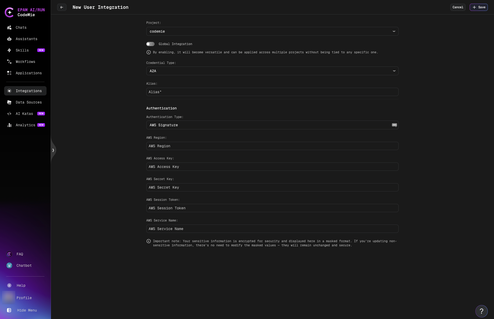
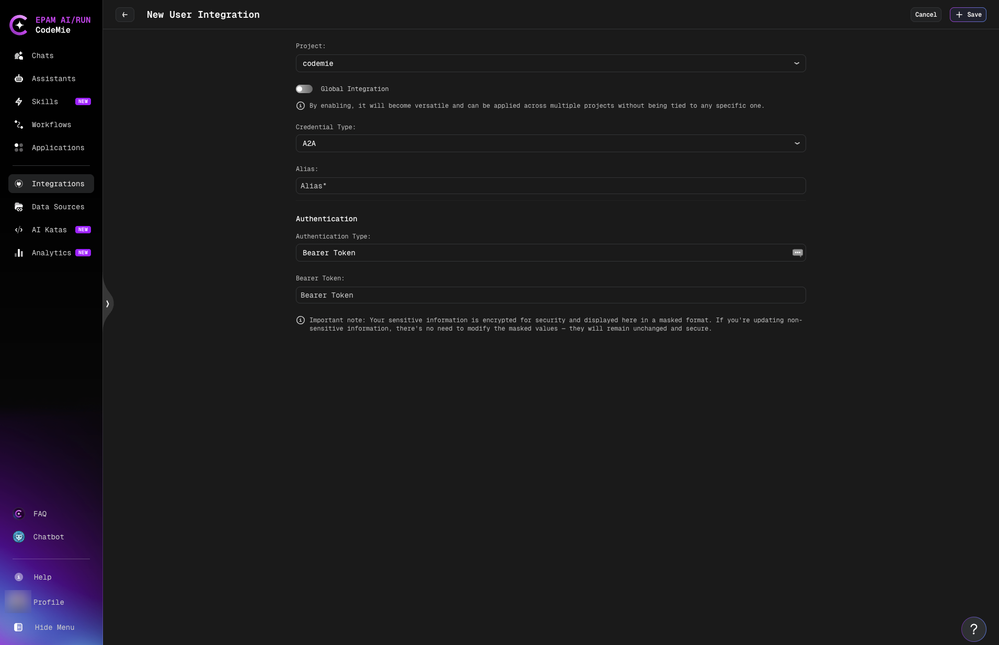
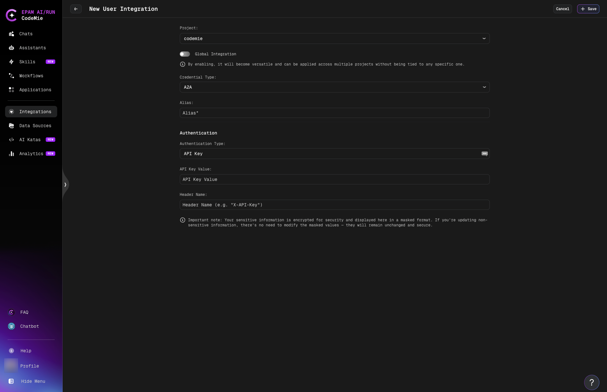

import Tabs from '@theme/Tabs';
import TabItem from '@theme/TabItem';

# Agent-to-Agent (A2A) Protocol

CodeMie supports the **Agent-to-Agent (A2A) Protocol**, an open-standard protocol designed to enable seamless communication and collaboration between AI agents built with different frameworks and by different vendors.
A2A provides a common language that breaks down silos and fosters interoperability across the AI ecosystem.

With A2A integration, CodeMie connects to external AI agents—regardless of their framework or origin—allowing them to communicate and work together on complex tasks.

:::warning Protocol Version 1.0
CodeMie implements A2A protocol **version 1.0**. Agents built for the earlier v0.3 protocol are not compatible and are refused at registration. This includes agents that serve only a legacy `agent.json` card and agents whose Agent Card declares a pre-1.0 JSON-RPC interface (for example a v0.3 card with a top-level `url` and `protocolVersion` `0.3.x`). Bedrock AgentCore runtimes are checked the same way: they must serve a v1.0 Agent Card.
:::

## Key Features

- **Framework-Agnostic**: Connect agents built with LangGraph, LangChain, CrewAI, or any framework supporting A2A
- **Vendor-Independent**: Integrate agents from different providers and platforms
- **Remote Assistants**: Add external agents as assistants within CodeMie
- **Standardized Communication**: JSON-RPC 2.0 protocol for reliable agent interactions
- **Multi-turn Conversations**: Support for conversational flows with state management
- **Real-time Streaming**: Get status updates and results as they're processed
- **Secure Integration**: Optional authentication and authorization support

## How It Works

A2A enables standardized interaction between CodeMie and external agents through a client-server model:



## Prerequisites

To integrate an external agent with CodeMie via A2A:

- **Agent URL**: The external agent must expose an A2A-compatible endpoint
- **Agent Card**: The agent should provide a card describing its capabilities
- **Network Access**: CodeMie must be able to reach the agent's URL

:::info Authentication
Most A2A agents are publicly accessible and don't require authentication.
If your agent requires authorization, see [Authentication](#authentication-optional) section below.
:::

## Create Remote Assistant

1. Navigate to **Assistants** and click the **Create Remote Assistant** button in the top-right corner:

   

2. On the **Create Remote Assistant** page, configure the basic settings:
   - **Project**: Select the project where the assistant will be created.
   - **Share with project**: Toggle on to make the assistant available to project team members.
   - **Integration (Optional)**: Leave empty for public agents. See [Authentication](#authentication-optional) section if your agent requires credentials.

   

3. Enter the **Assistant URL** and click **Fetch**:

   The assistant URL should point to your A2A agent's endpoint. For example:
   - `https://example.com/agent`
   - `https://example.ngrok-free.dev`

   After clicking **Fetch**, CodeMie will send a request to retrieve the agent card.

4. Review the fetched agent card details:

   

   The agent card contains:
   - **Assistant name**: Pre-populated from the agent. You can customize it if desired.
   - **Description**: Agent's purpose and capabilities
   - **Skills**: Available tools and functions
   - **Other metadata**: Version, supported modes, etc.

   :::tip
   The assistant card provides transparency about what the remote agent can do. Review it carefully to understand the agent's capabilities before saving.
   :::

5. Click **Save** to create the remote assistant.

## Work with Remote Assistants

Remote assistants are marked with an **A2A** label to differentiate them from regular CodeMie assistants.



### Start a Conversation

Click on the remote assistant card to open the chat interface. The conversation works just like with regular CodeMie assistants:



- Type your questions or requests
- Receive real-time status updates during processing
- View results directly in the chat
- Continue multi-turn conversations with context

### View Agent Card

Click the assistant icon in the chat to view the agent card and detailed capabilities at any time.

### Edit Remote Assistant

Remote assistants support limited editing to maintain integrity:

- **Editable**: Assistant name, project assignment, sharing settings
- **Read-only**: All agent-specific fields (description, tools, capabilities)

This ensures that the remote agent's configuration remains consistent with its actual implementation.

### Delete Remote Assistant

Remote assistants can be deleted like regular assistants. This only removes the reference in CodeMie—the external agent continues to run independently.

## Authentication (Optional)

:::info
Most A2A agents are publicly accessible and don't require authentication. Only configure this if your external agent requires credentials.
:::

If your external agent requires authentication, CodeMie supports multiple authentication types:

### Configure A2A Integration

1. Navigate to **Integrations** → **User** or **Project** → **+ Create**.

2. Select basic parameters:
   - **Project**: Select your CodeMie project name.
   - **Global Integration**: Toggle on to use across multiple projects.
   - **Credential Type**: Select **A2A**.
   - **Alias**: Enter integration name (e.g., "my-agent-auth").

3. Choose **Authentication Type** and configure credentials:

<Tabs groupId="auth-type">
  <TabItem value="aws" label="AWS Signature" default>

Use for agents deployed on AWS that require AWS Signature Version 4 authentication.



**Required fields:**

<ul>
<li><strong>AWS Region</strong>: AWS region where your agent is deployed (e.g., <code>us-east-1</code>)</li>
<li><strong>AWS Access Key</strong>: Your AWS access key ID</li>
<li><strong>AWS Secret Key</strong>: Your AWS secret access key</li>
<li><strong>AWS Session Token</strong> (optional): Temporary session token for role-based access</li>
<li><strong>AWS Service Name</strong> (optional): AWS service name for signature (e.g., <code>execute-api</code>)</li>
</ul>

  </TabItem>
  <TabItem value="bearer" label="Bearer Token">

Use for agents that require bearer token authentication.



**Required fields:**

<ul>
<li><strong>Bearer Token</strong>: The authentication token provided by your agent</li>
</ul>

  </TabItem>
  <TabItem value="basic" label="Basic Auth">

Use for agents that require username/password authentication.


**Required fields:**

<ul>
<li><strong>Username</strong>: Your username</li>
<li><strong>Password</strong>: Your password</li>
</ul>

  </TabItem>
  <TabItem value="api-key" label="API Key">

Use for agents that require API key authentication via custom headers.



**Required fields:**

<ul>
<li><strong>API Key Value</strong>: Your API key</li>
<li><strong>Header Name</strong>: Custom header name (e.g., <code>X-API-Key</code>, <code>Authorization</code>)</li>
</ul>

  </TabItem>
</Tabs>

### Using the Integration

After creating the integration:

1. Click **Save**.
2. When creating a remote assistant, select this integration in the **Integration (Optional)** dropdown.
3. CodeMie will automatically include the authentication credentials when communicating with the agent.

## Example: Demo Agents

The [ai-run-demo-agents](https://github.com/epam-gen-ai-run/ai-run-demo-agents) repository provides three reference agents that implement A2A protocol 1.0:

| Agent                  | Path                                 | Style                                                                                |
| ---------------------- | ------------------------------------ | ------------------------------------------------------------------------------------ |
| `text-insights-agent`  | `python/agents/text-insights-agent`  | Non-streaming — returns a single message                                             |
| `howto-guide-agent`    | `python/agents/howto-guide-agent`    | Streaming — returns a task with incremental artifact events                          |
| `codemie-caller-agent` | `python/agents/codemie-caller-agent` | Non-streaming — proxies to a CodeMie assistant via A2A v1.0 and returns a wire trace |

All three agents use the `a2a-sdk` 1.x and serve a v1.0 Agent Card at `/.well-known/agent-card.json`.

### Run an Agent Locally

1. Clone the repository:

   ```bash
   git clone https://github.com/epam-gen-ai-run/ai-run-demo-agents.git
   cd ai-run-demo-agents/python/agents/text-insights-agent
   ```

2. Start the agent (see the agent's `README.md` for environment variables):

   ```bash
   uv run .
   ```

3. Register the agent in CodeMie using its base URL (for example `http://localhost:10800` when CodeMie runs on the same machine).

   The demo agents advertise `http://<host>:<port>/` in their Agent Card, where `--host` and `--port` come from the command line. They have no built-in tunnel option, so `--host` must be an address CodeMie can reach.

:::note Docker
When CodeMie runs in Docker, start the agent on the same Docker network and pass `--host <container-name>` so the Agent Card advertises an address the CodeMie container can reach.
:::

:::tip Developer Community
The [ai-run-demo-agents](https://github.com/epam-gen-ai-run/ai-run-demo-agents) repository provides examples and contribution guidelines for building A2A-compatible agents.
:::

## Call a CodeMie Assistant from an External Client

Every CodeMie assistant is also published as an A2A agent and can be called by any external A2A 1.0 client or another agent.

| Endpoint          | Path                                                                |
| ----------------- | ------------------------------------------------------------------- |
| Agent Card        | `GET /v1/a2a/assistants/{assistant_id}/.well-known/agent-card.json` |
| JSON-RPC endpoint | `POST /v1/a2a/assistants/{assistant_id}`                            |

Every JSON-RPC request must carry the header `A2A-Version: 1.0` (or the query parameter `A2A-Version=1.0`). Requests without this header are rejected with error `-32009`.

**Authentication:** the JSON-RPC endpoint always requires credentials. A private assistant's card also requires credentials; the card of a global assistant is public.

- With `IDP_PROVIDER=local`: log in via `POST /v1/local-auth/login` and include `Authorization: Bearer <token>`. The token is valid for 24 hours.
- With other identity providers: use the bearer token issued by that provider.

## Supported Operations

| Method                                             | Support                                       |
| -------------------------------------------------- | --------------------------------------------- |
| `SendMessage`                                      | Supported — blocking; result is a task        |
| `SendStreamingMessage`                             | Supported — server-sent events                |
| `GetTask`                                          | Supported                                     |
| `CancelTask`                                       | Supported (a completed task answers `-32002`) |
| `GetExtendedAgentCard`                             | Supported — returns the agent card            |
| `ListTasks`, `SubscribeToTask`, push notifications | Not implemented — returns `-32601`            |

## Known Limitations

- **Protocol version 1.0 only.** Pre-1.0 method names and agents without `A2A-Version: 1.0` are rejected.
- **Text parts only.** The card declares `text/plain` input and output modes. A request with `acceptedOutputModes` that excludes `text/plain` answers `-32005`.
- **`returnImmediately` is not supported** — returns `-32004`.
- **`ListTasks`, `SubscribeToTask`, and push notifications are not implemented** — return `-32601`.
- **Protocol errors are HTTP 200.** JSON-RPC errors (version mismatch, unknown method, invalid params) come back with HTTP 200 and a JSON-RPC `error` object. Authentication and lookup failures are plain HTTP errors (`401`, `403`, `404`).
- **An exception inside an assistant run** is reported as task state `TASK_STATE_INPUT_REQUIRED`, not `FAILED`.

## Important Notes

### Agent Compatibility

- External agents must implement A2A protocol **version 1.0**
- Supported communication: JSON-RPC 2.0 over HTTP/HTTPS
- The Agent Card must be served at `/.well-known/agent-card.json`

### Network Requirements

- CodeMie must have network access to the agent URL
- For local development, use tools like ngrok to expose agents
- Production agents should use HTTPS with valid SSL certificates

### Security Considerations

:::warning Agent Trust
Only add agents from trusted sources. Remote agents have access to conversation context and can process sensitive information shared in chats.
:::

- Use A2A integration with authentication for production agents
- Review agent cards to understand what data the agent accesses
- Consider using project-level assistants to limit scope

### Timeout Configuration

Administrators can configure A2A timeout settings in the platform configuration:

- `A2A_AGENT_CARD_FETCH_TIMEOUT`: Maximum seconds to fetch agent capability cards (default: 30s)
- `A2A_AGENT_REQUEST_TIMEOUT`: Maximum seconds to wait for agent responses (default: 30s)

See [API Configuration](../../../admin/configuration/codemie/api-configuration.md#agent-to-agent-a2a-communication) for details.

## Troubleshooting

| Symptom                                                                           | Fix                                                                                                                                                                                                |
| --------------------------------------------------------------------------------- | -------------------------------------------------------------------------------------------------------------------------------------------------------------------------------------------------- |
| Registration fails with `HTTP 404`                                                | The base URL is incorrect (do not include `/.well-known/agent-card.json` or any path), or the agent only supports an older protocol version. Verify with `curl <url>/.well-known/agent-card.json`. |
| Registration succeeds, chat fails with `ConnectError`                             | The Agent Card advertises an address the CodeMie container cannot reach (for example `http://0.0.0.0:<port>/`). Restart the agent with `--host <container-name>` on the CodeMie Docker network.    |
| `-32009` on every JSON-RPC call                                                   | Add `A2A-Version: 1.0` to the request headers.                                                                                                                                                     |
| `401 Authentication required`                                                     | Token is missing or expired (24-hour lifetime). Log in again to obtain a fresh token. The `user-id` header alone is not accepted in non-local environments.                                        |
| Slow first response                                                               | The remote agent calls an LLM. Raise `A2A_AGENT_REQUEST_TIMEOUT` in the platform configuration.                                                                                                    |
| Registration fails with `Invalid agent card format`                               | The agent's `/.well-known/agent-card.json` is not valid JSON. Fix the agent card format.                                                                                                           |
| Registration fails with `Agent card has no JSON-RPC interface`                    | The card declares no JSON-RPC interface in `supportedInterfaces`. Add one to the agent card.                                                                                                       |
| Registration fails with `Agent does not support A2A protocol 1.0`                 | The agent's JSON-RPC interface declares a pre-1.0 protocol version (a v0.3 agent). Upgrade the agent to A2A v1.0, for example `a2a-sdk` 1.x.                                                       |
| Chat fails with `Remote A2A agent does not support the required protocol version` | The Agent Card says 1.0, but the agent rejected the v1.0 requests. Make sure it handles the `A2A-Version: 1.0` header and the v1.0 method names.                                                   |

## Learn More

- **[A2A Protocol Documentation](https://google.github.io/A2A/#/documentation)** - Official A2A protocol specification
- **[Building A2A-Compatible Agents](./a2a-building-agents.mdx)** - Guide for wrapping an existing agent with the A2A protocol
- **[Demo Agents Repository](https://github.com/epam-gen-ai-run/ai-run-demo-agents)** - Example agents and implementation guides
- **[Sub-Assistants and Orchestration](../../assistants/sub-assistants-multi-assistant-orchestrator.md)** - Agent-to-agent communication within CodeMie
- **[API Configuration](../../../admin/configuration/codemie/api-configuration.md)** - Platform-level A2A settings
