import Tabs from '@theme/Tabs';
import TabItem from '@theme/TabItem';

# Confluence

CodeMie integrates with Atlassian Confluence to allow assistants to retrieve and interact with Confluence spaces, pages, and articles. This enables AI-powered search and summarization of a team's knowledge base directly from the chat.

Two authentication methods are available for the Confluence integration:

- **Personal Access Token (PAT)** — a Confluence API token is created manually and pasted into the integration form. This is the classic approach and works for both Confluence Cloud and Confluence Self-hosted.
- **OAuth 2.0 (Atlassian 3LO)** — an administrator configures the Atlassian OAuth application once (shared `client_id` and `client_secret`), and each member authorizes under their own Atlassian account. Tokens are per-user: calls run as the member who connected, so no one borrows another member's token. **This option is only available for Confluence Cloud and requires the platform's Confluence OAuth feature to be enabled by an administrator.**

:::info OAuth availability
The OAuth 2.0 sign-in option is shown in the integration form only when the platform administrator has enabled it. If the toggle is not visible, the `CONFLUENCE_OAUTH_ENABLED` flag is off. Contact the platform administrator to enable it. See the [OAuth Integration Setup](../../../admin/configuration/codemie/api-configuration.md#confluence-oauth) admin guide.
:::

## 1. Create API Token

<Tabs groupId="confluence-version">
  <TabItem value="cloud" label="Confluence Cloud" default>

1.1. Click your profile icon in the top-right corner and select **Account settings**:

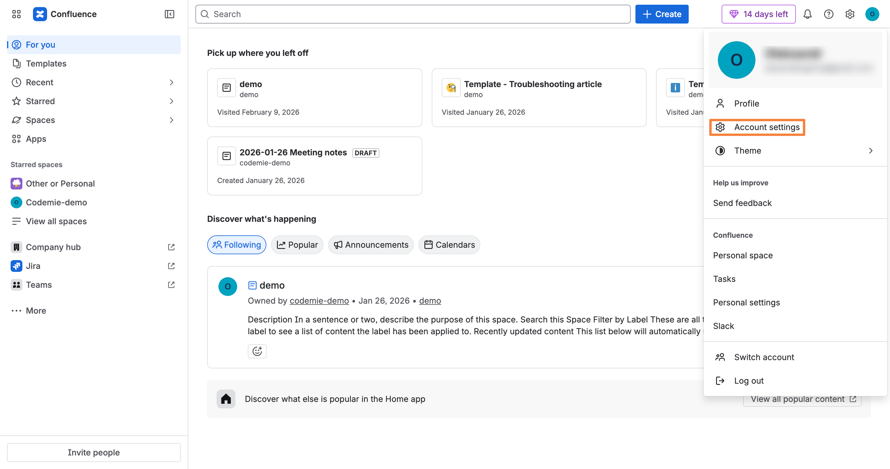

1.2. Navigate to the **Security** tab. In the **API Tokens** section, click **Create API token**:

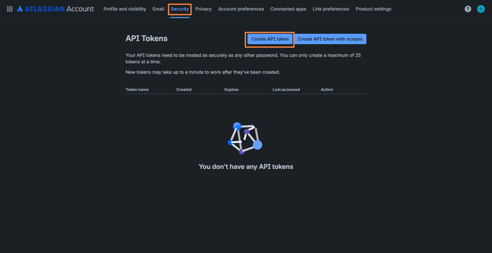

1.3. Specify a token name (e.g., "codemie-demo"), set an expiration date, and click **Create**:

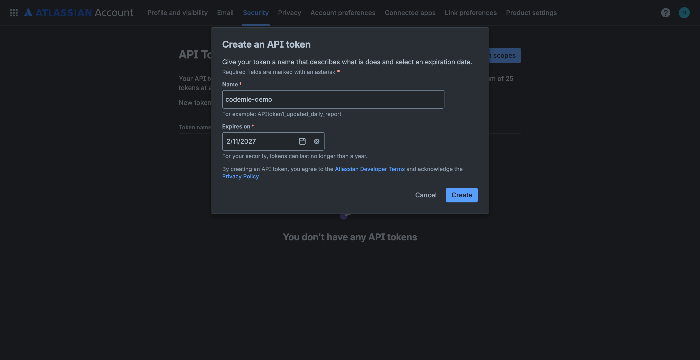

1.4. Click **Copy** to copy the generated API token and store it securely:

:::warning
You can't recover the API token after you close this dialog. Make sure to copy and save it before clicking **Done**.
:::

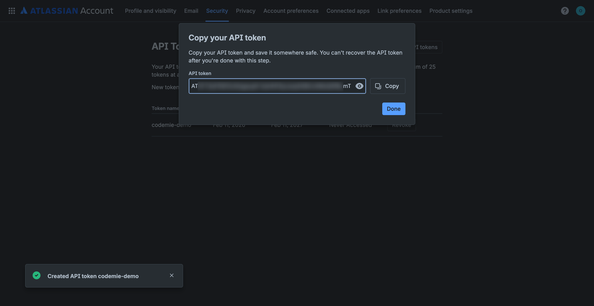

  </TabItem>
  <TabItem value="self-hosted" label="Confluence Self-hosted">

1.1. Log in to your Confluence instance. Click your profile icon in the top-right corner and select **API Token Authentication**:

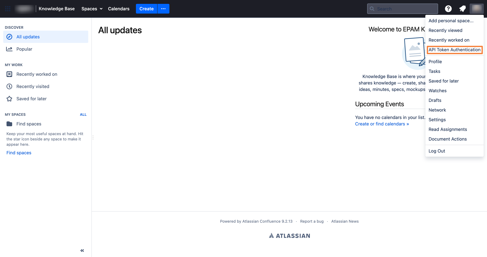

1.2. On the **My API Tokens** page, click **New API Token**:

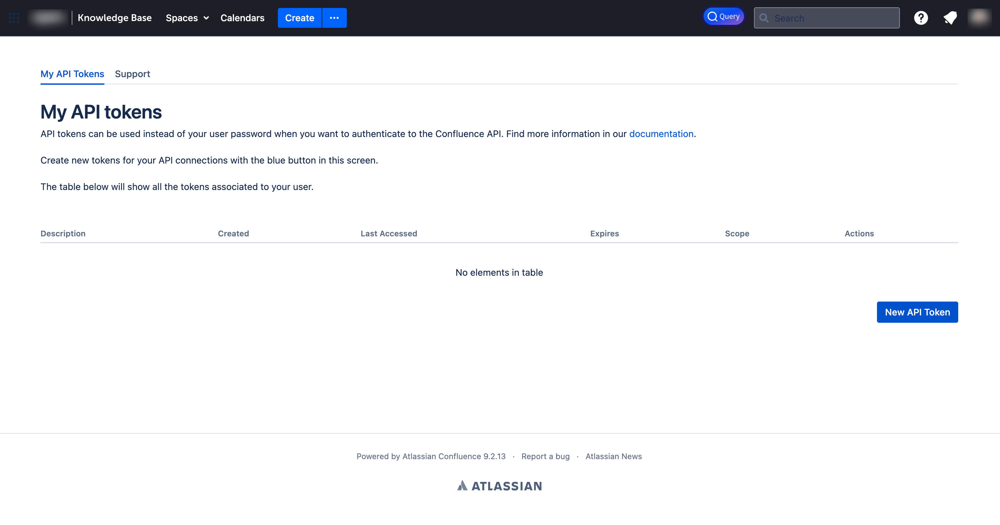

1.3. Fill in the token details and click **Create API Token**:

- **API Token Description**: Enter a descriptive name for your token (e.g., "API Token from 2026-02-11").
- **API Token Expiration**: Select expiration period (e.g., "6 months").
- **Token Scope**: Choose **Read & Write** for full access.

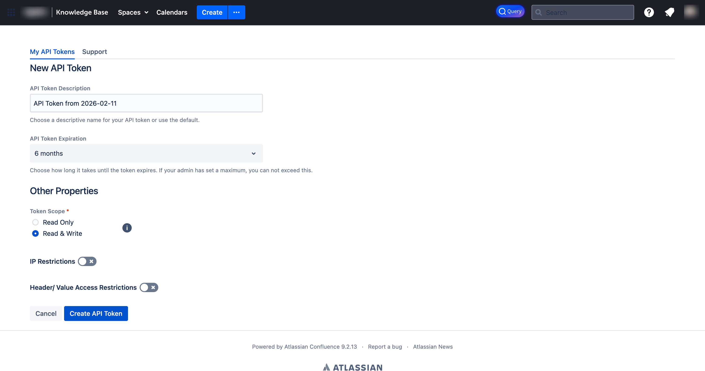

1.4. Copy the generated token and store it securely:

:::warning
You won't be able to see your token once you leave this screen. Make sure to copy and save it.
:::

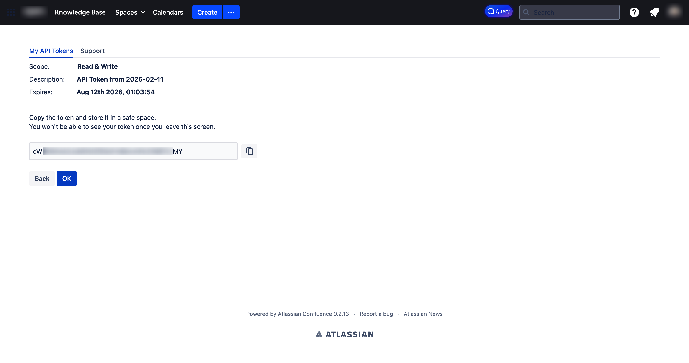

  </TabItem>
</Tabs>

## 2. Configure Integration in CodeMie

2.1. In the CodeMie main menu, click **Integrations**, select **User** or **Project** tab, and click **+ Create**.

2.2. Set **Credential Type** to **Confluence** and fill in the **Project**, **Global Integration** toggle, and **Alias** fields. Then choose an authentication method:

<Tabs groupId="confluence-auth">
  <TabItem value="pat" label="Personal Access Token" default>

Specify the integration parameters and click **+ Save**:

- **URL**: The Confluence instance URL. For Confluence Cloud, the correct value depends on the API token type (see the warning below):
  - For Confluence Cloud with a **classic (unscoped)** token: `https://your-domain.atlassian.net`
  - For Confluence Cloud with a **scoped** token: `https://api.atlassian.com/ex/confluence/your-cloud-id`
  - For Confluence Self-hosted: the Confluence server URL (e.g., `https://confluence.example.com`)
- **Is Confluence Cloud**:
  - ✅ **Check this box** if using **Confluence Cloud**
  - ❌ **Leave unchecked** if using **Confluence Self-hosted**
- **Username/email for Confluence**: The Atlassian account email (e.g., `user@example.com`).
- **Token/ApiKey**: Paste the API token copied in step 1.4.

:::warning Cloud URL depends on the API token type
Atlassian Cloud offers two kinds of API tokens, and each requires a different **URL** value. CodeMie sends requests to exactly the URL provided, so the URL and token type must match:

- A **classic (unscoped)** token works with the site URL: `https://your-domain.atlassian.net`.
- A **scoped** token (created with specific permissions) only works through the Atlassian API gateway: `https://api.atlassian.com/ex/confluence/your-cloud-id`.

To find the cloud ID, open `https://your-domain.atlassian.net/_edge/tenant_info` in a browser while signed in to Atlassian. The returned `cloudId` value is the `your-cloud-id` used in the gateway URL.
:::

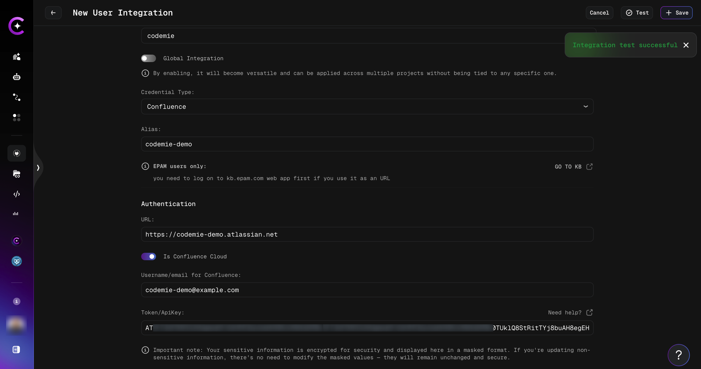

:::tip
Click the **Test** button to verify the connection before saving. An "Integration test successful" notification confirms the parameters are correct.
:::

:::info
If this integration is created under the **Project** tab, the key is available to the entire project by default, meaning all project members can use it.
:::

  </TabItem>
  <TabItem value="oauth" label="OAuth 2.0 (Atlassian)">

:::info Prerequisite
The OAuth 2.0 option is only available when the platform administrator has enabled it (the `CONFLUENCE_OAUTH_ENABLED` flag). If the **Use OAuth 2.0 sign-in** toggle is not shown, contact the platform administrator.
:::

OAuth 2.0 integrations are **per-user**: the OAuth application credentials (`Client ID`, `Client Secret`, `Callback Base URL`) are entered in the integration form when creating the integration, and each member then connects under their own Atlassian account. Calls to Confluence run as the individual member — no shared token.

**Steps:**

2.2.1. Enable the **Use OAuth 2.0 sign-in** toggle in the integration form. The form shows the OAuth application fields: **Client ID**, **Client Secret**, and **Callback Base URL**. Fill these in with the values from the Atlassian OAuth application registered for this platform.

2.2.2. Click **Sign in with Confluence**. A browser popup opens the Atlassian authorization page.

2.2.3. Log in to Atlassian and grant the requested permissions. The popup closes automatically on success.

2.2.4. The form shows a confirmation that the account is connected. The Atlassian `cloud_id` is resolved automatically — no URL field is required.

2.2.5. Click **Save** to create the integration.

:::note
A successful sign-in is required before the integration can be saved. The save button remains disabled until the OAuth connection is completed.
:::

  </TabItem>
</Tabs>

## 2a. Connect from Chat (OAuth only)

When a run first uses a Confluence integration that a member has not yet connected, the chat displays a **"Connect your Confluence account"** prompt with a **Sign in** button.

To connect:

1. Click **Sign in** in the chat prompt. The Atlassian authorization popup opens.
2. Log in and grant the requested permissions. The popup closes on success.
3. Resend the message that triggered the prompt. The run retries with the newly connected account.

:::info
This in-chat connect gate appears only for OAuth integrations. Members using a personal access token integration do not see this prompt.
:::

## 3. Create Assistant with Confluence Tool

3.1. Click **Explore Assistant**, then click **Create Assistant** or edit an existing one.

3.2. In the assistant settings, expand the **Project Management** section under available tools, check **Generic Confluence**, and select your Confluence integration alias from the dropdown:

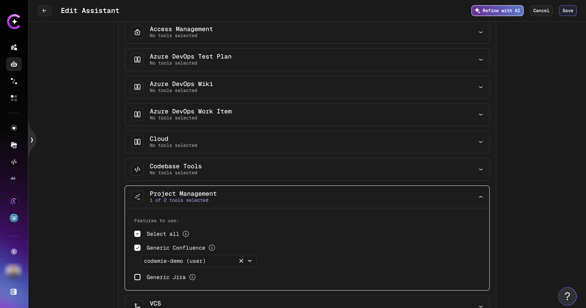

3.3. Click **Create** or **Save** to finalize your assistant.

## 4. Use Your Assistant

4.1. Select your assistant and start a conversation. You can interact with your Confluence data using natural language, for example:

- "Get me some article from Confluence"
- "Find all pages in the codemie-demo space"
- "Summarize the Getting Started page from Confluence"

The assistant will retrieve articles from your Confluence spaces and present them with space names and direct links:

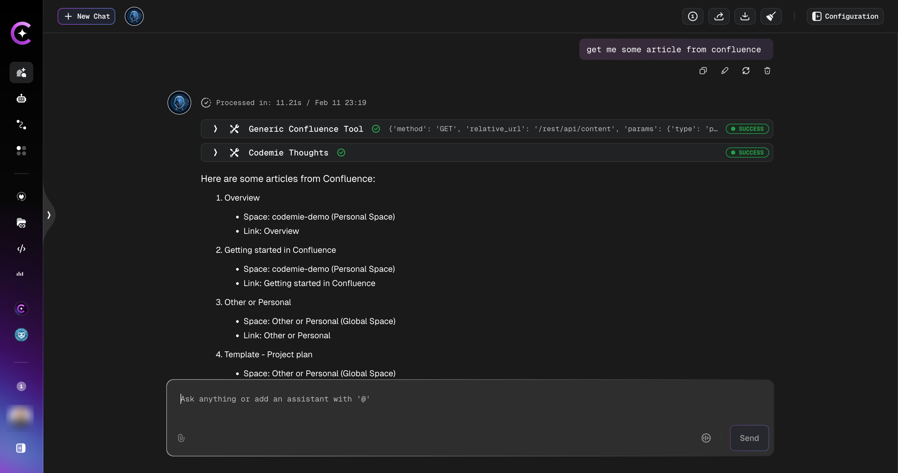
