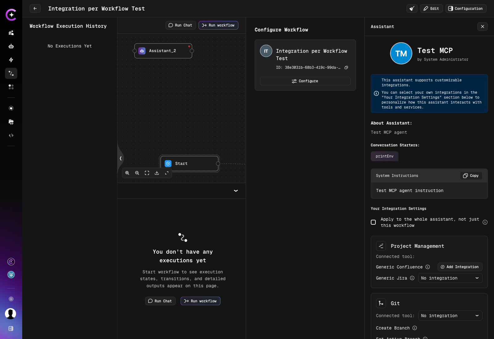

# Assistant Panel on the Executions Page

Assistant nodes on the workflow executions page can be opened in a side panel that shows the complete assistant view in context — profile details, instructions, tools, and integrations — without leaving the execution.

The panel is a read-only surface with one exception: the **Your Integration Settings** section, where a personal integration can be selected for the assistant. Because the panel is opened from a specific workflow, it also decides **how far that selection reaches**: by default the choice applies to the current workflow only, and a checkbox extends it to the assistant everywhere.

## Opening the panel

1. Open a workflow. The page shows **Workflow Execution History** together with the workflow graph.
2. Click an assistant node in the graph, either in the graph itself or in an execution opened from the history.

The panel opens on the right side of the page, under the **Assistant** heading. It is available even before the workflow has been run for the first time — an empty execution history does not prevent it from opening.

The execution graph keeps working exactly as before while the panel is open: panning and zooming remain available, nodes stay non-selectable, and the workflow editor is not affected. The panel is available on the executions page only.

### Nodes that open a panel

| Node                                     | Result                              |
| ---------------------------------------- | ----------------------------------- |
| Assistant node with a valid assistant    | Panel opens with the assistant view |
| Tool node                                | Panel does not open                 |
| Inline node                              | Panel does not open                 |
| Virtual assistant                        | Panel does not open                 |
| Node without a valid assistant reference | Panel does not open                 |

If the assistant exists but the current user has no access to it, the panel still opens and shows a placeholder message instead of an empty or broken view.

## What the panel shows

The panel opens under the **Assistant** heading and replicates the content of the standalone assistant view page:

- profile details — avatar, name, and author
- **About Assistant** description
- **Conversation Starters**
- **System Instructions**, with a **Copy** action
- tools and integrations
- metadata

If the assistant supports per-user integration selection, a note at the top of the panel points to the **Your Integration Settings** section below it.

All of this content is read-only. The standalone assistant page itself is unchanged, and nothing opened from the panel modifies the workflow.

The only editable part is the **Your Integration Settings** section, and it appears only when the assistant supports per-user integration selection. Assistants without it open normally — simply without that section.

## Selecting a personal integration

1. Open the panel for the assistant node, as described above.
2. Scroll to the **Your Integration Settings** section.
3. Find the tool, toolkit, or MCP server in the list. Entries are grouped by toolkit, and each one names the connected tool it applies to.
4. Choose an integration from its dropdown. If no integration of the required type exists yet, use **Add Integration** next to the entry to create one.
5. Decide on the scope of the change using the **Apply to the whole assistant, not just this workflow** checkbox at the top of the section — see [Where the selection applies](#where-the-selection-applies).
6. Save the section.

:::info
Which integrations appear in a dropdown, what the **No integration** option means, and why integrations pinned by the assistant author are not offered for selection are described in [Automatic Credentials Lookup](../tools_integrations/integrations/index.md#automatic-credentials-lookup) and [MCP Integration Credentials](../tools_integrations/tools/mcp/mcp-integration-credentials.md).
:::

If the assistant orchestrates sub-assistants, their integration settings are shown in the same section and follow the same scope as the rest of it.

## Where the selection applies

A personal selection is always private: it never affects other users of the same assistant or the same workflow. What the **Apply to the whole assistant, not just this workflow** checkbox controls is a narrower question — whether the selection is remembered for this workflow only, or for the assistant everywhere.

| Checkbox | Scope           | The selection applies to                                                                                                      |
| -------- | --------------- | ----------------------------------------------------------------------------------------------------------------------------- |
| Cleared  | Workflow scope  | This workflow, this assistant, this user only. Chat, the assistant page, and other workflows are unaffected                   |
| Selected | Assistant scope | This assistant everywhere for this user — chat, the assistant page, and workflows without their own workflow-scoped selection |

Selecting the checkbox does two things at once: it saves the selection at assistant scope, and it removes the workflow-scoped selection for the current workflow, so the newly saved assistant-scoped selection takes effect there as well. Workflow-scoped selections saved for **other** workflows are left untouched.

### Default state of the checkbox

| Situation                                                   | Checkbox state      |
| ----------------------------------------------------------- | ------------------- |
| No personal selection has been saved for this assistant yet | Selected by default |
| A personal selection already exists for this assistant      | Cleared by default  |

The default can always be changed before saving. Leaving it selected on a first save means the initial choice is remembered for the assistant as a whole; clearing it keeps that first choice limited to the current workflow.

### Which selection wins

When the workflow runs, a user-selectable integration slot is resolved in this order:

| Priority | Source                                                                                      |
| -------- | ------------------------------------------------------------------------------------------- |
| 1        | Workflow-scoped personal selection for this workflow                                        |
| 2        | Assistant-scoped personal selection                                                         |
| 3        | Automatic credentials lookup, if the assistant author left it enabled for the slot          |
| 4        | No integration — nothing is resolved and the tool reports the missing integration when used |

A personal selection, including an explicit **No integration**, always takes precedence over automatic lookup and is not overwritten by it on the next run.

Integration slots pinned by the assistant author are outside this order entirely: they always resolve to the author's integration, are not offered for personal selection, and are not affected by either scope. The full slot model is described in [Automatic Credentials Lookup](../tools_integrations/integrations/index.md#automatic-credentials-lookup).

### Other users of the same workflow

Workflow-scoped selections apply only to executions started by the user who saved them. When another user runs the same workflow, the workflow resolves against that user's own settings — their workflow-scoped selection if they saved one, otherwise their assistant-scoped selection.

### The same assistant in several places

- **Several nodes in one workflow.** If the same assistant is used in more than one node of a workflow, all of those nodes share the same workflow-scoped selection for that user.
- **Several workflows.** A workflow-scoped selection made for one workflow does not affect the same assistant in another workflow. Each workflow keeps its own.

### Cloning a workflow

Workflow-scoped selections are not copied when a workflow is cloned. In the clone, the assistant starts from the assistant-scoped selection until a workflow-scoped one is saved for it.

### If an integration becomes unavailable

If an integration saved at workflow scope is later removed or becomes inaccessible, the execution falls back to the base configuration. The panel continues to open and the run continues without breaking.

## Saving from the assistant page

The standalone assistant page keeps its existing behavior: there is no scope checkbox, and a selection saved there is always stored at assistant scope. The checkbox exists only in the panel opened from a workflow, where a narrower scope is meaningful.

:::note
Personal selections saved before workflow scope became available remain assistant-scoped and continue to work. Nothing has to be selected again.
:::

## Access to integrations

Access rules are unchanged by the new scope. A selection is validated against the assistant's own project and its marketplace status, in both scopes — the project the workflow belongs to does not widen what may be selected. An integration that is not accessible cannot be chosen or saved at either scope.
