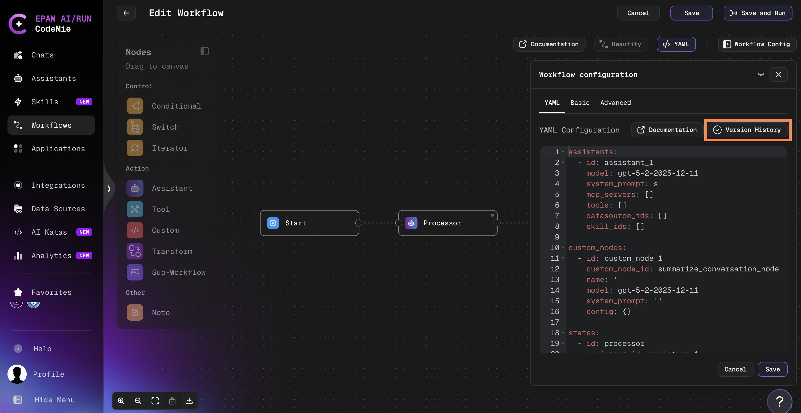
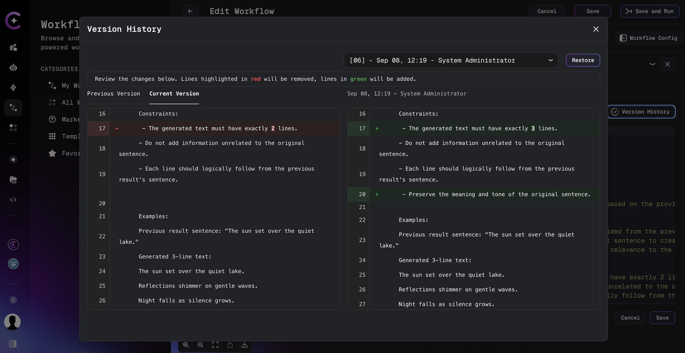
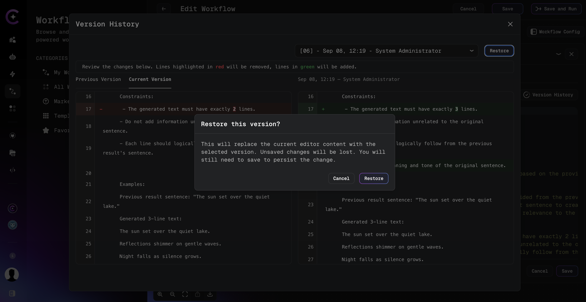

# Workflow Version History

Workflow YAML configuration changes are tracked automatically. When editing an existing workflow, you can browse prior YAML versions, compare them against the current editor content, and restore a previous configuration when an experiment does not work out.

Version history applies to **workflow YAML configuration** only. Workflow metadata (name, description, project assignment) and execution history are managed separately.

## Prerequisites

- An existing workflow with at least one saved YAML change (history is empty until the configuration is modified and saved at least once)
- Access to edit the workflow (see [Permissions](#permissions) below)

## Open Version History

Version history is available when **editing** an existing workflow. It is not shown during workflow creation.

1. Navigate to **Workflows** and open a workflow for editing (click **Actions** (⋮) → **Edit** on the workflow card, or **Edit** on the Workflow Details page).

2. Open the YAML editor:
   - **Visual Editor**: Click the **YAML** button in the upper-right corner of the workflow editor.
   - **Legacy form editor**: Open the YAML configuration field in the workflow form.

3. In the YAML header action bar, click **Version History** (beside **Documentation** when documentation is available):

   

:::info Editor Paths
Both the visual editor YAML panel and the legacy YAML form editor expose the same **Version History** button. The button appears even when **Documentation** is hidden for the workflow.
:::

## Browse and Compare Versions

The **Version History** popup lists every saved prior version of the workflow YAML. Each entry is labeled in this format:

`[NN] - <date> - <author>`

Where `NN` is a sequential version number (newer versions have higher numbers).

1. Select a version from the dropdown to load it into the diff view.

2. Compare the selected version against a baseline:

   | Baseline             | Description                                                                                    |
   | -------------------- | ---------------------------------------------------------------------------------------------- |
   | **Current Version**  | The YAML currently in the editor, including any unsaved changes captured when the popup opened |
   | **Previous Version** | The next older historical version relative to the selected entry (disabled when none exists)   |

3. Review the side-by-side diff. Lines highlighted in **red** will be removed; lines in **green** will be added.

   

If no historical versions exist, the popup displays **No version history available** and the **Restore** button is unavailable.

## Restore a Previous Version

Restoring a version replaces the YAML in the editor with the content from the selected historical version. The change is **not** saved automatically.

1. Select the version to restore from the dropdown.

2. Click **Restore**.

3. Confirm the restore action in the confirmation dialog:

   

4. Click **Save** on the Edit Workflow page to persist the restored configuration.

:::warning Unsaved Changes
Restoring a version replaces the current editor content. All unsaved workflow edits—including changes made in the visual editor or YAML panel—are discarded when restore is confirmed.
:::

:::info Distinction from AI Revert
**Revert to Previous** discards an unsaved AI refinement and returns to the YAML captured before refinement. **Version History** restores any previously saved YAML version from the workflow's change history. See [Create Workflow](./create-workflow.md) for AI refinement details.
:::

## Permissions

| Access level | Browse history | Compare versions | Restore |
| ------------ | -------------- | ---------------- | ------- |
| Read         | Yes            | Yes              | No      |
| Write        | Yes            | Yes              | Yes     |

Users with read-only access can open version history and review diffs but cannot restore versions. Saving a restored configuration requires write access to the workflow.

## When History Is Recorded

A new history entry is created when the workflow YAML configuration is saved with content that differs from the previous saved version. Metadata-only changes (such as renaming the workflow) do not add YAML history entries.

## Related Documentation

- [Create Workflow](./create-workflow.md) — Build and edit workflows with the visual editor and YAML panel
- [Workflow YAML Configuration Guide](./configuration/introduction.md) — YAML syntax and configuration reference
