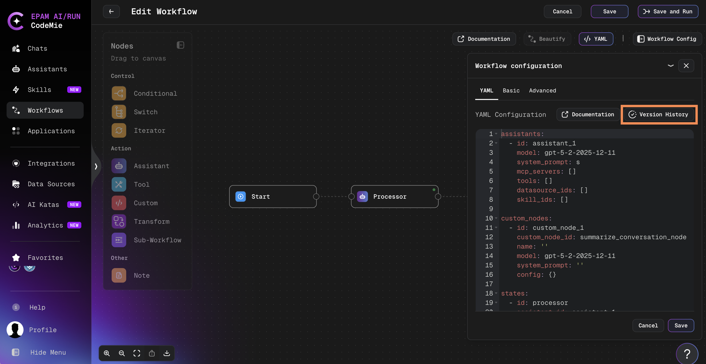
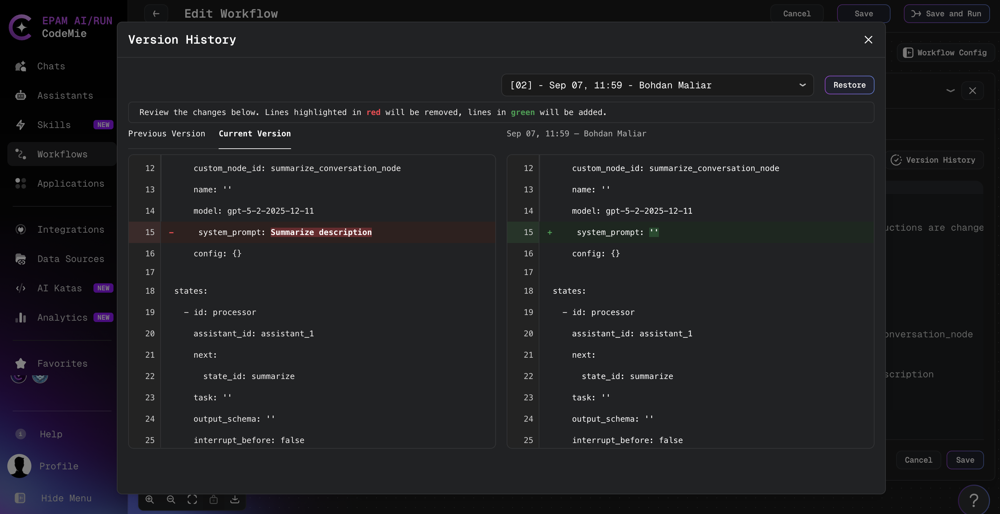
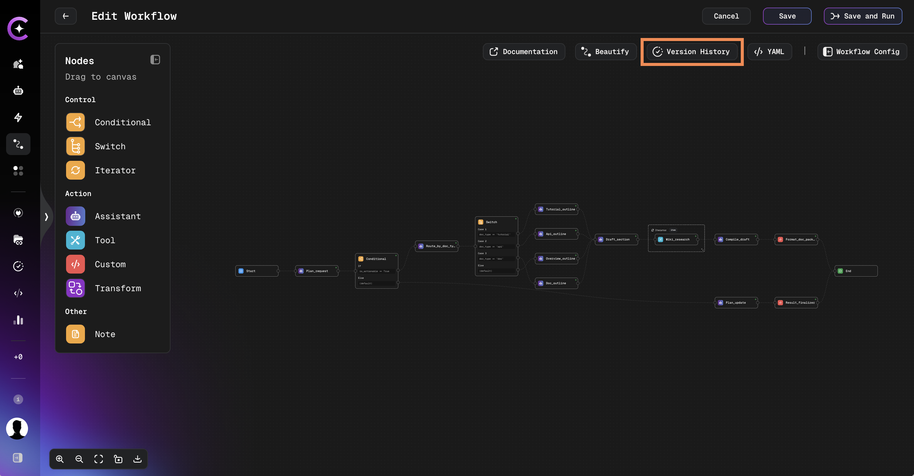
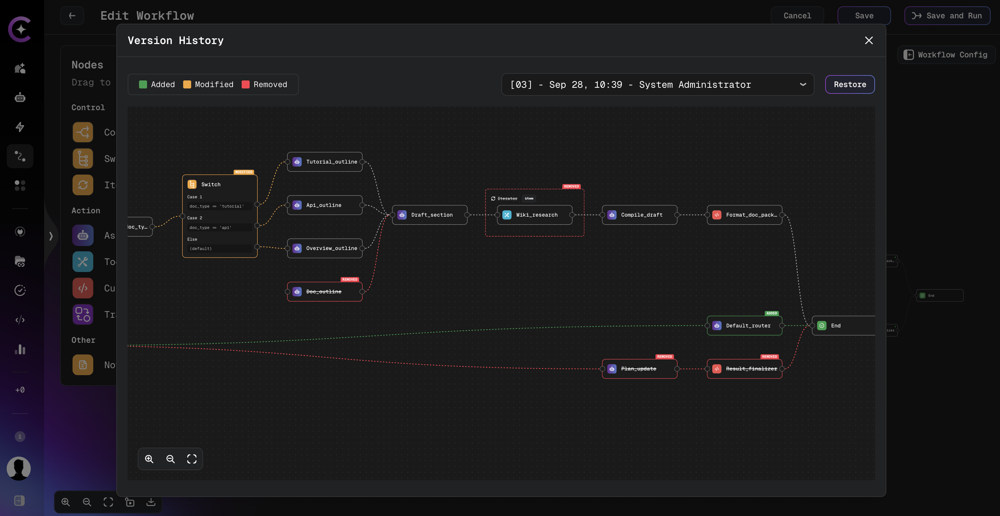
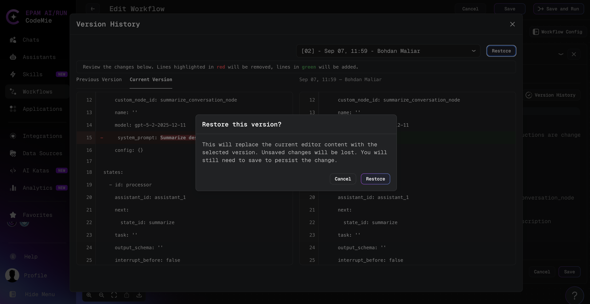

# Workflow Version History

Workflow YAML configuration changes are tracked automatically. When editing an existing workflow, prior versions can be browsed, compared against the current editor content, and restored when an experiment does not work out.

Two ways to review what changed between two versions are available:

- **YAML diff** — a line-level textual diff of the underlying YAML configuration, opened from the YAML panel.
- **Visual diff** — a single node graph of the target revision with additions, removals, and modifications highlighted directly on the graph, opened from the Visual Editor toolbar.

Both views compare exactly two revisions at a time; comparing more than two revisions at once, or in a chain, is not supported. Version history applies to **workflow YAML configuration** only. Workflow metadata (name, description, project assignment) and execution history are managed separately.

## Prerequisites

- An existing workflow with at least one saved change (history is empty until the configuration is modified and saved at least once)
- Access to edit the workflow (see [Permissions](#permissions) below)

## Open the YAML Diff

The YAML diff is available when **editing** an existing workflow. It is not shown during workflow creation.

1. Navigate to **Workflows** and open a workflow for editing (click **Actions** (⋮) → **Edit** on the workflow card, or **Edit** on the Workflow Details page).

2. Open the YAML editor:
   - **Visual Editor**: Click the **YAML** button in the upper-right corner of the workflow editor.
   - **Legacy form editor**: Open the YAML configuration field in the workflow form.

3. In the YAML header action bar, click **Version History** (beside **Documentation** when documentation is available):

   

:::info Editor Paths
Both the visual editor YAML panel and the legacy YAML form editor expose the same **Version History** button. The button appears even when **Documentation** is hidden for the workflow.
:::

### Browse and Compare Versions

The **Version History** popup lists every saved prior version of the workflow YAML. Each entry is labeled in this format:

`[NN] - <date> - <author>`

Where `NN` is a sequential version number (newer versions have higher numbers).

1. Select a version from the dropdown to load it into the diff view.

2. Compare the selected version against a baseline:

   | Baseline             | Description                                                                                    |
   | -------------------- | ---------------------------------------------------------------------------------------------- |
   | **Current Version**  | The YAML currently in the editor, including any unsaved changes captured when the popup opened |
   | **Previous Version** | The next older historical version relative to the selected entry (disabled when none exists)   |

3. Review the side-by-side diff. Lines highlighted in **red** will be removed; lines in **green** will be added.

   

If no historical versions exist, the popup displays **No version history available** and the **Restore** button is unavailable.

## Open the Visual Diff

The visual diff shows the same comparison as the YAML diff, but as a node graph instead of text. It is reached through its own entry point in the Visual Editor toolbar — it is not a toggle inside the YAML diff popup.

1. Navigate to **Workflows** and open a workflow for editing in the **Visual Editor**.

2. Click **Version History** in the editor toolbar:

   

3. Select a version from the dropdown and a baseline to compare it against, the same way as in the [YAML diff](#browse-and-compare-versions).

The popup opens showing a single node graph for the target revision, rendered using the same graph visualization as the Visual Editor, with one set of **zoom in/out**, **fit view**, and **drag-to-pan** controls. Changes are highlighted directly on the graph:

| Highlight                                                  | Meaning                                                                                                               |
| ---------------------------------------------------------- | --------------------------------------------------------------------------------------------------------------------- |
| **Green border**                                           | Node added — exists in the target revision but not in the version being compared against                              |
| **Red border, REMOVED badge, strikethrough label** (ghost) | Node removed — shown at its former position; existed in the compared version, no longer exists in the target revision |
| **Amber border**                                           | Node modified — exists in both revisions, but its configuration differs                                               |

The amber highlight signals that a node's configuration changed without exposing the exact changed values inline. To see the exact before/after values for a modified node, switch to the [YAML diff](#open-the-yaml-diff).

:::warning Not Every Change Is Highlighted
The visual diff highlights structural changes: nodes added, removed, or with a modified configuration. A node that was only moved to a different position on the canvas, with no other change, is **not** highlighted — its position is a visual layout detail, not a tracked configuration difference. To confirm whether a node's configuration actually changed, check the YAML diff.
:::

The visual diff is read-only: workflows cannot be edited directly from this view, and no per-node action to jump to the YAML diff for a specific node is provided. Use the YAML diff for exact changed values.

## Restore a Previous Version

Restoring a version replaces the current content with the content from the selected historical version. It can be triggered from either the YAML diff popup or the visual diff popup. The change is **not** saved automatically.

1. Select the version to restore from the dropdown.

2. Click **Restore**.

3. Confirm the restore action in the confirmation dialog:

   

Restoring automatically runs the same validation that runs on **Save** against the restored content, in the background, without persisting anything to the backend. Any issues found are surfaced inline in the editor; the restore itself is not reverted.

4. Resolve any inline validation issues, then click **Save** on the Edit Workflow page to persist the restored configuration.

:::warning Unsaved Changes
Restoring a version replaces the current editor content. All unsaved workflow edits—including changes made in the visual editor or YAML panel—are discarded when restore is confirmed.
:::

:::info Distinction from AI Revert
**Revert to Previous** discards an unsaved AI refinement and returns to the YAML captured before refinement. **Version History** restores any previously saved version from the workflow's change history. See [Create Workflow](./create-workflow.md) for AI refinement details.
:::

## Permissions

| Access level | Browse history | Compare versions | Restore |
| ------------ | -------------- | ---------------- | ------- |
| Read         | Yes            | Yes              | No      |
| Write        | Yes            | Yes              | Yes     |

Users with read-only access can open version history and review diffs (YAML or visual) but cannot restore versions. Saving a restored configuration requires write access to the workflow.

## When History Is Recorded

A new history entry is created when the workflow configuration is saved with content that differs from the previous saved version. Metadata-only changes (such as renaming the workflow) do not add history entries.

## Related Documentation

- [Create Workflow](./create-workflow.md) — Build and edit workflows with the visual editor and YAML panel
- [Workflow YAML Configuration Guide](./configuration/introduction.md) — YAML syntax and configuration reference
